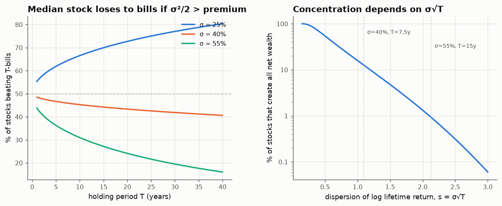
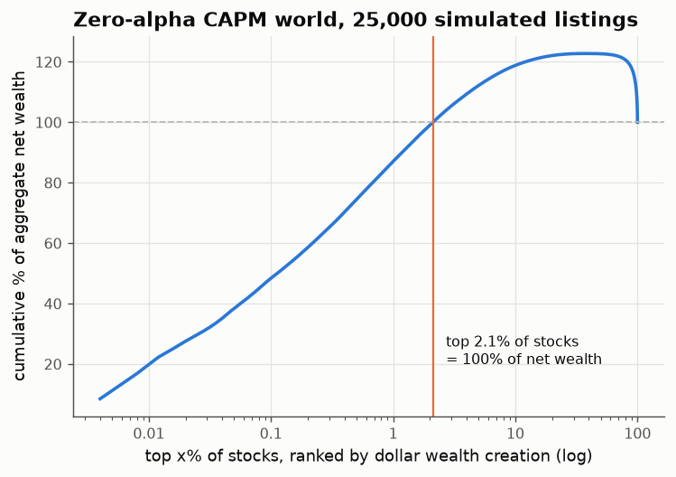
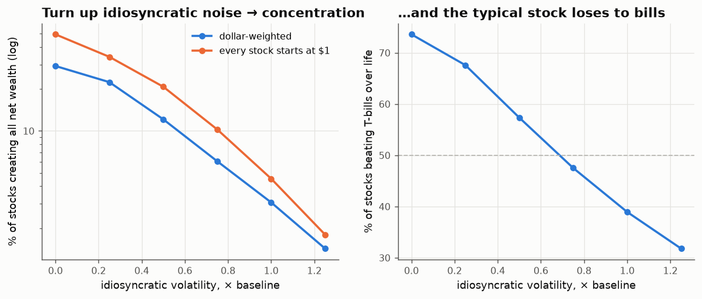
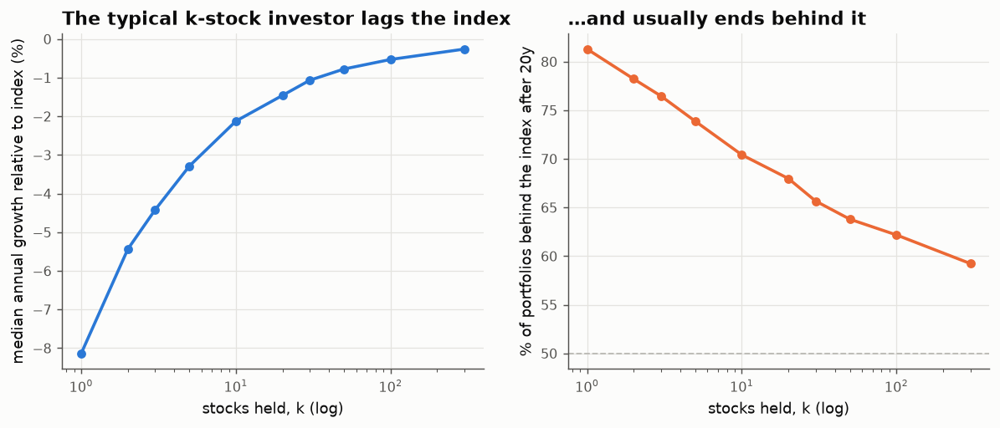

# 01 · Three growth rates, and why 4% of stocks make all the money

*Code: [`code/01_bessembinder.py`](../code/01_bessembinder.py) · output: [`figures/01_output.txt`](../figures/01_output.txt)*

## The puzzle

Hendrik Bessembinder (2018, *Do stocks outperform Treasury bills?*) went through
every US common stock in CRSP from 1926 to 2016 and found three things that sound
like they can't all be true at once:

1. The stock market as a whole beat Treasury bills by a wide margin.
2. **Most individual stocks did not.** A majority had lifetime buy-and-hold returns
   below one-month T-bills.
3. About **4%** of listed companies accounted for *all* of the net dollar wealth
   the market created. The other 96%, taken together, did no better than bills.

People usually tell this as a story about superstar firms: Apple, Exxon,
Microsoft, a small set of companies with something special. I want to argue that
it needs no story at all. It follows from one fact about multiplication, and you
can work out roughly how big the effect should be before you open the data.

## One lognormal, three centres

Take a single stock whose log price is a Brownian motion. Over a lifetime of
$T$ years its gross return relative to bills is

$$X = e^{Y},\qquad Y \sim \mathcal N\!\left(mT - \tfrac12 s^2,\; s^2\right),\qquad s = \sigma\sqrt T,$$

where $m$ is the arithmetic excess return (the risk premium) and $\sigma$ the
volatility. The $-\tfrac12 s^2$ is the familiar Itô correction; it keeps
$\mathbb E[X] = e^{mT}$.

A lognormal has three natural "centres", and each one belongs to a different
observer:

| observer | what they see | log growth rate per year |
|---|---|---|
| the **typical stock** (median of $X$) | $e^{mT - s^2/2}$ | $m - \sigma^2/2$ |
| the **average** (mean of $X$) | $e^{mT}$ | $m$ |
| the **typical dollar** (median of $X$ under the wealth-weighted measure) | $e^{mT + s^2/2}$ | $m + \sigma^2/2$ |

The third row is the one that matters here. Ask "where does a randomly chosen
*dollar* of end-of-period market value sit?", not "where does a randomly chosen
*stock* sit?". That means reweighting each outcome by its size,
$d\mathbb Q = \frac{X}{\mathbb E X}\,d\mathbb P$. For a lognormal this
**exponential tilt** does nothing except move the mean of $Y$ up by exactly
$s^2$. (It is the same algebra as Girsanov's theorem, and the same algebra as
changing numéraire in option pricing. Here it has a plain meaning: it is the
difference between counting companies and counting money.)

So the mean growth rate sits exactly halfway between the typical stock and the
typical dollar:

$$\underbrace{m - \tfrac{\sigma^2}{2}}_{\text{typical stock}} \;<\; \underbrace{m}_{\text{average}} \;<\; \underbrace{m + \tfrac{\sigma^2}{2}}_{\text{typical dollar}}.$$

The gap between the two outer rows is $\sigma^2$ per year, and it is large. For
an individual stock with $\sigma = 45\%$, $\sigma^2 \approx 20\%$ a year. Nothing
in the premium can offset that. **The typical stock and the typical dollar live
in different economies**, and "the market beat bills" is a statement about the
second one.

## Consequence 1: the median stock loses to bills

The chance that a stock beats bills over its life is

$$\Pr(Y > 0) = \Phi\!\left(\frac{(m - \sigma^2/2)\sqrt T}{\sigma}\right).$$

This falls below one half exactly when $\sigma^2 > 2m$. With an equity premium
around 6.5%, the threshold is $\sigma \approx 36\%$. The median US listing is more
volatile than that. Worse, once you are past the threshold, a longer holding
period makes it *more* likely you lose to bills, because the argument of $\Phi$
grows like $-\sqrt T$.

## Consequence 2: concentration is set by $\sigma\sqrt T$

How many stocks, counted from the top, account for all net wealth creation? We
want the cut-off $y^*$ below which the stocks net to zero excess:

$$\mathbb E\big[(X - 1)\,\mathbf 1\{Y<y^*\}\big] = 0
\iff e^{mT}\,\Phi(z - s) = \Phi(z),\qquad z = \frac{y^* - (mT - s^2/2)}{s}.$$

(I used the lognormal identity $\mathbb E[X\mathbf 1\{Y<y\}] = \mathbb E[X]\,\Phi(\tfrac{y - \mu_Y - s^2}{s})$,
which is the size-biased shift again.) When $s$ is moderately large, $\Phi(z)\approx 1$
and this solves to $z \approx s + c$ with $c = \Phi^{-1}(e^{-mT})$. The fraction
of stocks that creates all the wealth is then

$$\boxed{\;p \;\approx\; \bar\Phi\!\left(\sigma\sqrt T + \Phi^{-1}\!\big(e^{-mT}\big)\right)\;}$$

This is a Gaussian tail in $\sigma\sqrt T$. The premium enters only through a
small constant shift. Put in $\sigma = 40\%$ and $T = 7.5$ years (roughly the
median CRSP lifetime): $s \approx 1.1$ and $p \approx 10$–$13\%$. Put in
$\sigma = 55\%$ and $T = 15$: $s \approx 2.1$ and $p \approx 1\%$. The data sit
between those two cases, and so does Bessembinder's 4%.

This also predicts **which** samples will look more concentrated. Longer
horizons and more volatile stocks (small caps, emerging markets) should be
more concentrated. That matches the follow-up work: Bessembinder and co-authors
find the global sample from 1990 even more concentrated than the US one, with
something like 1% of firms creating all net wealth.

## Consequence 3: it survives a realistic simulation

The one-lognormal picture leaves out a lot: a common market factor, random betas,
listing dates spread over 90 years, exponentially distributed lifetimes (median
≈ 7 years), dollar weighting with widely dispersed starting sizes, and small
firms being noisier than large ones. So I built all of that. The simulation is a
**zero-alpha CAPM world**: every stock's expected return is exactly
$r + \beta\,(\text{premium})$. No stock is special, and no stock has anything a
stock-picker could find.

Over 30 simulated market histories (median, with 10th–90th percentile):

| statistic | zero-alpha simulation | Bessembinder (CRSP 1926–2016) |
|---|---|---|
| stocks beating bills over their life | 37% [30%, 42%] | ≈ 43% |
| monthly returns beating bills | 48.6% | a little under half |
| share of stocks creating all net wealth | 2.0% [0.15%, 3.7%] | ≈ 4% |

The strongest evidence is the "knob" experiment. Hold everything else fixed and
scale idiosyncratic volatility from 0 to 1.25× the baseline:

With no idiosyncratic noise, three-quarters of stocks beat bills, and
concentration is modest: 30% of stocks, and half of all stocks if they all start
at the same size. Turning the noise up alone produces the Bessembinder pattern.
**The skewness is caused by the volatility.** Superstar firms exist, but you
would see the same statistics without them.

One honest note. At baseline the simulation comes out slightly *more* extreme
than the real data: 37% vs 43% beating bills, and 2% vs 4% for concentration.
So the interesting question may not be "why is the real market so skewed?" but
"why is it slightly *less* skewed than pure compounding predicts?". Some
candidate reasons:
(a) my idiosyncratic vols are a bit high;
(b) real idiosyncratic returns mean-revert at long horizons (bad firms get
taken over or restructured before they compound all the way to zero);
(c) many delistings are acquisitions at a premium, which cuts off the left tail.
I have not tested these.

## Consequence 4: the concentration tax on stock pickers

If the index (the typical-dollar view) is so different from the typical stock,
what about someone holding $k$ stocks? I simulated 20-year buy-and-hold
portfolios of $k$ equally weighted zero-alpha stocks with 40% idiosyncratic vol:

| stocks held | median growth vs. index | P(behind index after 20y) |
|---|---|---|
| 1 | −8.1%/yr | 81% |
| 10 | −2.1%/yr | 70% |
| 30 | −1.1%/yr | 66% |
| 100 | −0.5%/yr | 62% |
| 300 | −0.3%/yr | 59% |

Even at 300 stocks, most such investors trail the index. No stock-picker here has
negative skill; the zero-skill investor simply lands at the median, and the
median is below the mean. The Fenton–Wilkinson approximation (a sum of lognormals
is roughly lognormal) gives this in closed form:

$$\text{median shortfall per year} \;\approx\; \frac{1}{2T}\,\ln\!\left(1 + \frac{e^{\sigma^2 T} - 1}{k}\right).$$

For $k = 100$ this gives 0.53%/yr, which matches the simulation.
(It overstates the shortfall for small $k$.)

**This formula says something I didn't expect.** The number of stocks a
*buy-and-hold* investor needs to get close to the index grows like
$e^{\sigma^2 T}$, exponentially in the horizon. With 40% vol that is about 24
stocks over 20 years and about 600 over 40 years. The reason is that a
buy-and-hold portfolio does not stay diversified. Its weights drift toward the
winners, and the expected inverse Herfindahl index (the effective number of
holdings) decays like $k\,e^{-\sigma^2 T}$. A **rebalanced** portfolio is
different: its shortfall is $\sigma^2/(2k)$ per year whatever the horizon.
Rebalancing is what stops the drift toward concentration, and note 02 is about
where that "rebalancing premium" comes from.

(Side thought: the cap-weighted index is itself a buy-and-hold portfolio, so it
should de-diversify in the same way. It doesn't, at least not without limit:
the shape of the market's capital distribution has been remarkably stable for
a century. Something must be pushing back against the $e^{\sigma^2 T}$
concentration. Note 03 looks for it.)

## What I take from this

- "Most stocks lose to bills" and "the market beats bills" are not in tension.
  They are the median and the size-biased median of the same lognormal, and they
  are $\sigma^2 T$ apart in log terms.
- The Bessembinder statistic is mostly a measurement of $\sigma\sqrt T$. Read on
  its own, as evidence of superstar economics, it is close to meaningless. It
  becomes informative only as a *deviation* from the compounding null, and on
  my numbers the deviation goes the other way (the real market is slightly less
  concentrated).
- Changing measure, the tool that looks most abstract in mathematical finance,
  has a very concrete meaning here: it is the difference between counting
  companies and counting money.
