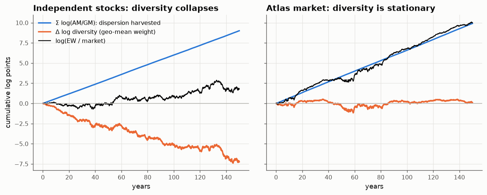
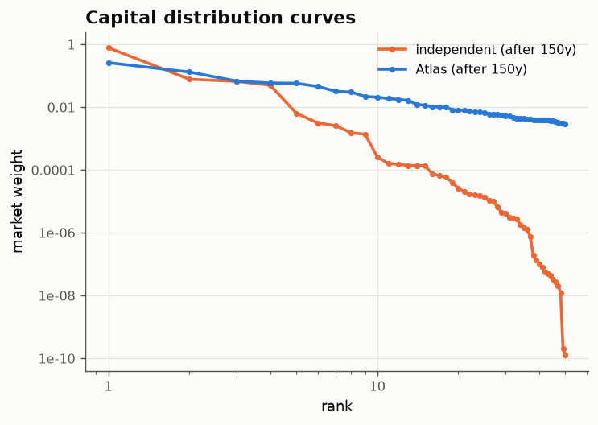
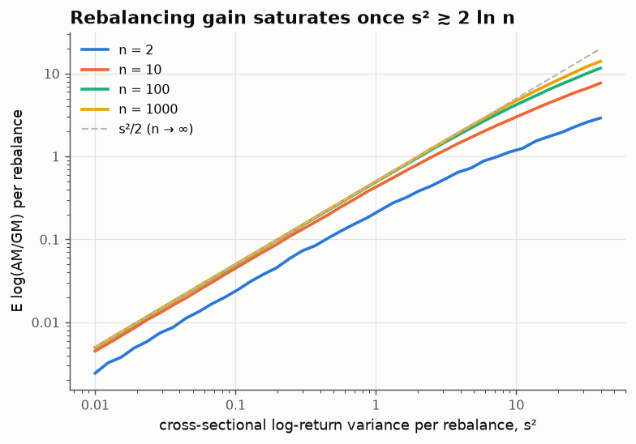
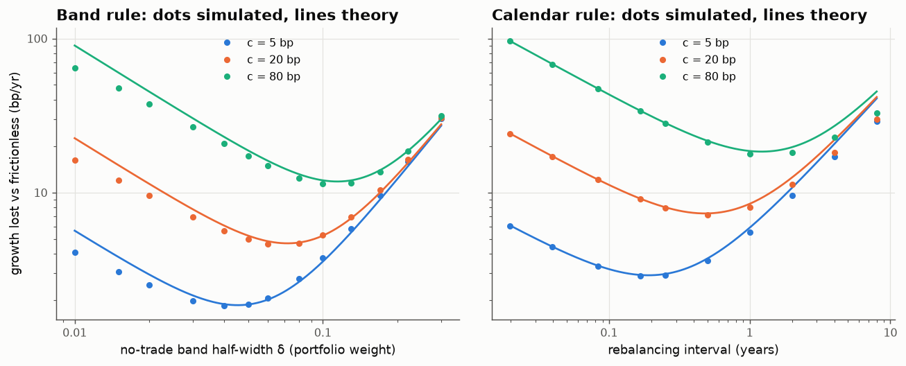

# 02 · Where the rebalancing premium comes from

*Code: [`code/02_rebalancing.py`](../code/02_rebalancing.py) · output: [`figures/02_output.txt`](../figures/02_output.txt)*

Note 01 ended with a loose thread. A buy-and-hold portfolio de-diversifies at a
rate $e^{\sigma^2 T}$, while a rebalanced one does not. The standard line is
that rebalancing earns a "diversification return" or "volatility pumping
premium". Take two assets that each go nowhere, rebalance between them, and the
portfolio grows. (Shannon's demon: an asset that doubles or halves with equal
probability, mixed 50/50 with cash, grows at $\tfrac12\ln(9/8) \approx 5.9\%$
per period.) Where does that money come from, who pays it, and what does
trading cost do to it? I want an accounting that doesn't depend on any model.

## An exact identity

Take $n$ assets with gross returns $R_{1,t},\dots,R_{n,t}$ in period $t$.
Compare:

- **EW**: rebalanced to equal weights every period; its gross return is the
  arithmetic mean $\mathrm{AM}_t = \frac1n\sum_i R_{i,t}$;
- **the market**: buy-and-hold, starting from market weights $\mu_i$.

After the period, market weights update as $\mu_i' = \mu_i R_i / \sum_j \mu_j R_j$.
Let $G(\mu) = (\prod_i \mu_i)^{1/n}$ be the geometric mean of the market weights.
It is a measure of **diversity**: largest when all weights are equal, and close
to zero when one stock dominates. Then

$$\log\frac{G(\mu')}{G(\mu)} = \frac1n\sum_i \log R_i - \log\sum_j \mu_j R_j = \log \mathrm{GM} - \log(\text{market return}),$$

where GM is the geometric mean of the gross returns. Add up over periods and
rearrange:

$$\boxed{\;\log\frac{V^{\rm EW}_T}{V^{\rm mkt}_T} \;=\; \underbrace{\sum_{t}\log\frac{\mathrm{AM}_t}{\mathrm{GM}_t}}_{\text{dispersion harvested}\;\ge 0} \;+\; \underbrace{\log\frac{G(\mu_T)}{G(\mu_0)}}_{\text{change in diversity}}\;}$$

This identity is **algebra, not probability**. It holds for every path: fat
tails, jumps, crashes, anything. On a 2000-period path of Student-$t(3)$
returns the two sides agree to $7\times10^{-15}$. It is the discrete version of
Fernholz's "master equation" from stochastic portfolio theory, and Pal & Wong
generalised it to any "functionally generated" portfolio. The case I've written
out is the simplest.

What it says:

- The first term is **always non-negative**, by the AM–GM inequality. For small
  returns it is about half the cross-sectional variance of log returns each
  period. EW collects it however prices move.
- The second term is the only way EW can lose. If the market becomes more
  concentrated (diversity falls), EW falls behind by exactly that much.

So the rebalancing premium is not a mysterious return. It is a race between
**cross-sectional dispersion**, which accumulates linearly in time like a
variance, and **concentration**, which is set by where the capital distribution
ends up.

## Two worlds

**Left: 50 independent stocks with identical growth.** The relative log price
of any two stocks is a random walk, so there is no mean reversion anywhere to
"buy low, sell high" against. Yet EW still pulls ahead. Diversity collapses (a
few stocks end up owning the market; see the capital distribution curve below),
but it collapses like $\sqrt t$ while the harvest grows like $t$. After 150
years: harvest +9.0, diversity −7.2, net +1.8 log points to EW.

**Right: an Atlas market.** Every stock drifts down slightly, except the current
smallest, which gets a push up. This is the simplest rank-based model in which
the capital distribution is **stationary**. Diversity then just fluctuates
around a level, and EW's excess return equals the harvest almost one-for-one:
+10 log points over 150 years.

This settles the question left open in note 01, at least in principle. **If the
capital distribution curve is stationary, then EW beats the market pathwise
over long horizons**, because the diversity term is bounded and the harvest is
not. Stationarity of the curve is precisely the condition for a long-run
rebalancing premium. Empirically the US capital distribution curve has kept
roughly the same shape for many decades, which is Fernholz's central
observation.

## The free lunch is in the median, not the mean

A point that gets lost: take $n$ assets with the same expected return and
compare the rebalanced and buy-and-hold portfolios. They have **exactly the same
expected wealth**, $\mathbb E[V_T] = e^{\mu T}$ for both, because expectation is
linear and each period's expected gross return is the same for both.

So rebalancing does *not* raise the mean. It raises the **median**, the growth
rate, from roughly $\mu - \sigma^2/2$ towards $\mu - \sigma^2/(2n)$. It pulls
the typical outcome up towards the mean, and pays for it by giving up the
lottery-like right tail of buy-and-hold (the chance of being the portfolio that
happened to own the one stock that went up 10,000×). In the language of note
01, **rebalancing moves you from the typical-stock economy toward the average
economy.** It is not a return premium. It trades skewness for typicality.

With two assets this is exactly an option position. Let $L = \log(S_1/S_2)$.
Up to the common factor $\sqrt{S_1S_2}$:

- buy-and-hold value $\propto \cosh(L/2)$, a convex function of $L$: a
  **straddle** on the relative price;
- rebalanced value $\propto e^{\sigma_L^2 t/8}$, with no dependence on $L$ at
  all and a steady accrual.

So the rebalancer is **short a straddle on the ratio and collects its time
value**, just like a delta-hedged option seller: theta is the harvest, gamma
losses are the diversity drop. Whether rebalancing wins depends on whether the
ratio's realised short-horizon variance (earned) beats its long-horizon
displacement (paid). Mean-reverting ratios favour the rebalancer and trending
ratios favour buy-and-hold. With pure random walks the rebalancer wins, but only
because $\sqrt t < t$. (Note 04 shows the trend follower is the exact mirror
image of this.)

## Saturation: why rebalancing frequency (mostly) doesn't matter

How much does it help to rebalance more often? If returns over one rebalancing
interval have log variance $s^2$, then for large $n$ the harvest per interval is
$\mathbb E\log(\mathrm{AM}/\mathrm{GM}) \to s^2/2$. Over a fixed horizon that
adds up to $\tfrac12\sigma^2 T$ **whatever the interval**. So frequency doesn't
matter to first order.

It does matter once the interval gets too long. For finite $n$ the arithmetic
mean of $n$ lognormals is dominated by the largest one, and
$\log \mathrm{AM} \approx s\sqrt{2\ln n} - \ln n$ grows like $s$ rather than
$s^2$. The harvest **saturates** once $s^2 \gtrsim 2\ln n$:

(For small $s$ the harvest is $(1-\tfrac1n)\,s^2/2$, which is why $n=2$ sits
at half the dashed line.) With $n=500$ and 35% vol, saturation sets in only
after about a century without rebalancing. With $n=2$ and 50% vol it sets in
within a few years. This is the same extreme-value effect as note 01's
"$k \gg e^{\sigma^2T}$" condition, seen from the other side.

## What trading costs do

Now charge a proportional cost $c$ per unit traded. Two uncorrelated assets,
each with 30% vol, target 50/50. Two policies:

- **Calendar**: every $\Delta$ years, trade back to 50/50.
- **Band**: do nothing while the weight stays within $\tfrac12 \pm \delta$;
  when it leaves the band, trade *back to the edge* (not the centre).

The band rule has a short derivation that I think is worth writing out, because
every step is a standard fact:

1. With $w = \tfrac12 + x$, portfolio growth is
   $\mu - \tfrac{\sigma^2}{4} - \sigma^2 x^2$. Being off target by $x$ costs
   $\sigma^2 x^2$ of growth per year.
2. Between trades, $x$ diffuses with variance rate $\sigma_w^2 = \sigma^2/8$.
   Reflected at $\pm\delta$, its stationary distribution is **uniform**, so
   $\mathbb E[x^2] = \delta^2/3$.
3. Keeping a diffusion inside $[-\delta,\delta]$ needs trading at the rate of
   its local time at the walls, which is $\sigma_w^2/(2\delta)$ per year. Each
   unit traded costs $2c$ (two legs).

$$\text{loss}(\delta) = \sigma^2\Big(\frac{\delta^2}{3} + \frac{c}{8\delta}\Big)
\;\Rightarrow\; \delta^* = \Big(\frac{3c}{16}\Big)^{1/3},\qquad \text{loss}^* = \sigma^2\,\delta^{*2}\propto c^{2/3}.$$

This is the classic cube-root law for no-trade regions (Magill–Constantinides,
Davis–Norman, and more recently Janeček–Shreve) in a two-line version. The
calendar rule works out the same way, with tracking loss $\sigma^4\Delta/16$
plus expected cost $2c\,\mathbb E|x_\Delta|/\Delta$. It has the same $c^{2/3}$
scaling but a worse constant. Simulated over 20,000 years of daily data (with
control variates to remove martingale noise):

| cost per unit traded | best band (theory) | band loss (theory) | best calendar (theory) | calendar loss |
|---|---|---|---|---|
| 5 bp | ±4% (±4.5%) | 1.8 bp/yr (1.9) | 42 d (48 d) | 2.9 bp/yr |
| 20 bp | ±6% (±7.2%) | 4.7 bp/yr (4.7) | 126 d (121 d) | 7.1 bp/yr |
| 80 bp | ±10% (±11%) | 11.4 bp/yr (11.8) | 252 d (306 d) | 17.8 bp/yr |

Two things stand out.

**The optimal band does not depend on volatility.** Both terms in the loss are
proportional to $\sigma^2$, so $\delta^*$ is independent of $\sigma$. The
optimal calendar interval is not: $\Delta^* \propto \sigma^{-2}$. So a calendar
rule has to be tuned to a volatility you don't know. A band rule tunes itself:
it trades more when markets are turbulent and less when they are calm.

The simulation confirms this. With two-state volatility (15% calm, 60%
stressed 20% of the time, same RMS vol as before):

| | constant vol | regime-switching vol |
|---|---|---|
| best band loss | 4.60 bp/yr | 4.52 bp/yr (unchanged) |
| best calendar loss | 7.09 bp/yr | 8.87 bp/yr (+25%) |

In the band rule's loss, volatility enters only through $\mathbb E[\sigma^2]$,
and in the same way in both terms, so it cancels from the optimum. In the
calendar rule it enters as $\mathbb E[\sigma^4]$ against $\mathbb E[\sigma]$,
and volatility clustering pushes those apart. **Volatility clustering is a
specific, quantifiable reason to rebalance on thresholds rather than dates.**

**The whole cost problem is small.** Even at 80 bp per trade, the best band
loses about 11 bp/yr, while the dispersion harvest here is
$\sigma^2/4 \approx 225$ bp/yr. The $c^{2/3}$ law is generous. In practice the
real danger to a rebalancing premium is the diversity term, not trading cost.

## Summary

- EW minus market = harvested dispersion (≥ 0, algebraically) + change in
  diversity. It needs no model.
- The rebalancing premium is a bet that the capital distribution stays stable.
  If it does, rebalancing wins pathwise.
- Rebalancing does not raise expected wealth. It raises the median by selling
  the right tail: it is short a straddle on relative prices.
- With costs: optimal band half-width $(3c/16)^{1/3}$, independent of vol;
  loss $\propto c^{2/3}$; and under volatility clustering bands beat calendars
  by a definite, computable margin.

## Loose ends

- The real market isn't a closed set of $n$ stocks. New listings enter small
  and delistings leave, which is another mechanism that stabilises diversity.
  How much of the stability of the capital distribution curve is rank-based
  drift, and how much is turnover of the universe?
- If everyone rebalanced, who would take the other side? The rebalancer
  supplies liquidity to trend-followers, and note 04 will show that the two
  strategies are exact mirror images of each other.
