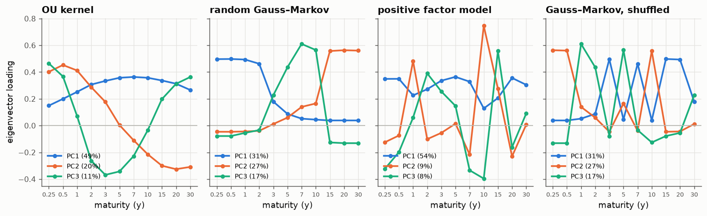
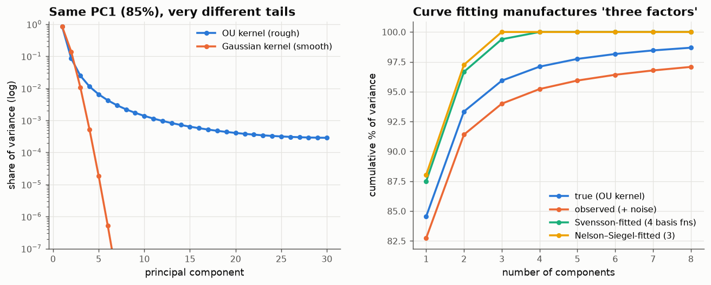

# 03 · Level, slope and curvature are a theorem

*Code: [`code/03_oscillation.py`](../code/03_oscillation.py) · output: [`figures/03_output.txt`](../figures/03_output.txt)*

Every fixed-income course shows the same picture. Run PCA on daily changes in
government yields across maturities and you get:

1. a first component that moves all maturities the same way ("level");
2. a second that moves short and long ends in opposite directions ("slope");
3. a third that moves the middle against both ends ("curvature");

and together they explain 95–99% of the variance. Litterman and Scheinkman
(1991) presented this as a finding about how interest rates move. I think most
of it is a mathematical inevitability, and it's worth separating out which parts
are theorem, which are artefact, and which are economics.

## The theorem part: total positivity

A matrix is **totally positive (TP)** if every minor (the determinant of every
square submatrix) is positive. It is **oscillatory** if it is totally
non-negative and some power of it is totally positive. The relevant theorem is
from Gantmacher and Krein's work on vibrating mechanical systems in the 1930s:

> **Theorem (Gantmacher–Krein).** An oscillatory matrix has distinct positive
> eigenvalues $\lambda_1 > \lambda_2 > \dots > \lambda_m$, and the eigenvector of
> $\lambda_k$ has **exactly $k-1$ sign changes**.

So PC1 has no sign change (level), PC2 has one (slope), PC3 has two
(curvature). The continuous version is Sturm–Liouville theory: the $k$-th mode
of a vibrating string has $k-1$ nodes. That is where the theory came from, and
it is the same picture.

When is a yield-change correlation matrix oscillatory? Here is the key
sufficient condition. Suppose that, *ordered by maturity*, yield changes behave
like a **Markov chain in maturity**: given the 5-year change, the 7-year change
tells you nothing more about the 10-year change. Then the covariance matrix is
a "Green's matrix", the inverse of a tridiagonal matrix with negative
off-diagonals, and such matrices are oscillatory when correlations are
positive. Kernels like $e^{-|x-y|/\ell}$ (an OU process in maturity) and
$e^{-(x-y)^2/2\ell^2}$ (a heat kernel) are totally positive too. Informally:
**any correlation structure that decays smoothly and positively with distance
in maturity** produces the three textbook shapes.

## Testing it

I generated 3,000 random correlation matrices over 11 maturities
(3 months to 30 years) from five families, and counted sign changes in the
top three eigenvectors:

| family | PC1: 0 changes | PC2: 1 change | PC3: 2 changes | all three | all 2×2 minors ≥ 0 |
|---|---|---|---|---|---|
| OU kernel in log-maturity (random length scale) | 100% | 100% | 100% | **100%** | 100% |
| Gaussian kernel in log-maturity | 100% | 100% | 100% | **100%** | 100% |
| random Gauss–Markov chain along maturity | 100% | 100% | 100% | **100%** | 100% |
| positive-loading factor model, no ordering | 100% | 0.5% | 3.9% | **0.1%** | 0% |
| Gauss–Markov with maturities shuffled | 100% | 0.3% | 3.0% | **0.0%** | 0% |

The last two rows are the controls.

**Row 4:** every correlation is positive but there is no structure along
maturity. PC1 is still all-positive, but that is a *different* theorem,
Perron–Frobenius: a matrix with positive entries has a positive leading
eigenvector. The "market mode" in stock correlation matrices, where every stock
loads with the same sign, is Perron–Frobenius. It says nothing about the
economy beyond "correlations are positive". Slope and curvature don't appear.

**Row 5:** the same matrices as row 3, with the maturity labels shuffled. The
eigen*values* are unchanged, because a permutation doesn't change the spectrum.
But the shapes disappear. **The level/slope/curvature shapes are entirely a
property of the maturity ordering.** The data only have to say "nearby
maturities are more correlated than distant ones".

One subtlety the random Gauss–Markov example shows: "level" doesn't have to be
flat. The theorem guarantees no sign changes, not equal loadings. PC1 is flat
only when correlations are uniformly high. Its *tilt* (whether the short end or
the long end moves more) is genuine information.

## The artefact part: why "three factors explain 99%"

The theorem fixes the *shapes*. It says nothing about *how much variance* each
component carries. That is set by the **smoothness** of the correlation kernel.
Karhunen–Loève eigenvalues decay polynomially for rough kernels (like $k^{-2}$
for the OU kernel, which has a kink at the diagonal) and faster than
exponentially for analytic kernels (the Gaussian).

I calibrated both kernels so PC1 explains exactly 85%, over 30 maturities:

| | PC1 | top 3 |
|---|---|---|
| OU (rough) kernel | 85% | 96.0% |
| Gaussian (smooth) kernel | 85% | 99.95% |

Same level factor, but the smooth kernel leaves almost nothing for PC4 onward.
So "three factors explain 99%" is a claim about the smoothness of the
cross-maturity correlation. That brings up something awkward about where
yields come from.

**Yield curves are not observed; they are fitted.** Central banks and data
vendors build them by fitting smooth functions to bond prices: Nelson–Siegel,
Svensson, smoothing splines. Nelson–Siegel's three basis functions *are* a
level, a slope and a curvature. I simulated "true" yield changes with a rough OU
kernel, added measurement noise, and then fitted each day's curve the way
vendors do:

| data | PC1 | top 3 |
|---|---|---|
| true changes (rough kernel) | 84.5% | 95.9% |
| observed with noise | 82.7% | 94.0% |
| after Svensson fit (4 basis functions) | 87.5% | **99.4%** |
| after Nelson–Siegel fit (3 basis functions) | 88.0% | **100%** |

Curve fitting raises the variance explained by three factors from 94% to 99+%,
and it does so by suppressing the higher components the true process has.
If you run PCA on a Nelson–Siegel-fitted curve, you get back the Nelson–Siegel
basis.

There is a second smoothing step built into yields themselves. A zero-coupon
yield is an *average* of instantaneous forward rates,
$y(\tau) = \frac1\tau\int_0^\tau f(u)\,du$, and averaging is integration, which
smooths the kernel. Lekkos (2000) made the related empirical point that forward
rates show a much less tidy factor structure than yields. In this framework
that is what you'd expect: integrating a rough kernel speeds up the decay of
its spectrum.

(I haven't seen the Gantmacher–Krein explanation of the shapes set alongside
the smoothing explanation of the percentages. Either may well be in the
literature somewhere; the combination is what I find clarifying.)

## What is left for economics?

After removing the theorem and the artefact, the following still carry
information:

- **The correlation length.** How fast correlation decays with maturity
  distance, i.e. how tightly the short end is linked to the long end. This is
  the monetary-policy-transmission question, and it changes over time (for
  example, near the zero lower bound the short end is pinned and decouples).
- **The tilt of PC1.** Whether "level" moves the long end more or less than the
  short end.
- **Departures from total positivity.** If a correlation matrix measured on raw,
  unsmoothed quotes had a PC2 with *two* sign changes, that would be real
  information: some segment of the curve moves independently (a supply shock at
  one maturity, say, or a preferred-habitat segment). The theorem gives a clean
  null to test against: **count the sign changes**.
- **Non-stationarity**: how any of the above changes across regimes.

## The general lesson

A pattern that shows up in every market and every period should make you look
for a theorem before you look for an economic mechanism. Two of the most
commonly cited "stylised facts" of multivariate finance are really:

- the market mode → **Perron–Frobenius** (positive matrix → positive leading
  eigenvector);
- level/slope/curvature → **Gantmacher–Krein** (oscillatory matrix → $k-1$ sign
  changes).

The same reasoning should apply to any market with a natural ordering:
commodity futures curves, implied-volatility term structures, the strike
dimension of a volatility smile, even the sequence of lags in an
autocorrelation function. In all of them expect to "find" level, slope and
curvature.
