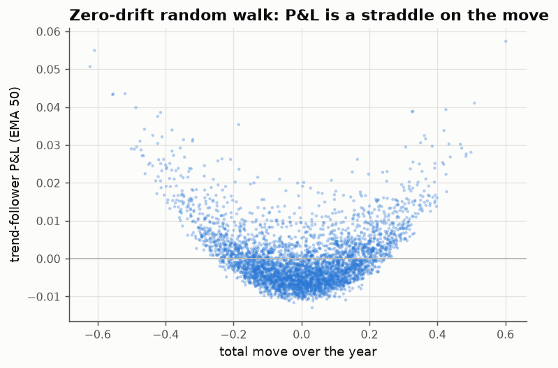
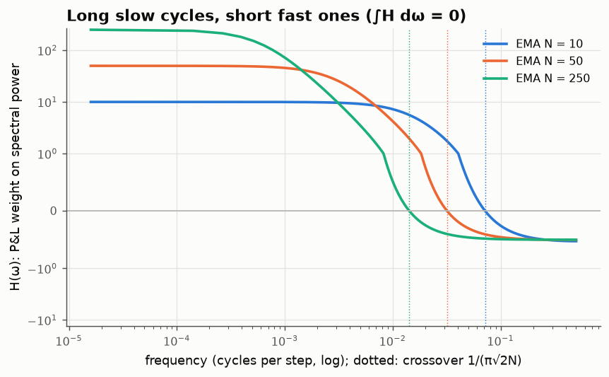
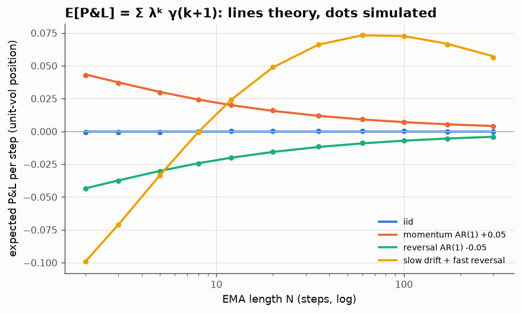
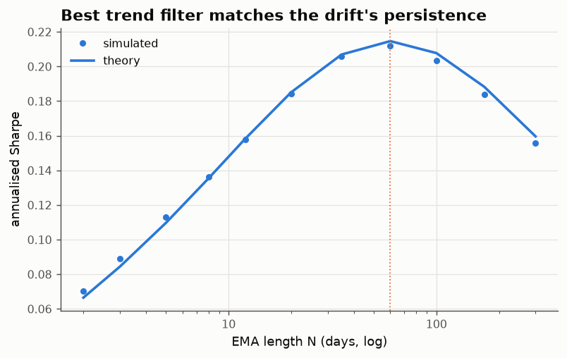

# 04 · Trend following is the discrete Itô formula

*Code: [`code/04_trend_ito.py`](../code/04_trend_ito.py) · output: [`figures/04_output.txt`](../figures/04_output.txt)*

Note 02 found that rebalancing is short a straddle on relative prices. This note
is about the opposite strategy, trend following. The main object is an identity
you get by summation by parts, which is also exactly the discrete form of
Itô's formula.

## The identity

Let $S_t$ be a price, $r_{t+1} = S_{t+1} - S_t$, and hold a position equal to
the cumulative move so far, $\theta_t = S_t - S_0$. This is the simplest trend
follower: the more the price has risen, the longer you are. Its P&L is

$$\sum_{t=0}^{T-1} (S_t - S_0)\,(S_{t+1} - S_t) \;=\; \tfrac12\Big[(S_T - S_0)^2 \;-\; \sum_{t} r_{t+1}^2\Big].$$

(Proof: expand $(S_{t+1}-S_0)^2 - (S_t - S_0)^2$ and telescope.) In continuous
time this is $\int_0^T (S_t - S_0)\,dS_t = \tfrac12[(S_T-S_0)^2 - \langle S\rangle_T]$,
which is Itô's formula applied to $x^2$. The discrete version is *exact*. It is
a statement about every path, and holds to $10^{-12}$ on fat-tailed simulated
paths.

Read as a trade, it says:

> **A trend follower is long the squared long-horizon move and short the sum of
> squared short-horizon moves.** It is a bet that variance measured over the
> long horizon exceeds variance measured step by step: a bet on the **variance
> ratio** being above 1.

For a random walk the two terms cancel in expectation and the strategy earns
nothing on average. It still has a very definite *shape*: a parabola in the
total move, minus a premium. That is a long straddle.

On a driftless random walk, the P&L of an EMA-50 trend follower over a year
correlates 0.77 with the squared total move. This is the mathematical content of
"crisis alpha": trend followers make money in large moves in either direction
(2008, 2022) because they are structurally long convexity. They pay for it in
quiet, choppy markets, like any option buyer.

## The general linear trend follower

Real trend followers use smoothed signals. Take an exponential moving average of
returns, $m_t = \lambda m_{t-1} + r_t$, and hold $m_t$. Squaring the recursion
gives $m_{t+1}^2 = \lambda^2 m_t^2 + 2\lambda m_t r_{t+1} + r_{t+1}^2$, so

$$\boxed{\;\text{P\&L} = \frac{1}{2\lambda}\sum_t\Big[(1-\lambda^2)\,m_t^2 \;-\; r_t^2\Big] + \text{boundary terms}\;}$$

Same structure again. $(1-\lambda^2)m_t^2$ is a **long-horizon variance
estimate**: for i.i.d. returns its expectation is exactly $\sigma^2$. The
subtracted $r_t^2$ is the one-step variance. The EMA trend follower is running
a variance-ratio test with an exponential kernel, and its P&L is the test
statistic.

## The frequency-domain view

Taking expectations, $\mathbb E[\text{P\&L per step}] = \sum_{k\ge0}\lambda^k\gamma(k+1)$,
where $\gamma$ is the autocovariance of returns. Writing this in terms of the
return spectrum $S(\omega)$:

$$\mathbb E[\text{P\&L}] = \frac{1}{\pi}\int_0^\pi H(\omega)\,S(\omega)\,d\omega,\qquad H(\omega) = \frac{\cos\omega - \lambda}{1 - 2\lambda\cos\omega + \lambda^2}.$$

Three facts about $H$:

1. $\int_0^\pi H\,d\omega = 0$. White noise (a flat spectrum) earns exactly
   nothing.
2. $H > 0$ at low frequencies and $H<0$ at high frequencies. The trend follower
   is long slow cycles and **short fast ones**.
3. The crossover is at $\cos\omega_c = \lambda$. For an $N$-step EMA
   ($\lambda = 1-1/N$) the crossover *period* is
   $$T_c = \frac{2\pi}{\arccos(1-1/N)} \approx \pi\sqrt{2N}.$$

The third fact surprised me. The dividing line between the cycles a trend
follower profits from and the cycles it pays for is **not at the lookback
$N$**. It is at $\pi\sqrt{2N}$, which is much shorter:

| EMA lookback N | crossover period |
|---|---|
| 10 days | 14 days |
| 50 days | 31 days |
| 250 days | 70 days |

A one-year EMA trend follower profits from any oscillation slower than about
three months, though it collects most of its weight from the very slow ones.

## Checking E[P&L] in four worlds

Autocorrelation structures, all with unit-variance positions:

- **i.i.d.:** zero at every lookback.
- **AR(1) momentum (+0.05):** positive, largest at short lookbacks.
- **AR(1) reversal (−0.05):** the mirror image.
- **slow drift + fast reversal:** the realistic case, with a persistent random
  drift plus a small negative lag-1 autocorrelation (bid–ask bounce,
  overreaction). Short lookbacks *lose* because they are short the fast
  reversal. Long lookbacks win. The sign flips near $N \approx 8$ and the
  optimum is around $N\approx 60$.

Simulated dots sit on the theory lines. The fourth panel is the practical
message: choosing a trend lookback amounts to choosing which part of the return
spectrum to be long.

## The optimal filter matches the drift

Suppose returns are a hidden drift plus noise, $r_t = \mu_t + \varepsilon_t$,
where $\mu_t$ is AR(1) with persistence $\rho$ (a drift that lasts about
$\tau = 1/(1-\rho)$ steps) and signal-to-noise ratio $\mathrm{SNR} = \mathrm{sd}(\mu)/\mathrm{sd}(\varepsilon)$.
Then $\gamma(k) = \mathrm{Var}(\mu)\rho^k$, so $\mathbb E[\text{P\&L}] = \mathrm{Var}(\mu)\,\rho/(1-\lambda\rho)$,
and for weak signals the P&L standard deviation is about $\sigma^2/\sqrt{1-\lambda^2}$. Hence

$$\text{Sharpe}(\lambda) \approx \mathrm{SNR}^2\,\frac{\rho\sqrt{1-\lambda^2}}{1-\lambda\rho}.$$

Differentiating, the maximum is at **$\lambda^* = \rho$**. The best EMA has the
same decay as the drift it is trying to track. (This is what a Kalman filter
would do in the weak-signal limit.) The maximum Sharpe is

$$\text{Sharpe}^* = \mathrm{SNR}^2\,\frac{\rho}{\sqrt{1-\rho^2}} \approx \mathrm{SNR}^2\sqrt{\tau/2}.$$

The simulation (SNR = 0.05 daily, τ = 60 days) peaks at N = 60 with an
annualised Sharpe of 0.212, against a theoretical 0.215.

The formula explains why trend following is a *diversification* business. The
Sharpe per market grows only like $\sqrt\tau$ in the persistence of trends and
like $\mathrm{SNR}^2$ in their strength. With realistic numbers (a drift that
varies by about 10%/yr on a 16%-vol asset, lasting about a year) you get a
per-market Sharpe of about 0.28. Getting to a portfolio Sharpe of 1 takes
roughly a dozen uncorrelated markets. That is what managed-futures funds
actually do.

## The mirror: rebalancing

Now take two assets with log price ratio $L$. Note 02 found that a 50/50
rebalanced portfolio outperforms buy-and-hold by
$\tfrac18\sum(\Delta L)^2 - \log\cosh(L_T/2) \approx \tfrac18\big[\sum (\Delta L)^2 - L_T^2\big]$.
Compare that with the trend identity applied to $L$:

$$\text{rebalanced} - \text{buy\&hold} \;\approx\; -\tfrac14\times\text{(trend-follower P\&L on } L).$$

Numerically, on one 2,000-step path: +0.0954 and +0.0954.

So **rebalancing and trend following are the same quadratic form with opposite
signs**. One is long short-horizon variance and short long-horizon variance;
the other is the reverse. The variance ratio of the market decides which one
wins. When a rebalancer sells the winner and buys the loser, the trend follower
is plausibly the one on the other side.

This also answers the question left over from note 02: *why* does rebalancing
win in a pure random walk if the variance ratio is exactly 1? In **arithmetic**
P&L it doesn't, since both strategies have zero expected value. The
rebalancer's edge shows up only in **log** (geometric) terms, where the
concavity of log turns a zero-mean straddle position into a growth-rate
difference. What looks like a free lunch comes from the choice of measuring
stick.

## Summary

- Trend-follower P&L $= \tfrac12[\text{long-horizon move}^2 - \sum \text{short moves}^2]$,
  exactly. It is a variance-ratio bet and a long straddle.
- An EMA trend follower is a spectral filter that is long cycles slower than
  $\pi\sqrt{2N}$ and short faster ones, with the two areas exactly balanced.
- The optimal EMA decay equals the persistence of the drift, and the
  Sharpe $\approx \mathrm{SNR}^2\sqrt{\tau/2}$ per market.
- Rebalancing is the same trade with the opposite sign.

## Loose ends

- Real CTAs use nonlinear signals ($\operatorname{sign}(m_t)$, capped
  z-scores). For Gaussian signals $\mathbb E[\operatorname{sign}(m)\,r] = \sqrt{2/\pi}\,\mathbb E[m r]/\mathrm{sd}(m)$,
  so the spectral picture carries over in expectation, but the convexity is
  different. A sign rule is less convex (its payoff grows like $|S_T - S_0|$,
  not the square), which might explain why "crisis alpha" is weaker in
  practice than the linear theory suggests. Worth quantifying.
- Volatility targeting (dividing positions by recent realised vol) interacts
  with the $-\sum r_t^2$ term. It shrinks exactly the short-horizon variance
  the strategy is short. My guess is that this is a large part of why
  vol-scaled trend following works better than unscaled, beyond the usual
  "equalises risk" story.
