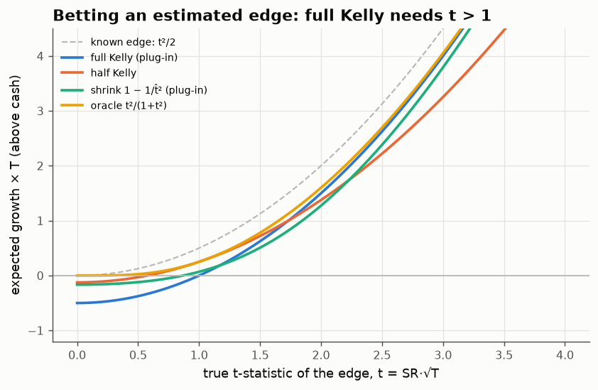
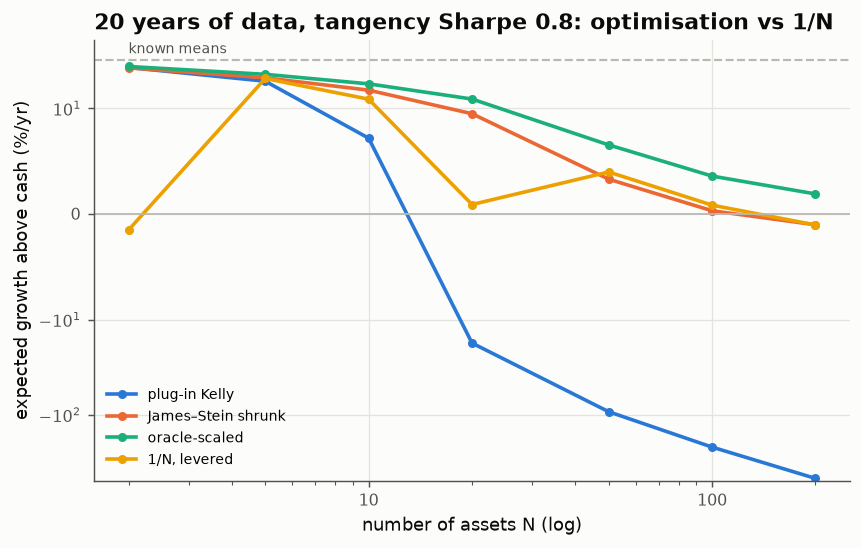
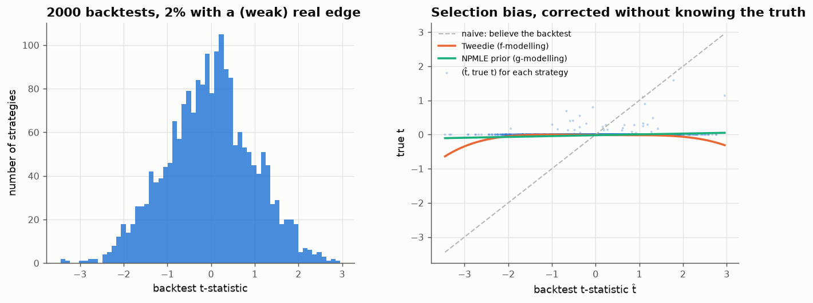

# 05 · Kelly with an estimated edge

*Code: [`code/05_kelly_estimation.py`](../code/05_kelly_estimation.py) · output: [`figures/05_output.txt`](../figures/05_output.txt)*

The Kelly criterion says to bet $f^* = \mu/\sigma^2$, which maximises the
long-run growth rate $g(f) = f\mu - \tfrac12 f^2\sigma^2$ at
$g^* = \tfrac12\mathrm{SR}^2$. Practitioners then almost always say to bet
*half* of that "because you don't really know $\mu$". I want to know what the
right fraction actually is, where it comes from, and whether "half" has any
justification.

## One asset

Suppose $\sigma$ is known (volatility is estimated far more precisely than the
mean) and $\mu$ is estimated from $T$ years of data, $\hat\mu \sim \mathcal N(\mu, \sigma^2/T)$.
Bet a fraction $k$ of plug-in Kelly, $f = k\hat\mu/\sigma^2$, and take the
expected future growth over the sampling distribution of $\hat\mu$:

$$\mathbb E[g]\cdot T \;=\; k\,t^2 - \tfrac12 k^2\,(t^2 + 1),\qquad t = \mathrm{SR}\sqrt T.$$

The whole problem depends on a single number: $t$, the **true t-statistic of
the edge**. Reading off the answers:

- **Full Kelly** ($k=1$): $\tfrac12(t^2-1)$. **Plug-in Kelly has positive
  expected growth only if the true t-statistic exceeds 1.** Below that, betting
  your estimate loses money in expectation, even though the edge is real.
- **Half Kelly**: $\tfrac18(3t^2-1)$, positive once $t > 0.58$.
- **Optimal fraction**: $k^* = \dfrac{t^2}{1+t^2}$.

So **half Kelly is exactly optimal when $t = 1$**, which gives the folk rule a
precise meaning: it is right for an edge that is one standard error from zero.
Some reference points:

| edge | t | optimal fraction of Kelly |
|---|---|---|
| a Sharpe-0.5 strategy with 10 years of data | 1.6 | 0.71 |
| a Sharpe-0.3 trend follower with 20 years | 1.3 | 0.64 |
| the equity premium, Sharpe ≈ 0.4 over 100 years | 4.0 | 0.94 |
| a Sharpe-2 HFT strategy with 3 years | 3.5 | 0.92 |

Here is a fact I think is under-appreciated. Because growth is **linear in
$\mu$**, uncertainty about $\mu$ doesn't reduce the optimal bet through any
"extra variance". A Bayesian with posterior mean $\mathbb E[\mu\mid\text{data}]$
should bet exactly $\mathbb E[\mu\mid\text{data}]/\sigma^2$. **Fractional Kelly
is shrinkage of the mean, nothing more.** The factor $t^2/(1+t^2)$ is the
posterior-mean shrinkage under a Gaussian prior whose scale matches the true
edge.

That raises the obvious move: since the optimal $k$ depends on the unknown
$t$, estimate $t$ and plug it in. The natural estimate is $k = 1 - 1/\hat t^2$
(using $\mathbb E\hat t^2 = t^2 + 1$). The green curve shows it **does worse than
plain half Kelly over most of the useful range**, and at high $t$ worse even than
full Kelly. The shrinkage factor is itself too noisy. This is Stein's paradox
in reverse. James–Stein shrinkage beats the naive estimate only in **three or
more dimensions**. With one strategy and no outside information, you can't
estimate how much to shrink. To shrink well you need other data.

## Many assets: where James–Stein does work

With $N$ assets, known covariance $\Sigma$ and estimated means
$\hat\mu\sim\mathcal N(\mu,\Sigma/T)$, the same calculation for plug-in Kelly
$f = \Sigma^{-1}\hat\mu$ gives

$$\mathbb E[g] = \tfrac12\Big(\mathrm{SR}^2_{\rm tan} - \frac{N}{T}\Big),$$

where $\mathrm{SR}_{\rm tan}$ is the Sharpe ratio of the true tangency
portfolio. The condition for plug-in mean–variance to beat cash is

$$\mathrm{SR}_{\rm tan}^2\,T \;>\; N:$$

the total information (squared Sharpe × years) must exceed the **number of
parameters** being estimated. The optimal scalar shrinkage is
$k^* = \mathrm{SR}^2T/(\mathrm{SR}^2T + N)$. With 100 assets, a tangency Sharpe
of 0.8 and 20 years of data, $k^* = 0.11$: you should bet a ninth of plug-in
Kelly.

This also accounts for the famous "1/N puzzle" (DeMiguel, Garlappi & Uppal,
2009: naive equal weighting beats optimised portfolios out of sample). For
optimisation to beat a levered 1/N portfolio you need
$\tfrac12(\mathrm{SR}_{\rm tan}^2 - N/T) > \tfrac12\mathrm{SR}_{1/N}^2$, i.e.

$$T > \frac{N}{\mathrm{SR}_{\rm tan}^2 - \mathrm{SR}_{1/N}^2}.$$

With 25 assets, a tangency Sharpe of 0.5 and a 1/N Sharpe of 0.4, that is
$T > 25/0.09 \approx 280$ years. DeMiguel et al. estimated about 3,000 months
(250 years) for 25 assets by a much longer route. This one-liner gets the same
order of magnitude.

In $N\ge3$ dimensions James–Stein works as advertised:
$f = (1 - \tfrac{N-2}{T\,\hat\mu^\top\Sigma^{-1}\hat\mu})_+\,\Sigma^{-1}\hat\mu$.

| N | plug-in Kelly (theory) | James–Stein | oracle-scaled |
|---|---|---|---|
| 5 | +19.4% (19.5) | +21.0% | +22.9% |
| 20 | −17.6% (−18.0) | +9.5% | +12.6% |
| 100 | −219% (−218) | +0.3% | +3.6% |
| 200 | −467% (−468) | −1.0% | +1.9% |

Plug-in optimisation doesn't just underperform; it falls off a cliff exactly
where $N/T$ passes $\mathrm{SR}^2$. James–Stein removes the cliff. (The levered
1/N line depends on how good equal weighting happens to be in each random
universe, so it is noisier.)

## The real problem: you picked the best backtest

Estimation noise is the textbook problem. In practice the bigger one is
**selection**. A research process tests $M$ strategies and bets on the one with
the best backtest. For pure noise the best of 2,000 t-statistics is about 3.4,
which looks like an outstanding strategy. Its true t is zero.

I simulated a research shop testing $M = 2{,}000$ strategies with 10-year
backtests in three worlds, betting Kelly on the winner, 300 times each.

| method (growth × T) | no real edges | 2% weak edges | 5% strong edges |
|---|---|---|---|
| best backtest's t̂ → true t | 3.45 → 0.00 | 3.57 → 0.45 | 7.06 → 6.24 |
| naive full Kelly | **−6.02** | **−4.71** | +20.76 |
| half Kelly | −1.50 | −0.74 | +16.98 |
| single-strategy shrink $1-1/\hat t^2$ | −5.06 | −3.86 | +20.87 |
| Tweedie's formula (Lindsey fit) | −1.35 | −1.38 | +16.11 |
| **empirical Bayes (NPMLE prior)** | **−0.39** | **−0.19** | **+20.96** |
| oracle (knows true t) | 0.00 | +0.58 | +21.56 |

The idea behind the last two methods: **the other 1,999 backtests tell you how
much to shrink the winner.** If the cross-section of t-statistics looks like a
standard normal, nothing is real and the posterior mean of the winner is about
zero. If there is a fat right tail, some edges are real and less shrinkage is
needed. Two ways to turn that into a number:

- **Tweedie's formula** (Robbins; Efron 2011): $\mathbb E[t\mid\hat t] = \hat t + \frac{d}{d\hat t}\log f(\hat t)$,
  where $f$ is the density of all observed t-statistics. You don't need a prior,
  only a density estimate. Unfortunately that estimate is worst in the extreme
  tail, which is exactly where the winner sits.
- **Nonparametric maximum likelihood** (Kiefer–Wolfowitz): estimate the *prior*
  on true $t$ directly, as a discrete distribution on a grid fitted by EM, then
  compute the posterior mean. It is far more stable in the tail.

NPMLE is the best practical method in all three worlds. It shrinks the winner
almost to zero when nothing is real and hardly at all when edges are strong.
Half Kelly is a crude compromise: much better than full Kelly when edges are
fake, and it gives up 18% of growth when they are real. Single-strategy
shrinkage is close to useless under selection, because it treats a t̂ of 3.45
as genuine evidence.

## What I take from this

1. **Fractional Kelly is Bayesian shrinkage of the mean.** Under log utility,
   parameter uncertainty has no separate variance penalty.
2. The optimal fraction is $t^2/(1+t^2)$ for one asset and
   $\mathrm{SR}^2T/(\mathrm{SR}^2T+N)$ for $N$ assets. Half Kelly corresponds to
   $t = 1$.
3. You can't estimate your own shrinkage from one strategy (Stein needs three
   dimensions). You *can* estimate it from the cross-section of everything you
   tried.
4. So **the right bet size is a property of the research process, not of the
   strategy.** Two shops holding the identical backtest should bet different
   amounts if one found it on the first try and the other after 2,000 attempts.
   Logging every backtest, including the failures, is necessary for sizing
   correctly, not just good hygiene.

## Loose ends

- In reality the $M$ backtests are correlated (variations on a theme). The
  effective $M$ is smaller, and the NPMLE deconvolution assumes independence.
  How badly does correlation break it?
- The covariance also has to be estimated. By random matrix theory the
  out-of-sample variance of the plug-in portfolio is inflated by about
  $1/(1-N/T)$ (for $T$ observations), which compounds the mean problem. Worth
  its own note.
