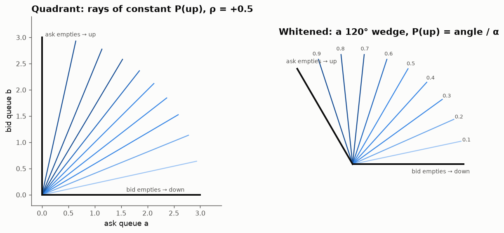
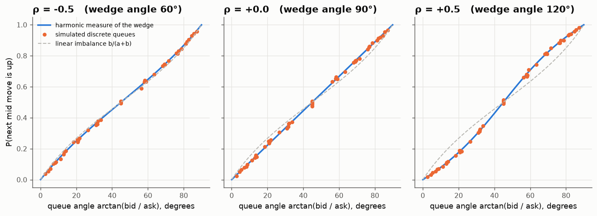
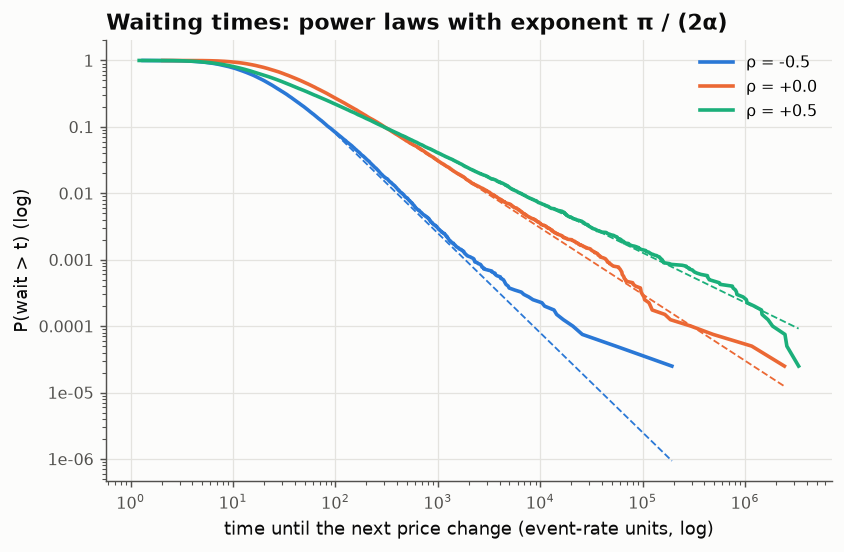
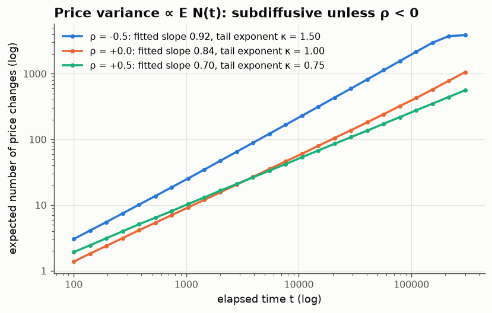

# 06 · The next tick is a harmonic measure

*Code: [`code/06_queue_wedge.py`](../code/06_queue_wedge.py) · output: [`figures/06_output.txt`](../figures/06_output.txt)*

In a limit order book, the best bid has a queue of $b$ shares waiting to buy and
the best ask has a queue of $a$ shares waiting to sell. Orders arrive, cancel
and get executed, so both queues fluctuate. When the **ask queue empties
first**, the best ask moves up a tick and the mid-price rises. When the **bid
queue empties first**, it falls. For a large-tick stock (where queues are long
relative to the tick size) this race is essentially the whole short-term price
process.

The practitioner's rule of thumb is that the imbalance $b/(a+b)$ predicts the
next move. I want the actual function, and I want to know what it says about
waiting times.

## The race is a harmonic function

Model $(a, b)$ as a two-dimensional Brownian motion in the positive quadrant,
started at the current queue sizes. Let

$$u(a,b) = \Pr(\text{ask axis } \{a=0\} \text{ hit before bid axis } \{b=0\}).$$

Then $u$ is **harmonic** ($\Delta u = 0$) inside the quadrant, equals 1 on the
$b$-axis (ask empty, so up) and 0 on the $a$-axis (bid empty, so down). This
is the **harmonic measure** of the part of the boundary that means "up".

For independent queues this is quick with a conformal map. The angle
$\theta = \arg(a + ib)$ is harmonic (it is the imaginary part of the analytic
function $\log z$), it is $0$ on one axis and $\pi/2$ on the other, so

$$\Pr(\text{up}) = \frac{2}{\pi}\arctan\frac{b}{a}.$$

## Correlated queues: the quadrant becomes a wedge

Real queues are correlated. A burst of activity can add to (or cancel from)
both sides at once, which gives $\rho>0$. Orders can migrate from one side to
the other, which gives $\rho<0$. With correlation $\rho$ the process is no
longer isotropic. So apply the linear map $\Sigma^{-1/2}$ that makes it a
standard Brownian motion. That map sends the quadrant to a **wedge** with
opening angle

$$\alpha = \arccos(-\rho)$$

(the angle between the images of the two axes under the inner product
$\Sigma^{-1}$). In the wedge, harmonic measure is again angle divided by
opening angle. Pulling back:

$$\boxed{\;\Pr(\text{up}\mid a,b) = \frac{\psi}{\alpha},\qquad \cos\psi = \frac{a-\rho b}{\sqrt{a^2 - 2\rho ab + b^2}}\;}$$

(This formula is essentially the one in Avellaneda, Reed & Stoikov (2011),
written there as $\tfrac12 + \arctan\!\big(k\frac{b-a}{b+a}\big)/(2\arctan k)$
with $k = \sqrt{(1+\rho)/(1-\rho)}$. I checked numerically that the two agree to
$10^{-14}$. The wedge picture is the easiest way I know to see where it comes
from.)

Two consequences follow straight from the geometry:

1. **Only the ratio $b/a$ matters.** The level sets of $\Pr(\text{up})$ are
   rays through the origin, so queues of $(5, 20)$ and $(50, 200)$ carry the
   same signal. The linear imbalance $b/(a+b)$ is also a function of the ratio
   alone, but it has the wrong shape.
2. **Correlation bends the curve.** For $\rho > 0$ the wedge is wider than
   90°, and $\Pr(\text{up})$ is an S-curve steeper than linear imbalance in the
   middle. For $\rho < 0$ it is flatter. Knowing $\rho$ tells you how much to
   trust a given imbalance.

## Checking with discrete queues

The diffusion is an idealisation. Real queues move in whole orders and can be
as small as 1. So I simulated integer queues: unit-rate $\pm1$ moves on each
side, plus correlated events at a rate chosen to give $\rho \in \{-0.5, 0, 0.5\}$.
I ran 3,000 races from each of 49 starting pairs $(a,b)\in\{1,2,3,5,8,13,21\}^2$:

The largest discrepancy over the 49 pairs is 0.02–0.026 for every $\rho$.
Even queues of one or two orders follow the continuum formula closely
(for example $(1,3)$ at $\rho=0.5$: simulated 0.841, theory 0.841).

A bug worth recording: my first run showed $\Pr(\text{up}\mid 1,1) = 0.60$ at
$\rho = 0.5$ in a symmetric model. The cause was a correlated $(-1,-1)$ event
emptying *both* queues at once, and my code always checked the ask first. With
ties broken by a coin flip it is 0.500. In a real book simultaneous depletion
happens (for example a large order sweeping one side while cancellations
empty the other), and how the exchange resolves it matters for exactly the
smallest queues.

## Waiting times: the wedge also sets a power law

The same geometry answers a second question: **how long until the next price
change?** For planar Brownian motion in a wedge of angle $\alpha$ there is a
classical result (Spitzer 1958; Burkholder 1977): the exit time has a power-law
tail

$$\Pr(\tau > t) \sim C\,t^{-\pi/(2\alpha)},$$

and $\mathbb E[\tau^p] < \infty$ exactly when $p < \pi/(2\alpha)$. The exponent
comes from the wedge's first Dirichlet eigenfunction
$r^{\pi/\alpha}\sin(\pi\theta/\alpha)$. Putting in $\alpha = \arccos(-\rho)$:

| queue correlation ρ | wedge α | tail exponent π/(2α) | mean waiting time |
|---|---|---|---|
| −0.5 | 60° | 1.5 | finite |
| 0 | 90° | 1.0 | **infinite** (log-divergent) |
| +0.5 | 120° | 0.75 | **infinite** |

The simulated tails, with Hill estimates on the top 2%, give 1.43, 0.94 and
0.74 against theory values of 1.5, 1.0 and 0.75. For $\rho<0$ the mean is
finite. Solving $\tfrac12\Delta u = -1$ in the wedge gives the closed form

$$\mathbb E[\tau] = \frac{r^2}{2}\left(\frac{\cos(2\phi - \alpha)}{\cos\alpha} - 1\right)$$

in whitened polar coordinates $(r, \phi)$. From queues of $(10,10)$ at
$\rho=-0.5$ this gives 50.0. The simulation gives 55.4. The difference is a
lattice effect: with a half-tick continuity correction (start at 10.5), theory
gives 55.1.

So **independent queues imply an infinite expected waiting time between price
changes.** Most of the time the price changes reasonably soon, but occasionally
both queues wander far from zero and the price freezes for a very long time.

## A consistency argument: prices can't be diffusive unless ρ < 0

Now suppose the queues regenerate after each price change, drawn fresh from
some typical size. The number of price changes $N(t)$ is then a renewal process
with heavy-tailed gaps. If the tail exponent $\kappa = \pi/(2\alpha)$ is below 1,
renewal theory gives $\mathbb E N(t) \sim t^{\kappa}$. Each price change is a
$\pm1$ tick, so the **variance of the price grows like $t^{\kappa}$: the price
is subdiffusive.**

(The fitted slopes of 0.92, 0.84 and 0.70 approach $\min(1,\kappa)$ slowly.
At $\kappa = 1$ the correction is logarithmic, $t/\log t$.)

Real prices are diffusive at horizons of minutes and longer: variance grows
linearly in time. So if the queue-race model is roughly right, something must
make the effective wedge narrower than 90°. That could be negative correlation
between the queues, or a *restoring drift*: queue sizes mean-revert because
liquidity providers refill small queues and cancel from large ones, which a
driftless Brownian motion ignores. Either way, the diffusivity of prices says
something checkable about order flow: **the two queues cannot behave like
independent random walks.** I find it satisfying that a macroscopic fact
(variance ∝ time) constrains a microscopic one (queue correlation) through the
angle of a wedge.

## Summary

- The chance that the next move is up is the harmonic measure of a wedge with
  angle $\arccos(-\rho)$. It depends only on the queue ratio and, through
  $\rho$, on how the queues co-move.
- The same wedge gives the waiting time until the next price change a power-law
  tail with exponent $\pi/(2\alpha)$. Independent or positively correlated
  queues give infinite mean waiting times.
- Diffusive prices then require negatively correlated or mean-reverting queues.

## Loose ends

- **Hidden liquidity.** Iceberg orders make the true queue larger than the
  visible one. If $\Pr(\text{up})$ is a known function of the true $(a,b)$,
  observed hit rates as a function of visible $(a,b)$ let you back out the
  hidden part. Avellaneda–Reed–Stoikov did roughly this. A nice inverse
  problem.
- **Drift.** With drift the harmonic function is replaced by the solution of
  $\tfrac12\Delta u + \mu\cdot\nabla u = 0$ in the wedge. That no longer has a
  conformal-map solution, but the Laplace transform in the angular variable
  should still give closed forms. The drift would introduce the length scale
  that the pure diffusion lacks (because of scale invariance), and with it a
  dependence on absolute queue sizes, which is presumably what makes big
  queues informative in practice.
