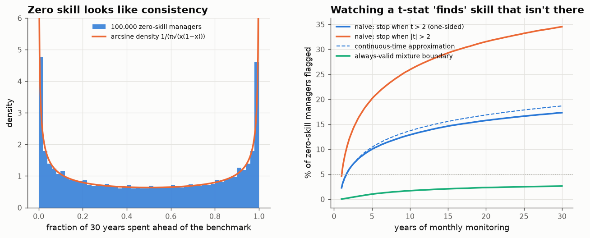
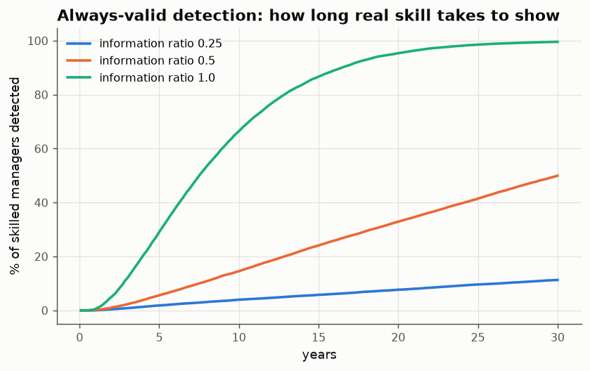

# 07 · Luck, track records, and the t-statistic you keep checking

*Code: [`code/07_luck_monitoring.py`](../code/07_luck_monitoring.py) · output: [`figures/07_output.txt`](../figures/07_output.txt)*

Note 05 dealt with selecting the best of many backtests. This note covers two
other ways that randomness passes for skill: how a zero-skill track record
*looks*, and how the way we *watch* track records changes what they prove.

Setup: a manager's monthly returns relative to the benchmark are i.i.d. with
mean zero (no skill), measured in units of tracking error. The cumulative
relative performance $S_t$ is a random walk.

## 1. Zero skill looks like consistency

What fraction of a 30-year career does a zero-skill manager spend ahead of the
benchmark? Intuition says "around half, give or take". Lévy's **arcsine law**
says the fraction $L$ has density

$$f(x) = \frac{1}{\pi\sqrt{x(1-x)}},$$

which is U-shaped. **The least likely outcome is half the time ahead. The most
likely outcomes are nearly always ahead or nearly always behind.**

Over 100,000 simulated zero-skill managers:

| statement about a zero-skill manager | simulated | arcsine theory |
|---|---|---|
| ahead >95% or <5% of the time | 28.3% | 28.7% |
| ahead >90% or <10% of the time | 40.6% | 41.0% |
| cumulatively ahead **without interruption for the last 27 of 30 years** | 11.2% | 10.2% |

The last row is the one I find most striking. In a large population of
coin-flippers, about one in ten will have a 27-year unbroken record of
cumulative outperformance. Anyone looking at such a record would call it
"consistent", and consistency is the quality allocators say they value most.

Why: a random walk that gets ahead tends to *stay* ahead, because returning to
zero needs a fluctuation as large as the lead, and the lead grows like
$\sqrt t$. Lead changes are rare. The number of zero crossings in $n$ steps is
of order $\sqrt n$, not $n$.

## 2. Sampling to a foregone conclusion

The second trap is procedural. An allocator checks the manager's t-statistic
$Z_t = S_t/\sqrt t$ every month and hires (or, symmetrically, fires) when it
crosses 2. Any one check has a 2.3% false-positive rate (one-sided). But the
allocator checks 348 times.

| monitoring monthly from year 1 | P(zero-skill manager flagged, t > 2) | two-sided, abs(t) > 2 |
|---|---|---|
| by year 3 | 7.8% | 15.6% |
| by year 10 | 12.9% | 25.9% |
| by year 30 | **17.3%** | **34.5%** |

It keeps rising. By the law of the iterated logarithm, $\limsup Z_t/\sqrt{2\log\log t} = 1$,
so *every* fixed threshold is eventually crossed with probability one. This is
Armitage's "sampling to a foregone conclusion" from clinical trials, and
performance evaluation has the same issue.

There is a tidy continuous-time approximation. The time-changed process
$U_s = W_{e^s}/e^{s/2}$ is a **stationary Ornstein–Uhlenbeck process** in
log-time. So monitoring from $t_0$ to $T$ is an OU process watched for
$\log(T/t_0)$ units of time. Pickands' asymptotics for the OU supremum give

$$\Pr(\text{flagged}) \approx 1 - \Phi(c)\,\exp\!\Big(-\log\frac{T}{t_0}\cdot\frac{c\,\varphi(c)}{2}\Big),$$

the dashed line in the figure (18.7% against 17.3% simulated; continuous
monitoring flags slightly more than monthly monitoring). The useful point is
the dependence on $\log(T/t_0)$. **The false-alarm rate depends on the ratio of
the longest to the shortest track record you're willing to judge, not on
calendar time.** Watching from year 1 to year 30 costs roughly the same as
watching from month 1 to month 30.

## 3. The fix: an always-valid boundary

Sequential analysis has had the answer since Robbins (1970). Under no skill,
for any $\lambda$, $\exp(\lambda S_t - \lambda^2 t/2)$ is a martingale.
Averaging it over a prior $\lambda\sim\mathcal N(0, 1/\rho)$ gives another
martingale,

$$M_t = \sqrt{\frac{\rho}{t+\rho}}\;\exp\!\Big(\frac{S_t^2}{2(t+\rho)}\Big),$$

and **Ville's inequality** (Doob's maximal inequality for non-negative
martingales) gives $\Pr(\sup_t M_t \ge 1/\alpha) \le \alpha$. Solving
$M_t = 1/\alpha$ for $S_t$ gives a boundary you can check **as often as you
like, for as long as you like**:

$$|S_t| \ge \sqrt{(t+\rho)\Big(\log\frac{t+\rho}{\rho} + 2\log\frac1\alpha\Big)}.$$

With $\alpha = 5\%$ and $\rho = 12$ months, the equivalent t-statistic threshold
is:

| after | 1 yr | 5 yr | 10 yr | 30 yr |
|---|---|---|---|---|
| always-valid t threshold | 3.66 | 3.06 | 3.04 | 3.12 |

The simulated false-alarm rate over 30 years of monthly checking is 2.6%,
within the 5% guarantee. (The threshold grows like $\sqrt{\log t}$, which is the
price of never having to commit to a horizon.)

A coincidence I like: Harvey, Liu & Zhu (2016) argued that new factors in
empirical finance should clear **t > 3** rather than 2, because of multiple
testing across the literature. The always-valid boundary also comes out at
about 3, for a different reason: repeated testing *over time*. Two separate
corrections, same number.

## 4. What it costs: how long real skill takes to show

| true information ratio | detected within 30 years (always-valid) | median time to detection | power of one test at year 30 |
|---|---|---|---|
| 0.25 | 11% | > 30 years | 28% |
| 0.5 | 50% | ≈ 30 years | 78% |
| 1.0 | 99.6% | 7.6 years | ≈ 100% |

An information ratio of 0.5 is an excellent active manager, top-decile by most
accounts. Watched honestly, such a manager has about even odds of
**statistically demonstrating** their skill within a 30-year career. A single
test at year 30 would do better (78%), but only by committing in advance to
looking once.

## What I take from this

- A long unbroken record of outperformance is weak evidence. Under zero skill
  about 10% of managers have one (arcsine law).
- Checking a t-statistic repeatedly inflates false positives by a factor that
  grows like $\log(T_{\max}/T_{\min})$. At usual horizons a nominal 5%
  two-sided test becomes about 35%.
- Mixture-martingale boundaries (t ≈ 3) fix this exactly, at a price: good
  managers take decades to confirm. The honest conclusion is that manager
  selection from track records alone is close to statistically impossible.
  Allocators have to rely on priors about *process*, not on outcomes. That
  echoes note 05: the bet size depends on the research process.

## Loose ends

- The mixture parameter $\rho$ sets where the boundary is tightest. A
  prior on skill (from the cross-section of all managers, as in note 05) would
  choose $\rho$ in a principled way and give an empirical-Bayes sequential test.
- Real relative returns have fat tails and volatility clustering. Ville's
  inequality needs only a supermartingale, so a self-normalised version
  (dividing by realised tracking error) should stay valid. Not checked here.
