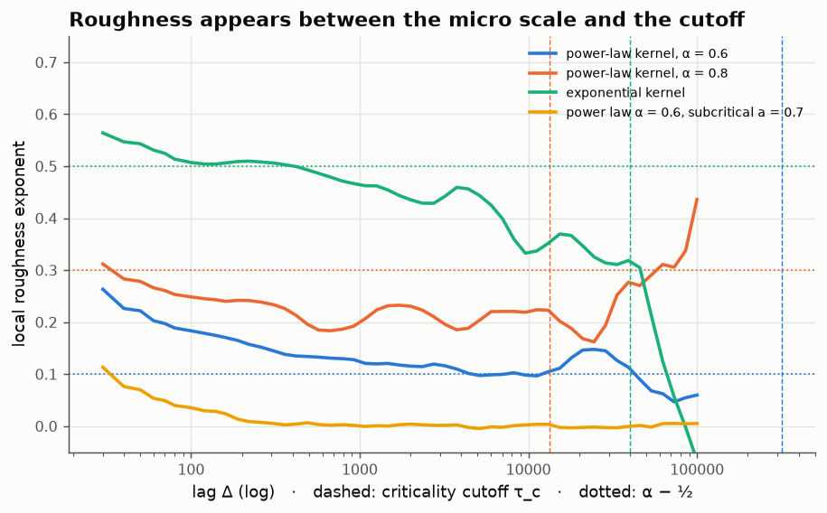
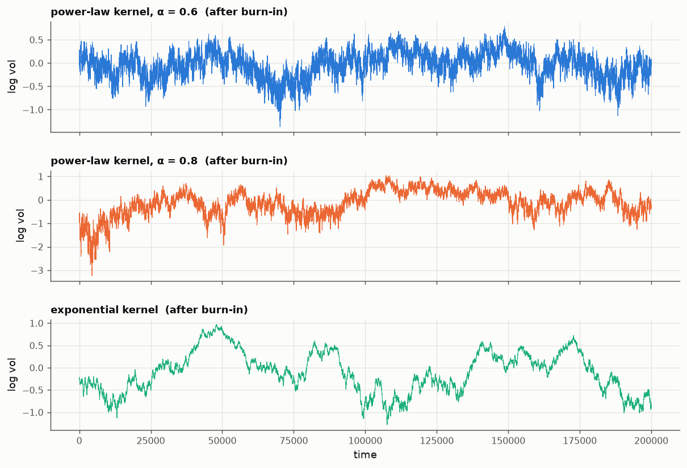

# 08 · Rough volatility from nearly critical order flow

*Code: [`code/08_rough_hawkes.py`](../code/08_rough_hawkes.py) · output: [`figures/08_output.txt`](../figures/08_output.txt)*

One of the more surprising empirical findings of the last decade: log
volatility behaves like fractional Brownian motion with Hurst exponent
$H \approx 0.1$ (Gatheral, Jaisson & Rosenbaum, 2018, "Volatility is rough").
Ordinary Brownian motion has $H = \tfrac12$. $H \approx 0.1$ means volatility
paths are far more jagged than any classical stochastic-volatility model
(Heston, SABR, GARCH diffusion limits) produces.

A fitted exponent isn't an explanation. I want to see roughness *come out of*
something about how markets work. The candidate (Jaisson & Rosenbaum, 2016; El
Euch, Fukasawa & Rosenbaum, 2018) is order flow that is **self-exciting, close
to critical, and has long memory**.

## The mechanism

Model order arrivals as a **Hawkes process**. Each order raises the future
arrival rate:

$$\lambda_t = \mu + \int_0^t \varphi(t-s)\,dN_s,\qquad \|\varphi\|_1 = a .$$

Read $a$ as the **branching ratio**: every order triggers on average $a$
"child" orders, those trigger their own children, and so on. Only a fraction
$1-a$ of activity is exogenous. Empirical Hawkes fits to high-frequency data
put $a$ close to 1 (Filimonov & Sornette; Hardiman, Bercot & Bouchaud). Most
trading is a reaction to other trading.

Two ingredients matter:

1. **Near-criticality**, $a\to1$: cascades become huge and long-lived.
2. **A heavy-tailed kernel**, $\varphi(t)\sim t^{-(1+\alpha)}$ with
   $\tfrac12<\alpha<1$: orders influence the rate for a long time
   (metaorders split over hours, reactions to reactions).

**Why this produces $H = \alpha - \tfrac12$ (heuristic).** The intensity
responds to the random part of order flow through the *resolvent*
$R = \varphi + \varphi*\varphi + \dots$, which is the total effect of an order
summed over all generations of descendants. In Laplace space
$\hat R = \hat\varphi/(1-\hat\varphi)$. A power-law tail gives
$\hat\varphi(z) \approx a\,\big(1 - \Gamma(1-\alpha)\,(cz)^\alpha\big)$ for small
$z$. At criticality ($a = 1$) that makes $1-\hat\varphi(z) \propto z^\alpha$,
and a Tauberian theorem turns $\hat R(z)\propto z^{-\alpha}$ into

$$R(t) \propto t^{\alpha - 1}.$$

The intensity is then approximately $\int R(t-s)\,dM_s$, where $M$ is the
compensated counting martingale. That is a Volterra process with kernel
$t^{\alpha-1}$, and a Volterra kernel $t^{H-1/2}$ is exactly the definition of a
rough process with Hurst index $H$. Matching exponents gives $H = \alpha - \tfrac12$.

> **The kernel of rough volatility is the critical resolvent of order flow.**

$\alpha = 0.6$ gives $H = 0.1$. For $a < 1$ the resolvent is cut off at a time
$\tau_c \sim (1-a)^{-1/\alpha}$. Beyond $\tau_c$ volatility mean-reverts, and
below it volatility looks rough.

## Simulation

Simulating a Hawkes process with a power-law kernel is slow in the naive way,
because the intensity depends on the whole history. The trick I used is that
the kernel is a Laplace mixture of exponentials,

$$(c+t)^{-(1+\alpha)} = \frac{1}{\Gamma(1+\alpha)}\int_0^\infty x^{\alpha} e^{-xc}\,e^{-xt}\,dx .$$

Discretising $x$ on a geometric grid (48 nodes from $10^{-9}$ to $10^2$) gives a
sum of exponentials that matches $\varphi$ to 0.03% for times up to $10^7$.
Each exponential is a Markov state, so Ogata thinning costs $O(48)$ per event.
With numba that is 50–100 million events in under a minute.

Four cases, each over $10^6$ time units with the first 20% discarded as
burn-in. The mean intensity is about 50–100 events per unit time, and
volatility is measured as the integrated intensity over windows of 10 units:

| case | branching ratio | theory H | measured local slope (plateau) |
|---|---|---|---|
| power-law kernel, α = 0.6 | 0.9995 | 0.10 | **0.105** (median over lags 10⁴–10⁵) |
| power-law kernel, α = 0.8 | 0.9995 | 0.30 | ≈ 0.20–0.25 (lags 10²–10⁴) |
| exponential kernel | 0.9995 | 0.50 | ≈ 0.50 (lags 10²–10³) |
| power law α = 0.6, **subcritical** | 0.7 | none | 0.00 (no structure) |

"Local slope" means the log-log slope of $\mathbb E|\log\sigma_{t+\Delta}-\log\sigma_t|$
against $\Delta$, computed in a sliding window of half a decade:

What this shows:

- **α = 0.6 lands on H = 0.1.** From about $4\times10^3$ to $10^5$ the local
  exponent stays within 0.05 of 0.1 (median 0.105). So a nearly critical Hawkes process with a
  $t^{-1.6}$ kernel produces the empirical roughness of volatility with no
  fractional Brownian motion in the model.
- **Roughness needs both ingredients.** With the same branching ratio but an
  exponential (short-memory) kernel you get the classical $H=\tfrac12$ at short
  lags, then mean reversion. With the heavy-tailed kernel but far from
  criticality ($a = 0.7$) you get no volatility dynamics at all: the intensity
  is essentially a constant plus shot noise, and log-vol increments don't grow
  with lag.
- **α = 0.8 is only partly consistent.** The exponent is below 0.3 at every lag
  I could reach. Its cutoff $\tau_c \approx 1.3\times10^4$ leaves little room
  between the micro scale and mean reversion. Pushing $a$ to 0.99995 (to move
  $\tau_c$ to $2\times10^5$) didn't fix it within my time budget, because the
  process then doesn't reach stationarity. I don't fully understand the
  shortfall. My best guess is slow convergence to the scaling limit, since the
  first correction to $1-\hat\varphi(z)\propto z^\alpha$ is of relative order
  $(cz)^{1-\alpha}$.

## A cautionary result along the way

My first run showed strongly *positively skewed* log-volatility increments in
the critical cases (+0.7 to +1.0): volatility rising in jumps and decaying
slowly, like the time-asymmetry seen in real volatility. I was ready to write
that up as "Hawkes-based rough volatility predicts time-irreversibility, which
Gaussian rough-vol models can't". **It was a burn-in artefact.** The process
starts with no history and takes several $10^4$ time units to reach its
stationary level, and that long initial climb was producing the skew. With the
first 20% discarded, skewness at lags of 10 and 1000 is roughly −0.2 to +0.1,
essentially zero. The measured roughness also moved (for α = 0.6 from about
0.13 to 0.105). Long-memory processes need long burn-ins, and their transients
can look like very convincing stylised facts.

## Why this matters

1. **It explains the number.** $H\approx0.1$ is no longer a free parameter. It
   is a property of the tail exponent of how order flow excites order flow:
   $\alpha \approx 0.6$, a response decaying like $t^{-1.6}$.
2. **It says why markets sit near criticality.** El Euch–Fukasawa–Rosenbaum
   argue that high-frequency no-arbitrage (a buy cascade can't be predictably
   profitable) together with liquidity asymmetry pushes the branching ratio
   towards 1. In that view, roughness is what efficiency looks like at the
   microstructure level.
3. **It links to note 06.** There, heavy-tailed waiting times came from the
   geometry of queue races. Here, heavy-tailed memory in order flow produces
   rough volatility. In both cases a power law at the microscopic level
   becomes a scaling law at the macroscopic level, and in both the exponent can
   be derived rather than fitted.

## Loose ends

- Real kernels aren't pure power laws. Hardiman–Bercot–Bouchaud report tails
  closer to $t^{-1-\varepsilon}$ with small $\varepsilon$, which would give
  $H<0$ in this formula, which is not allowed. So either the fits or the
  mapping need care. The regime $\alpha<\tfrac12$ gives a different limit.
- The price itself: in the El Euch–Rosenbaum construction a buy/sell pair of
  Hawkes processes with the right symmetry yields a *rough Heston* price
  process. The natural next step is to simulate the two-sided version and
  check the leverage effect.
