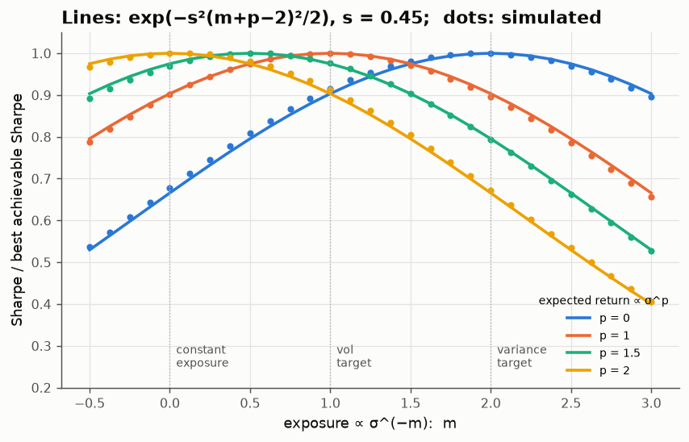
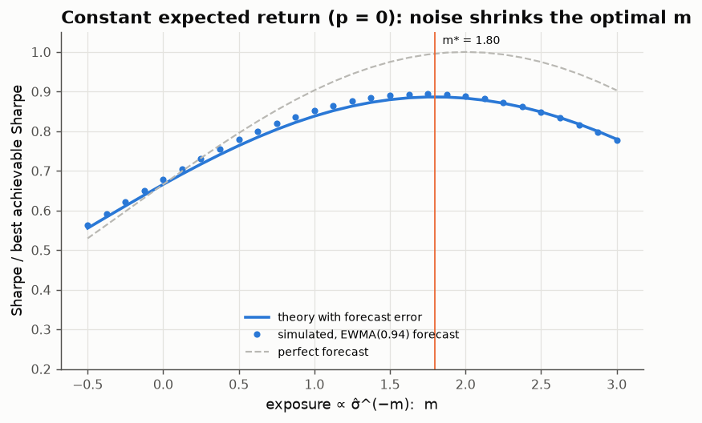

# 09 · When does volatility targeting work? The 3/2 rule

*Code: [`code/09_vol_targeting.py`](../code/09_vol_targeting.py) · output: [`figures/09_output.txt`](../figures/09_output.txt)*

Volatility targeting means cutting exposure when recent volatility is high and
raising it when volatility is low. It is one of the most widely used overlays
in practice. Moreira & Muir (2017) found that scaling the market and many
factors by inverse recent variance raised their Sharpe ratios. Cederburg et al.
(2020) found that across many strategies, out-of-sample gains mostly
disappear. I want a formula that says when it should work.

## Sharpe efficiency as a cosine

Let returns be $r_t = \mu_t + \sigma_t\varepsilon_t$, where $\mu_t$ and
$\sigma_t$ are known one step ahead. For any exposure rule $w_t$,

$$\mathrm{SR}(w) = \frac{\mathbb E[w\mu]}{\sqrt{\mathbb E[w^2\sigma^2]}} = \frac{\langle w\sigma,\; \mu/\sigma\rangle}{\|w\sigma\|}\;\le\; \|\mu/\sigma\|$$

in $L^2$, by Cauchy–Schwarz. Equality holds when $w\sigma \propto \mu/\sigma$,
i.e. $w\propto\mu/\sigma^2$, Merton's rule. So any rule's **efficiency** is the
cosine of the angle between two random variables: the **risk you take**,
$w\sigma$, and the **conditional Sharpe ratio on offer**, $\mu/\sigma$.

When both are lognormal there is a clean identity. For jointly lognormal
positive $X, Y$,

$$\frac{\mathbb E[XY]}{\sqrt{\mathbb E X^2\,\mathbb E Y^2}} = \exp\!\Big(-\tfrac12\,\mathrm{Var}\big(\log X - \log Y\big)\Big),$$

which follows by expanding the lognormal moments. So:

$$\boxed{\;\frac{\mathrm{SR}(w)}{\mathrm{SR}_{\max}} = \exp\!\Big(-\tfrac12\,\mathrm{Var}\big[\log(\text{risk taken}) - \log(\text{Sharpe on offer})\big]\Big)\;}$$

The penalty depends only on the variance of the log-mismatch between the risk
you take and the Sharpe ratio available.

## The 3/2 rule

Now parametrise. Suppose expected returns scale as a power of volatility,
$\mu_t = \kappa\sigma_t^p$ (a risk–return trade-off with exponent $p$), and
log-volatility has standard deviation $s$. The exposure rule is
$w_t = \sigma_t^{-m}$: $m=0$ is constant exposure, $m=1$ vol targeting, $m=2$
variance targeting. The log-mismatch is $(2 - p - m)\log\sigma$, so

$$\frac{\mathrm{SR}_m}{\mathrm{SR}_{\max}} = \exp\!\Big(-\tfrac{s^2}{2}\,(m + p - 2)^2\Big).$$

The optimal exponent is $m^* = 2-p$. The efficiency is Gaussian in the
distance from it, with width set by how much volatility moves. Comparing vol
targeting ($m=1$) with doing nothing ($m=0$):

$$\text{vol targeting wins} \iff (p-1)^2 < (p-2)^2 \iff \boxed{p < \tfrac32}.$$

The simulation (4 million days of lognormal AR(1) volatility with $s = 0.45$)
lies on the curves:

| risk–return exponent p | vol-target / constant: theory | simulated |
|---|---|---|
| 0 (expected return doesn't move with vol) | 1.357 | 1.349 |
| 1 (constant conditional Sharpe) | 1.107 | 1.110 |
| 1.5 | 1.000 | 1.007 |
| 2 (expected return ∝ variance, the ICAPM benchmark) | 0.903 | 0.912 |

So the empirical success of volatility management is a statement about $p$.
Moreira–Muir's result is equivalent to saying that at monthly horizons expected
returns rise *less than* $\sigma^{3/2}$ when volatility rises. The textbook
Merton (1980) relation $\mu\propto\sigma^2$ says volatility management should
*hurt*. One number ($p$) separates the two views, and the break-even point
($3/2$) is not where intuition would put it. You might guess $p=1$ (constant
Sharpe), but at $p=1$ vol targeting is already *optimal*, and it keeps beating
constant exposure until $p = 1.5$.

With $s\approx0.45$ and $p\approx0$, the formula predicts a 36% Sharpe
improvement from vol targeting and about another 10% from moving to variance
targeting. The published in-sample improvements are of the same order (tens of
percent), though I haven't checked the exact figures against a specific
sample.

## Forecast error: don't lever up on noise

In practice $\sigma_t$ is forecast, not known. Model the forecast as
$\log\hat\sigma = b\log\sigma + \eta$, with loading $b$ and noise
$\eta\sim\mathcal N(0,e^2)$. The mismatch picks up an independent term and

$$\frac{\mathrm{SR}_m}{\mathrm{SR}_{\max}} = \exp\!\Big(-\tfrac{s^2}{2}(mb + p - 2)^2 - \tfrac{m^2e^2}{2}\Big),\qquad
m^* = \frac{b\,s^2\,(2-p)}{b^2s^2 + e^2}.$$

The optimal exponent is **shrunk**, the same structure as the Kelly shrinkage
in note 05. The noisier the forecast relative to the true variation in
volatility, the less you should respond to it. With a RiskMetrics EWMA
forecast ($\lambda = 0.94$) the simulated forecast has $b = 0.78$ and
$e = 0.23$. Theory gives $m^* = 1.80$, and the simulation's best is 1.75:

The forecast error costs about 11% of the attainable Sharpe (0.39 against
0.44), even with the exponent set optimally. This suggests why out-of-sample
studies find smaller gains than in-sample ones: they pay the $\tfrac12m^2e^2$
term, and they also estimate $p$ and the scaling constant with error.

## What I take from this

- For any positive scaling rule, Sharpe efficiency is
  $\exp(-\tfrac12\mathrm{Var}[\log\text{risk} - \log\text{Sharpe}])$. That one
  line covers vol targeting, variance targeting, and forecast error.
- Vol targeting beats constant exposure iff expected returns scale more weakly
  than $\sigma^{3/2}$. It is optimal at $p=1$, and variance targeting is
  optimal at $p=0$.
- Forecast noise shrinks the optimal response exactly as estimation error
  shrinks Kelly bets.

## Loose ends

- Leverage constraints cut off the top of the exposure distribution (you
  can't lever 5× in calm markets). With a cap the lognormal algebra breaks,
  but it becomes a truncated-moment problem that should still have a closed
  form.
- Note 04's question (does vol scaling help trend following *through* the
  $-\sum r^2$ term?) now has a framework. For a trend strategy the "Sharpe on
  offer" depends on the drift's signal-to-noise ratio, which falls as asset
  volatility rises ($\mathrm{SNR}\propto 1/\sigma$ if drifts don't scale with
  vol). That corresponds to $p = 0$, where scaling by $\sigma^{-2}$ is optimal.
  So vol-scaled trend following should work for this reason, independent of
  the Itô-term story.
