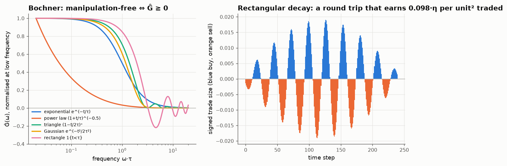
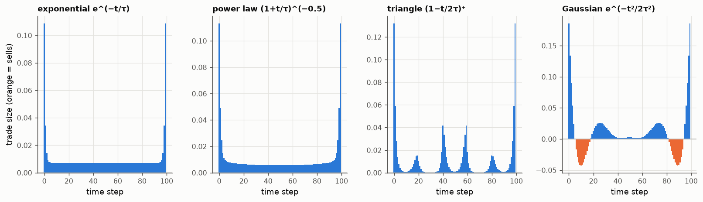
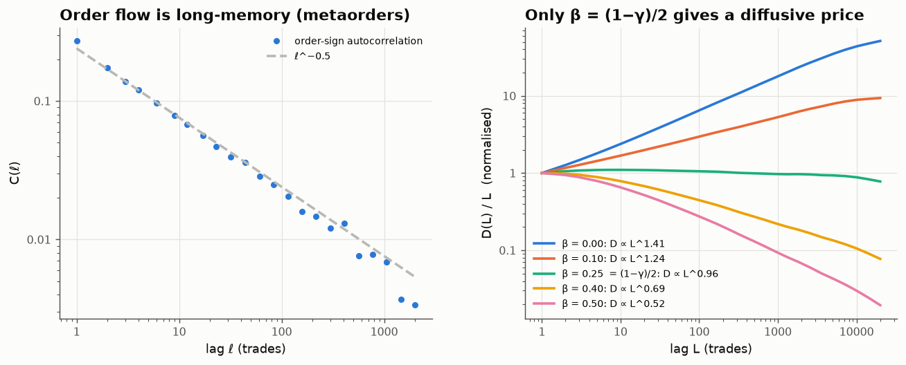

# 10 · Impact kernels: efficiency picks the exponent, Bochner forbids manipulation

*Code: [`code/10_impact_kernels.py`](../code/10_impact_kernels.py) · output: [`figures/10_output.txt`](../figures/10_output.txt)*

When you buy, the price goes up. Part of that impact is permanent and part
decays. The **propagator model** (Bouchaud, Gefen, Potters & Wyart 2004;
Gatheral 2010) writes this as a convolution:

$$S_t = S_0 + \eta\sum_{s<t} G(t-s)\,v_s + \text{noise},$$

where $v_s$ is signed trading volume and $G$ is the **decay kernel**: how much
of a trade's impact is still in the price after a lag. The whole theory rests
on the choice of $G$. Two very different mathematical constraints act on it,
and they turn out to agree.

## Constraint 1: no manipulation, via Bochner's theorem

The cost of executing a schedule $v$ is what you pay above the starting price:
$\sum_t v_t(S_t - S_0)$. With the propagator (and splitting each trade's
self-impact symmetrically) this is a quadratic form:

$$\mathcal C(v) = \frac{\eta}{2}\sum_{s,t} v_s\,G(|t-s|)\,v_t = \frac\eta2\, v^\top \mathbf G\, v .$$

A **round trip** (buy and sell the same amount, $\sum v = 0$) with *negative*
expected cost would be a money machine: price manipulation. No round trip
earns money iff $\mathbf G$ is positive semi-definite. For a stationary kernel
this means $G(|t|)$ is a **positive-definite function**, and Bochner's theorem
says:

> $G(|\cdot|)$ is positive definite $\iff$ its Fourier transform $\hat G(\omega)$ is non-negative.

So "no price manipulation" is a statement about the *spectrum* of impact decay.
Some cases:

| kernel | $\hat G \ge 0$? | manipulation-free? |
|---|---|---|
| exponential $e^{-t/\tau}$ | yes (Lorentzian) | yes |
| power law $(1+t/\tau)^{-\beta}$ | yes (convex ⇒ positive definite, Pólya) | yes |
| triangle $(1-t/2\tau)^+$ | yes ($\mathrm{sinc}^2$) | yes |
| Gaussian $e^{-t^2/2\tau^2}$ | yes, but decays super-exponentially | yes, barely |
| **rectangle** $\mathbf 1\{t<\tau\}$ | **no**: $\hat G \propto \sin(\omega\tau)/\omega$ | **no** |

The rectangular kernel is the natural "impact lasts exactly τ, then
disappears" model, and it is arbitrageable. The most profitable round trip is
the eigenvector of the most negative eigenvalue of the Toeplitz matrix. It
oscillates between buying and selling with period $2\pi\tau/4.493 \approx 1.4\tau$
(28 steps for τ = 20, matching the simulation). $4.493$ is where
$\sin x / x$ reaches its most negative value. So you can read the
manipulation strategy straight off the Fourier transform: **trade at the
frequency where $\hat G$ is most negative.** Buy, let the impact support the
price until just before it vanishes, then sell into it.

## Positive definite isn't enough: optimal buys that sell

Now execute a pure *buy* program: acquire 1 unit over 100 steps at minimum
cost. By Lagrange multipliers, $v^* \propto \mathbf G^{-1}\mathbf 1$. I added a
small instantaneous impact ($0.05\,v_t^2$, the spread and immediate book
depletion) because otherwise the Gaussian problem is numerically singular.

- **Exponential**: the Obizhaeva–Wang shape, blocks at both ends and a
  constant rate in between.
- **Power law**: a U-shape with smoothly rising ends.
- **Triangle**: bursts roughly every $2\tau$ steps. Each burst is placed where
  the previous burst's impact has just worn off. A kernel with finite support
  creates **resonance** in the optimal schedule.
- **Gaussian**: the optimal *buy* program **sells 0.68 units** along the way
  (it buys 1.68 in total). This is what Alfonsi, Schied & Slynko (2012) call
  *transaction-triggered price manipulation*. There is no profitable round
  trip ($\mathbf G$ is positive definite), but interim sells are still
  optimal because the Gaussian kernel is *concave* near zero: impact barely
  decays at first, so an early sell lowers the price you'll pay later. Their
  theorem is that **convex, decreasing** kernels rule this out. All three
  convex kernels above produce buy-only schedules.

So there is a hierarchy: $\hat G\ge0$ (Bochner) rules out profitable round
trips, and convexity rules out the subtler interim sells.

## Constraint 2: efficiency

Now the empirical side. Market order signs are strongly **long-memory**.
Because large metaorders are split into many small trades, the sign of the
next trade is predictable from the last thousand, with autocorrelation
$C(\ell)\sim\ell^{-\gamma}$ and $\gamma\approx0.5$ in many stocks (Lillo &
Farmer 2004). If every trade had permanent impact, prices would inherit that
predictability: they would trend.

Under the propagator, $S = G * \varepsilon$. The cumulative order-sign process
has Hurst exponent $H_\varepsilon = 1-\gamma/2$. Convolving with a kernel
$\ell^{-\beta}$ is fractional integration of order $1-\beta$, so it *lowers* the
Hurst exponent by $\beta$ relative to the cumulative flow:

$$\mathrm{Var}(S_{t+L}-S_t) \;\propto\; L^{2(H_\varepsilon - \beta)} = L^{\,2 - \gamma - 2\beta}.$$

Prices are diffusive (unpredictable at all horizons) only if

$$\boxed{\;\beta = \frac{1-\gamma}{2}\;}$$

I generated order signs as the sign of fractional Gaussian noise with $H=0.75$
(so $\gamma \approx 0.5$; the fitted value is 0.56) and pushed them through
power-law kernels:

| β | variogram exponent (simulated) | theory $2 - 2\beta - \gamma$ |
|---|---|---|
| 0 (permanent impact) | 1.41 | 1.50: trending prices |
| 0.10 | 1.24 | 1.30 |
| **0.25 = (1−γ)/2** | **0.96** | **1.00: diffusive** |
| 0.40 | 0.69 | 0.70 |
| 0.50 | 0.52 | 0.50: mean-reverting prices |

Bouchaud et al. (2004) found measured kernels close to $\beta = (1-\gamma)/2$
across stocks, which is what efficiency requires. The impact kernel **undoes the memory of order
flow** by exactly the right fractional order. Liquidity providers, anticipating
that a run of buys will continue, let each buy's impact fade just fast enough
that the continuation is already priced in.

## The two constraints agree

The kernel selected by efficiency, $G(\ell)\propto\ell^{-(1-\gamma)/2}$, is
convex and decreasing. By Pólya's criterion it is positive definite (no
profitable round trips), and by Alfonsi–Schied–Slynko it rules out interim
sells in buy programs. So **the kernel that makes prices unpredictable is
also one that can't be manipulated**, and neither property was imposed to
get the other.

I don't think this is a coincidence. Both constraints express "no free
lunch", one statistical and one strategic. A kernel that let a trader earn
from their own impact would make the price predictable from that trader's
schedule, so a violation of either should show up as a violation of the
other. Making that implication precise, e.g. showing that a Wiener–Hopf
solution for the martingale kernel is automatically positive definite, is
an open question I'd like to come back to.

This is now the third note where **efficiency fixes a microstructure
exponent**: queue correlations and diffusivity (note 06), branching ratio and
roughness (note 08), and here order-flow memory and impact decay.

## Loose ends

- The real metaorder impact is concave, $\propto\sqrt{Q}$ (the square-root
  law), which is nonlinear in $v$. Gatheral showed nonlinear instantaneous
  impact combined with exponential decay allows manipulation. What power-law
  decay is needed for square-root impact to be manipulation-free? I believe
  the answer involves $\beta\ge\tfrac12$ in some formulations, which would be
  in tension with β = 0.25 from efficiency. Worth untangling.
- A latent-order-book derivation of the square-root law (Donier, Bonart,
  Mastromatteo, Bouchaud 2015) would make a good simulation note: a
  reaction–diffusion model $A + B \to \emptyset$ with a linear density profile
  near the price.
