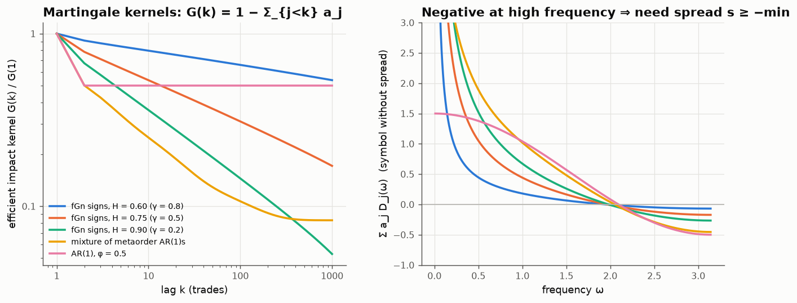
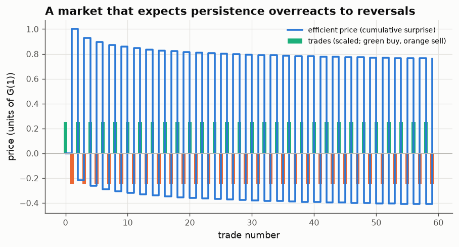

# 11 · An efficient price can still be manipulated, unless there is a spread

*Code: [`code/11_efficiency_vs_manipulation.py`](../code/11_efficiency_vs_manipulation.py) · output: [`figures/11_output.txt`](../figures/11_output.txt)*

Note 10 ended with a conjecture: the impact kernel that makes prices
unpredictable should also rule out profitable manipulation, because both are
forms of "no free lunch". This note tests it. **It is false as stated.** The
counterexample is simple and I think informative: it gives a reason for the
bid–ask spread to exist.

## The efficient kernel

Order signs $\varepsilon_t$ are stationary and predictable. Write the best
linear predictor as $\hat\varepsilon_t = \sum_{j\ge1} a_j\,\varepsilon_{t-j}$.
For the propagator price $p_t = \sum_{s<t} G(t-s)\,\varepsilon_s$ to be a
martingale, the predictable part of each price change has to cancel. Matching
coefficients gives

$$G(k) = G(1)\Big(1 - \sum_{j<k} a_j\Big)\qquad\Longleftrightarrow\qquad p_t = G(1)\sum_{s<t}\big(\varepsilon_s - \hat\varepsilon_s\big).$$

**The efficient price is the cumulative surprise in order flow.** Every trade
has permanent impact equal to the part of it that wasn't expected.

Check against note 10: for long-memory signs (sign of fractional Gaussian noise
with Hurst $H$, $\gamma = 2-2H$), the kernel computed from the Yule–Walker
predictor decays as

| H | γ | fitted decay exponent of G | note 10's $(1-\gamma)/2$ |
|---|---|---|---|
| 0.60 | 0.8 | 0.09 | 0.10 |
| 0.75 | 0.5 | 0.26 | 0.25 |
| 0.90 | 0.2 | 0.43 | 0.40 |

Two independent routes, fractional scaling (note 10) and exact linear
prediction (here), give the same efficient kernel.

## Cost of a strategy, and a Dirichlet kernel

A strategic trader with schedule $v$ (their own trades enter the order flow
and are "predicted" like anyone else's) has expected cost
$\tfrac12 v^\top T v$. Here $T$ is Toeplitz with $T(k) = G(k)$ for $k\ge1$ and
$T(0) = G(1)(1+s)$, where $s$ is any extra immediate cost per unit (a
half-spread, say) in units of $G(1)$. No round trip is profitable iff $T$ is
positive semi-definite, iff its symbol is non-negative (Bochner, note 10).

The symbol comes out in closed form. Using $\sum_{k\ge1}G(k)z^k = G(1)\,z(1-a(z))/(1-z)$
and $e^{i\omega}/(1-e^{i\omega}) = -\tfrac12 + \tfrac i2\cot\tfrac\omega2$:

$$\frac{\hat T(\omega)}{G(1)} \;=\; s + \sum_{j\ge1} a_j\,D_j(\omega),\qquad D_j(\omega) = \frac{\sin\big((j+\tfrac12)\omega\big)}{\sin(\omega/2)},$$

where $D_j$ is the **Dirichlet kernel** from Fourier-series theory. At the
highest frequency $D_j(\pi) = (-1)^j$, so

$$\frac{\hat T(\pi)}{G(1)} = s - (a_1 - a_2 + a_3 - \cdots).$$

With persistent order flow ($a_j > 0$ and decreasing), the alternating sum is
positive. **With no extra immediate cost ($s = 0$), the efficient market is
manipulable**, and the most profitable manipulation alternates buy, sell, buy,
sell ($\omega = \pi$).

For every sign process I tried, the symbol's minimum was exactly at
$\omega=\pi$. The smallest eigenvalue of a 400×400 Toeplitz matrix changes
sign exactly at $s^* = a_1 - a_2 + a_3 - \cdots$ ($-0.020$ at $s^*-0.02$,
$+0.020$ at $s^*+0.02$).

| order-sign process | $a_1$ | minimum immediate cost $s^*$ | innovation sd | $s^*/\sigma_{\rm innov}$ |
|---|---|---|---|---|
| fGn signs, H = 0.60 | 0.089 | 0.069 | 0.994 | 0.07 |
| fGn signs, H = 0.75 | 0.216 | 0.172 | 0.947 | 0.18 |
| fGn signs, H = 0.90 | 0.327 | 0.267 | 0.798 | 0.33 |
| mixture of metaorder AR(1)s | 0.499 | 0.455 | 0.722 | 0.63 |
| AR(1), φ = 0.5 | 0.500 | 0.500 | 0.866 | 0.58 |

## What the manipulation looks like

A market maker who expects persistence treats a *reversal* as a large surprise.
After a buy, the market expects another buy. A sell instead is a surprise of
size $1 + a_1 + \dots$, and the price falls by more than one unit of impact.
So the alternating trader buys after their own sell has pushed the price down
(to about −0.4 in units of $G(1)$) and sells after their own buy has pushed it
up (to about +0.8). Over a 60-trade alternating round trip with $s = 0$, the
expected profit is 4.9 units. With $s = 0.2$, just above $s^* = 0.17$, it
becomes a loss.

## The spread as a no-manipulation condition

So the efficient price is manipulation-free only if every trade carries an
immediate cost of at least

$$\text{half-spread} \;\ge\; s^*\,G(1) = (a_1 - a_2 + a_3 - \cdots)\,G(1).$$

Since the volatility per trade in this model is $\sigma_1 = G(1)\,\sigma_{\rm innov}$,
this becomes

$$\frac{\text{half-spread}}{\sigma_1} \;\ge\; \frac{a_1 - a_2 + a_3 - \cdots}{\sigma_{\rm innov}},$$

which is 0.2–0.6 for realistic order-flow persistence. Empirically, spreads
and volatility per trade are tied together in an $O(1)$ ratio across stocks
(Wyart, Bouchaud, Kockelkoren, Potters & Vettorazzo, 2008). Their explanation
is a market maker's break-even condition. This calculation gives a second,
complementary reason: **a spread below this bound would let traders exploit
the market maker's rational expectation of persistence.** I haven't checked
whether the two bounds coincide numerically on real data. That would be a
good test.

## Correcting note 10

Note 10 said the efficiency-selected kernel $\ell^{-(1-\gamma)/2}$ is convex
and decreasing, so positive definite by Pólya, so manipulation-free. The gap
in that argument is **lag zero**. Pólya's criterion needs convexity *including
the origin*, i.e. $T(0) - T(1) \ge T(1) - T(2)$, which here means $s \ge a_1$.
Convexity at lags ≥ 1 is not enough. The exact threshold is the alternating
sum $s^* \le a_1$. So the corrected statement is:

> Statistical efficiency plus a large enough spread implies no manipulation.
> Efficiency alone doesn't.

I've added a pointer to this in note 10.

> **Follow-up ([note 16](16-skewed-quotes-stop-manipulation.md)):** redone with
> discrete execution (trades pay the pre-trade quote), the condition becomes
> half-spread ≥ G(1)(1 + a₁ − a₂ + ⋯)/2. A competitive break-even spread meets
> it only if order flow is not too persistent (φ ≤ ½ for AR(1) signs), while
> Glosten–Milgrom *skewed* quotes are manipulation-proof for any persistent flow.

## Loose ends

- The spread here is exogenous. In a model where market makers set it
  competitively, is it driven exactly to $s^*$ (the smallest manipulation-proof
  spread), or somewhere else? If competition pushes spreads down to the
  break-even point and that is below $s^*$, markets would be persistently
  manipulable at high frequency, which might describe "quote stuffing" or
  spoofing-type behaviour.
- Nonlinear impact ($\sqrt{Q}$) changes everything here, since the cost is no
  longer a quadratic form.
