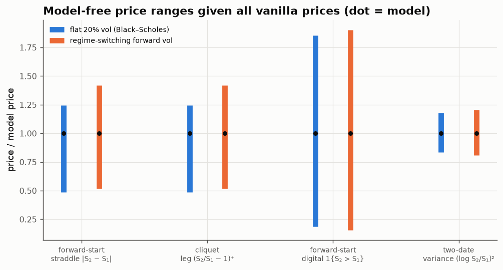
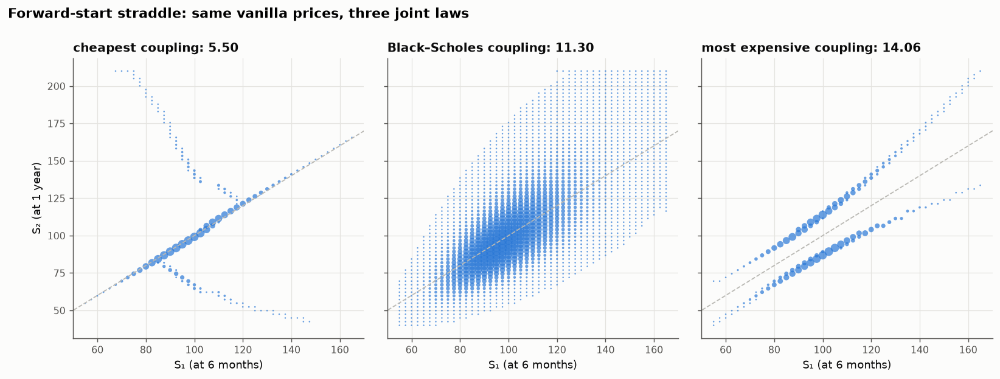

# 12 · What vanilla prices don't tell you: forward-start options as optimal transport

*Code: [`code/12_mot_bounds.py`](../code/12_mot_bounds.py) · output: [`figures/12_output.txt`](../figures/12_output.txt)*

Breeden and Litzenberger showed that the call prices across all strikes for a
single expiry pin down the risk-neutral distribution of the stock at that
expiry: the second derivative of the call price with respect to strike *is*
the density. With calls at two expiries $T_1 < T_2$ you know both **marginal**
distributions, of $S_1$ and of $S_2$. What you don't know is how they are
**joined**: given where the stock is at $T_1$, where does it go next? Every
option whose payoff depends on both dates (forward-starts, cliquets,
path-dependent structures) depends on that joint law.

## The problem is a linear program

The admissible joint laws are exactly the couplings $\pi$ of the two marginals
that are also **martingales**, $\mathbb E_\pi[S_2\mid S_1] = S_1$ (the
no-arbitrage condition). Strassen's theorem says such couplings exist iff the
marginals are in convex order, i.e. $T_2$ calls are worth more than $T_1$
calls at every strike, which is calendar-spread arbitrage-freeness. On a grid,
finding the range of prices for a payoff $c(S_1,S_2)$ is:

$$\min / \max\; \sum_{ij}\pi_{ij}\,c(x_i,y_j)\quad\text{s.t.}\quad \sum_j\pi_{ij} = \mu_i,\;\; \sum_i\pi_{ij}=\nu_j,\;\; \sum_j \pi_{ij}(y_j - x_i) = 0,\;\; \pi\ge0.$$

This is **martingale optimal transport** (Beiglböck, Henry-Labordère &
Penkner, 2013; Galichon, Henry-Labordère & Touzi). The LP dual is the
cheapest **semi-static super-hedge**: static vanilla positions $u_1(S_1)$ and
$u_2(S_2)$, plus a single rebalancing at $T_1$ into $\Delta(S_1)$ shares, such
that $u_1(S_1) + u_2(S_2) + \Delta(S_1)(S_2-S_1) \ge c(S_1,S_2)$ in every
state. So the upper bound is a *price you can enforce by hedging*, not just a
number.

I set $S_0 = 100$, $T_1 = 6$ months, $T_2 = 1$ year, and used 45 × 70 grid
points. HiGHS solves each LP in a fraction of a second.

## Results

Two "true" worlds generating the marginals: flat 20% Black–Scholes, and a
world whose forward volatility switches between 12% and 38%.

| payoff | lower bound | Black–Scholes model | upper bound | width / model |
|---|---|---|---|---|
| forward-start straddle $\lvert S_2 - S_1\rvert$ | 5.50 | 11.30 | 14.06 | 0.76 |
| cliquet leg $(S_2/S_1 - 1)^+$ (×100) | 2.76 | 5.65 | 7.02 | 0.76 |
| forward-start digital $\mathbf 1\{S_2>S_1\}$ (×100) | 8.5 | 46.1 | 85.5 | **1.67** |
| two-date variance $(\log S_2/S_1)^2$ (×100) | 1.69 | 2.02 | 2.38 | 0.34 |
| sanity check $(S_2^2 - S_1^2)/100$ | 2.065 | 2.065 | 2.065 | 0 |

The ranges are wide. With every vanilla price known, a forward-start at-the-money
straddle can be worth anything from half the Black–Scholes price to 25%
more. The forward-start digital (a bet on whether the stock rises between
$T_1$ and $T_2$) can be worth anything from 8.5% to 85.5% of notional. The
vanilla surface says almost nothing about it.

## Why: vanillas fix the forward variance, and the rest is kurtosis

The sanity-check row explains the structure. For any martingale coupling,

$$\mathbb E[(S_2-S_1)^2] = \mathbb E[S_2^2] - \mathbb E[S_1^2] - 2\,\mathbb E\big[S_1(S_2-S_1)\big] = \mathbb E[S_2^2] - \mathbb E[S_1^2],$$

because the cross term vanishes under the martingale condition. The right-hand
side depends only on the marginals. So **vanillas fix the forward variance
exactly** (to 206.5 here), and payoffs that are quadratic in the move have
zero-width bounds.

The straddle pays $\mathbb E|S_2 - S_1|$ instead: the first absolute moment,
not the second. For fixed variance $v$, Cauchy–Schwarz gives
$\mathbb E|X| \le \sqrt v$, with equality when $|X|$ is constant (every path
moves by the same amount). The minimum comes when moves are as concentrated as
possible: mostly nothing, occasionally a lot. So

$$\frac{\text{forward-start straddle}}{\sqrt{\text{forward variance}}} \in [0.38,\; 0.98],\qquad \text{Black–Scholes: } 0.786 \approx \sqrt{2/\pi}.$$

**A forward-start straddle is a bet on the kurtosis of the forward return.**
The vanilla surface fixes the variance. The straddle is then long "all moves
the same size" and short "moves come in rare jumps". That is exactly what the
optimal couplings look like:

- **Most expensive (right):** each $S_1$ goes to one of two points, up or down
  by a roughly constant amount. The increment is essentially binary with
  constant $|S_2-S_1|$, which is where the Cauchy–Schwarz bound is attained
  (0.978 of the ceiling; the marginal constraints stop it reaching 1).
- **Cheapest (left):** most mass stays on the diagonal (no move), and the
  remaining mass goes to far-away branches that supply the required variance.
  This is maximal kurtosis. It resembles the "left-curtain" couplings of
  Beiglböck–Juillet, though I haven't checked it's exactly that.
- **Black–Scholes (middle):** a diffuse cloud of Gaussian-like moves at
  $\sqrt{2/\pi}$.

Both optimisers put at most a handful of support points on each $S_1$
(median 3). That matches the theory: for most payoffs MOT optimisers are
supported on graphs of a few functions.

The regime-switching world's model price is *lower* (0.67 of the ceiling),
because its forward moves are fat-tailed. That is the kurtosis dial in action,
without any change to the vanilla prices.

The **digital** is the extreme case. A martingale can make "up" very likely
(many small up-moves balanced by rare large drops) or very unlikely (the
reverse). The only real constraints come from the marginals' shapes, and
they're weak.

## What I take from this

- Knowing every vanilla price at two dates fixes $\mathbb E[(S_2-S_1)^2]$
  exactly and fixes nothing else about the joint law beyond what the marginals
  force.
- Forward-start straddles and cliquets are **forward-kurtosis** products, and
  the model you price them with is effectively your assumption about
  vol-of-vol and jumps in the forward period. Stochastic-vol and jump models,
  with fat-tailed forward moves, price them lower. Local-vol models, whose
  forward smiles flatten out so forward moves are closer to Gaussian, price
  them nearer the Black–Scholes value. Nothing standard gets near the upper
  bound, which needs constant-size moves. This is the well-known "forward
  smile" problem, and here it has a precise geometric form.
- Model-free bounds are wide enough to be useless for pricing but very useful
  for **risk limits**: the upper bound is achievable by a semi-static hedge,
  so it caps the loss from model error.

## Loose ends

- A third expiry between $T_1$ and $T_2$ adds a marginal and should narrow the
  bounds, since it constrains how kurtosis is spread over time. This is a
  multi-marginal LP with $n^3$ variables, feasible at about 30 points per
  date. How much does one extra maturity shrink the digital's range?
- Adding the forward-start *variance swap* as another traded instrument turns
  $\mathbb E[(\log S_2/S_1)^2]$ into a constraint. With both the straddle and
  the variance fixed, what's left of the digital's range?
