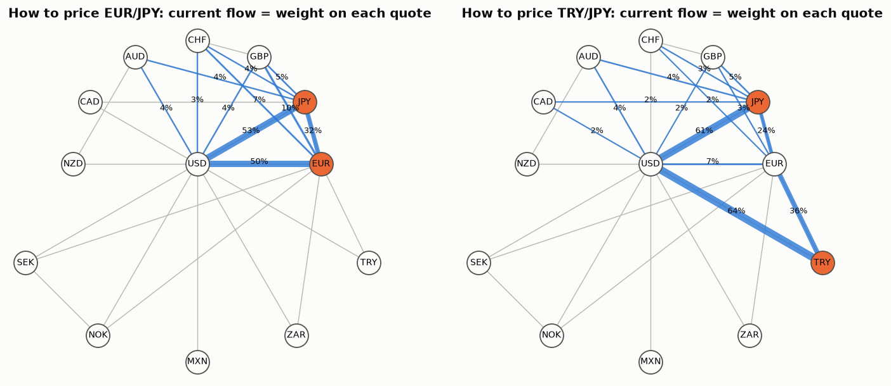

# 13 · Cross rates, Kirchhoff's laws and cohomology

*Code: [`code/13_fx_network.py`](../code/13_fx_network.py) · output: [`figures/13_output.txt`](../figures/13_output.txt)*

In the foreign exchange market, only some currency pairs are actively quoted.
EUR/USD and USD/JPY trade in enormous size, while TRY/JPY barely trades
directly. So what is the "right" TRY/JPY rate, and how precisely can anyone
know it? And when quotes disagree, what kinds of arbitrage are possible? Graph
theory answers both, and the answers involve electrical networks and algebraic
topology.

## Setup

Currencies are nodes. Each quoted pair $e = (i\to j)$ is an edge carrying a
noisy log-rate $w_e = \varphi_j - \varphi_i + \epsilon_e$, where $\varphi$ is
the log value of each currency in some numéraire and $\epsilon_e$ has standard
deviation $\sigma_e$ (think half-spread). With incidence matrix $B$, this is
$w = B\varphi + \epsilon$.

**No arbitrage** means the rates are a *gradient*: $w = B\varphi$ exactly, so
every loop multiplies out to 1. In the language of cohomology, the rates are an
exact 1-cochain. Changing numéraire, $\varphi\to\varphi+c$, is the gauge
freedom.

## Part 1: implied cross rates are an electrical network

The best linear unbiased estimate of $\varphi$ is weighted least squares:
$L\hat\varphi = B^\top W w$, where $L = B^\top W B$ is the **weighted graph
Laplacian** with conductances $1/\sigma_e^2$. The implied cross rate
$\hat\varphi_j - \hat\varphi_i$ then has variance

$$\mathrm{Var}(\hat\varphi_j - \hat\varphi_i) = (e_i - e_j)^\top L^{+} (e_i - e_j) = R_{\rm eff}(i, j),$$

the **effective resistance** between $i$ and $j$ in a circuit where each quote
is a resistor of $\sigma_e^2$ ohms. Precise quotes are low resistances, and
several independent routes act like parallel resistors.

The optimal weights have a physical meaning too. The BLUE of the cross rate is
$\sum_e i_e w_e$, where $i_e$ is the **current** through edge $e$ when one
ampere is injected at $i$ and withdrawn at $j$. This is Thomson's principle:
current minimises dissipated energy $\sum r_e i_e^2$ subject to unit flow, and
that energy is exactly the variance of $\sum i_e w_e$ subject to
unbiasedness. **Gauss–Markov estimation on a graph is Kirchhoff's circuit
laws.**

I used a 13-currency quote graph with realistic relative quote noise (EUR/USD
0.5 bp up to EUR/TRY 20 bp), checked against 20,000 simulations:

| pair | direct quote sd | network estimate sd (simulated) | $\sqrt{R_{\rm eff}}$ | gain |
|---|---|---|---|---|
| EUR/JPY | 1.0 bp | 0.57 bp | 0.56 bp | 1.8× |
| GBP/JPY | 2.0 bp | 0.73 bp | 0.73 bp | 2.7× |
| SEK/NOK | 4.0 bp | 2.23 bp | 2.25 bp | 1.8× |
| TRY/JPY | not quoted | 12.1 bp | 12.0 bp | |
| MXN/NZD | not quoted | 5.2 bp | 5.2 bp | |

**The direct EUR/JPY quote gets only 32% of the weight** in the best estimate
of EUR/JPY. Most of the information arrives through the USD legs (53% and 50%
of the current). That's how interbank FX works in practice: EUR/JPY is a
"cross", priced off EUR/USD and USD/JPY, and the network view says precisely
how much weight each route deserves. For TRY/JPY, 64% of the current flows
through USD/TRY and 36% through EUR/TRY. The TRY legs are the bottleneck
resistors: they set 12 bp of uncertainty even though the JPY side is known to
under 1 bp.

This matters for any market with a quote graph, not just FX: ETFs and their
baskets, dual-listed shares and ADRs, crypto venues. The implied price's
precision is an effective resistance, and a new quoted pair helps as much as
its parallel-resistor contribution says.

## Part 2: two kinds of arbitrage

When quotes are inconsistent, the residual $r = w - B\hat\varphi$ is not a
gradient. The **Hodge decomposition** (Jiang, Lim, Yao & Ye (2011) used it for
ranking) splits edge flows into three mutually orthogonal parts:

$$w = \underbrace{B\varphi}_{\text{gradient: consistent prices}} \;\oplus\; \underbrace{\partial_2^{*}\psi}_{\text{curl: triangular arbitrage}} \;\oplus\; \underbrace{h}_{\text{harmonic: global cycle arbitrage}}.$$

- The **curl** part lives on triangles (3-cliques) of the quote graph. It is
  classic triangular arbitrage, detectable by checking each triangle.
- The **harmonic** part is circulation around cycles that are *not* the
  boundary of any combination of triangles. Its dimension is the first Betti
  number $\beta_1$ of the clique complex: the number of "holes" in the quote
  graph. **No triangle check can see harmonic arbitrage**, because every
  triangle can be consistent while a longer loop is not.

Counting: the graph has $E - V + 1$ independent cycles, split into
$\mathrm{rank}(\partial_2)$ triangle-generated cycles plus $\beta_1$ holes.
Under pure quote noise the whitened residual sum of squares is $\chi^2$ with
$E-V+1$ degrees of freedom, split the same way.

**The FX graph has no holes.** With 13 currencies and 26 quoted pairs there
are 14 independent cycles, and the 19 triangles have rank 14, so
$\beta_1 = 0$. The USD hub triangulates everything: any loop can be broken into
triangles through USD. In the simulation the null curl sum of squares averages
13.95 (χ² with 14 dof) and the harmonic part is identically zero. So FX
arbitrage is always local. **The dominance of the dollar is, topologically,
what makes triangular arbitrage checks sufficient.**

**A venue graph can have holes.** Take six crypto venues quoting the same
coin, with transfer links only between ring neighbours plus one cross-link:
$V = 6$, $E = 7$, no triangles, $\beta_1 = 2$. I injected a 10 bp price
inconsistency around the 4-cycle 0→1→2→3→0. The curl part is 0 (there are no
triangles) and the harmonic part is 6.25 in units of quote variance, so the
decomposition finds it immediately. Any "check every triangle" monitor would
report nothing, because there is no triangle to check.

## Summary

- Implied cross rates are potentials in a resistor network. Their uncertainty
  is effective resistance, and their optimal construction is current flow.
- No-arbitrage means the rates are exact (a gradient). Inconsistencies split
  into local (curl) and global (harmonic) parts, and the global part is
  exactly the first cohomology of the quote complex.
- Hub-and-spoke markets (FX around USD) have no holes, so triangular checks
  are complete. Fragmented markets (crypto venues, OTC networks) can have
  holes where arbitrage hides from local checks.

## Loose ends

- A global χ² test is weak for a *single* bad quote: a 3 bp error on one
  EUR/GBP/JPY leg raised the curl sum of squares to only 6.1 (null
  expectation 14). A localised test on the triangles through that edge would
  catch it. There is probably a nice "graph wavelet" version of arbitrage
  detection.
- With time, quotes become a 1-cochain on a space-time complex, and covered
  interest parity (spot, forward, two interest rates) is a square
  ("plaquette"). CIP deviations since 2008, the cross-currency basis, are then
  curvature on that lattice. That is Ilinski's gauge-theory picture of
  arbitrage. With real data one could measure which plaquettes carry the
  curvature.
