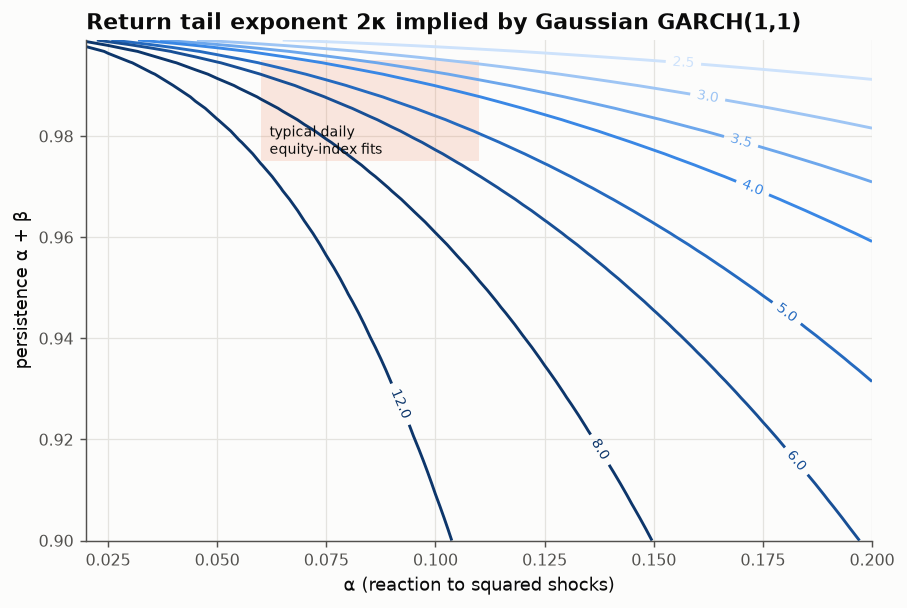
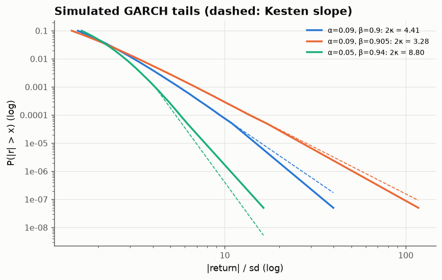

# 14 · GARCH predicts its own tail exponent

*Code: [`code/14_garch_kesten.py`](../code/14_garch_kesten.py) · output: [`figures/14_output.txt`](../figures/14_output.txt)*

Two of the best-established stylised facts about returns are **volatility
clustering** (big moves follow big moves) and **heavy tails**. For daily
returns, $\Pr(|r|>x)$ decays like $x^{-\zeta}$ with $\zeta$ around 3–4 (the
"cubic law" of Gopikrishnan et al. is the high-frequency version). These are
usually modelled separately: GARCH for clustering, a fat-tailed innovation
distribution for the tails. But GARCH with *Gaussian* innovations already has
power-law tails, and its exponent is fixed by the same parameters that
describe clustering. So a fitted GARCH makes a testable prediction about the
tails.

## GARCH is a Kesten process

GARCH(1,1) sets $r_t = \sigma_t z_t$ with

$$\sigma_{t+1}^2 = \omega + (\alpha z_t^2 + \beta)\,\sigma_t^2 = \omega + A_t\,\sigma_t^2 .$$

This is a **Kesten recursion** $X_{t+1} = A_t X_t + B$ with random
multiplier $A_t$. The Kesten–Goldie theorem says that if
$\mathbb E\log A < 0$ (stationarity) but $A > 1$ happens with positive
probability, the stationary law has a Pareto tail

$$\Pr(\sigma^2 > x) \sim C x^{-\kappa},\qquad \mathbb E\big[(\alpha z^2+\beta)^\kappa\big] = 1,$$

and by Breiman's lemma returns inherit tail exponent $\zeta = 2\kappa$.

The mechanism is worth stating plainly. $\log\sigma^2$ is a random walk with
**negative drift**, held up by the floor $\omega$. Extreme volatility comes from
rare *runs* of multipliers above 1, which compound. The stationary tail of such
a reflected walk is exponential with rate given by the Cramér–Lundberg
equation $\mathbb E[e^{\kappa\log A}]=1$, the same equation that gives an
insurer's ruin probability. **The return tail exponent is the adjustment
coefficient of a ruin problem in log-volatility.** It's the same mechanism
behind Pareto wealth distributions and Zipf's law for cities: multiplicative
noise with a barrier.

## A formula you can do in your head

Write persistence $p = \alpha+\beta$ and $A = p + \alpha(z^2-1)$. For small
$\alpha$, a second-order cumulant expansion of $\log\mathbb E[A^\kappa]$ gives

$$\zeta = 2\kappa \;\approx\; 2 + \frac{4\,p^2\,(-\log p)}{\alpha^2\,\mathrm{Var}(z^2)} \;\approx\; 2 + \frac{2(1-p)}{\alpha^2}\quad(\text{Gaussian } z).$$

Two consequences:

- As persistence $p\to1$ (IGARCH), $\zeta\to2$: the variance itself becomes
  infinite. The tail thickens because volatility becomes more persistent,
  not because shocks get bigger.
- The tail depends on $(1-p)/\alpha^2$. A large reaction $\alpha$ fattens
  tails quadratically, and a small distance from unit persistence fattens
  them linearly.

| α | β | p | 2κ exact | approximation | 2κ with t₆ innovations | finite kurtosis? |
|---|---|---|---|---|---|---|
| 0.05 | 0.940 | 0.990 | 8.80 | 9.88 | 4.70 | yes |
| 0.08 | 0.900 | 0.980 | 7.27 | 8.06 | 4.29 | yes |
| 0.09 | 0.900 | 0.990 | **4.41** | 4.43 | 3.18 | yes |
| 0.10 | 0.890 | 0.990 | 3.99 | 3.97 | 3.00 | **no** |
| 0.09 | 0.905 | 0.995 | **3.28** | 3.23 | 2.65 | **no** |
| 0.12 | 0.870 | 0.990 | 3.43 | 3.37 | 2.75 | no |

The shaded box is roughly where daily equity-index GARCH fits land. **Gaussian
GARCH in that region implies tail exponents between about 3 and 6**, which
brackets the empirical range. The cubic law needs no fat-tailed innovations,
only persistence around 0.995 with $\alpha\approx0.09$.

## Checking by simulation

Twenty million simulated days per parameter set, with Hill estimates at
different tail depths:

| α, β | Kesten 2κ | Hill (top 2,000) | Hill (top 20,000) | Hill (top 200,000) |
|---|---|---|---|---|
| 0.09, 0.900 | 4.41 | 4.57 | 4.39 | 3.99 |
| 0.09, 0.905 | 3.28 | 3.05 | 3.31 | 3.14 |
| 0.05, 0.940 | 8.80 | 7.82 | 7.11 | 5.97 |

For realistic parameters the Hill estimates agree with theory. For the
thin-tailed case (2κ = 8.8) Hill is badly biased downward even with 20 million
observations: the Pareto regime starts so far out that most of the "tail"
used by Hill is really the Gaussian-like body. **Thin power-law tails are
almost impossible to measure.** This is worth remembering whenever someone
reports a tail exponent of 5 or more.

## The uncomfortable part: the tail is badly identified

Persistence is typically estimated with a standard error of a few
thousandths. Hold $\alpha = 0.09$ and move $p$ by $\pm0.0025$:

| persistence | implied 2κ range |
|---|---|
| 0.985 ± 0.0025 | 4.9 – 5.9 |
| 0.990 ± 0.0025 | 3.9 – 4.9 |
| 0.995 ± 0.0025 | **2.7 – 3.9** |

So near the empirically relevant region, the GARCH-implied tail exponent is
uncertain by ±0.6. That spans "finite kurtosis" to "kurtosis infinite and
skewness barely finite". Two GARCH fits that look identical on every standard
diagnostic can disagree about how often a 10-sigma day happens by a factor of
10 or more.

There's also a structural tension. Volatility clustering in real data decays
*slowly* (close to long memory). A short-memory GARCH(1,1) fitted to such data
is pushed toward $p\to1$ to mimic that slow decay, and by the formula above
that pushes $\zeta\to2$. So **part of the "heavy tails" a GARCH fit reports
may be a side effect of forcing a short-memory model onto long-memory
volatility.** A model with separate long- and short-memory components
(FIGARCH, HAR, or the rough-vol picture of note 08) would separate the two. I
haven't tested this; it would be the natural next experiment.

## Summary

- GARCH(1,1) is a Kesten process, so its return tail exponent solves
  $\mathbb E[(\alpha z^2+\beta)^{\zeta/2}] = 1$. This is a Cramér–Lundberg
  equation for log-volatility.
- $\zeta \approx 2 + 2(1-p)/\alpha^2$ for Gaussian innovations. Typical fits
  imply $\zeta\approx3$–$5$, consistent with data and without fat-tailed
  innovations.
- The implied tail is very sensitive to persistence, and Hill estimation of
  thin power tails is hopelessly biased. Tail exponents are among the least
  well-identified quantities in finance.
