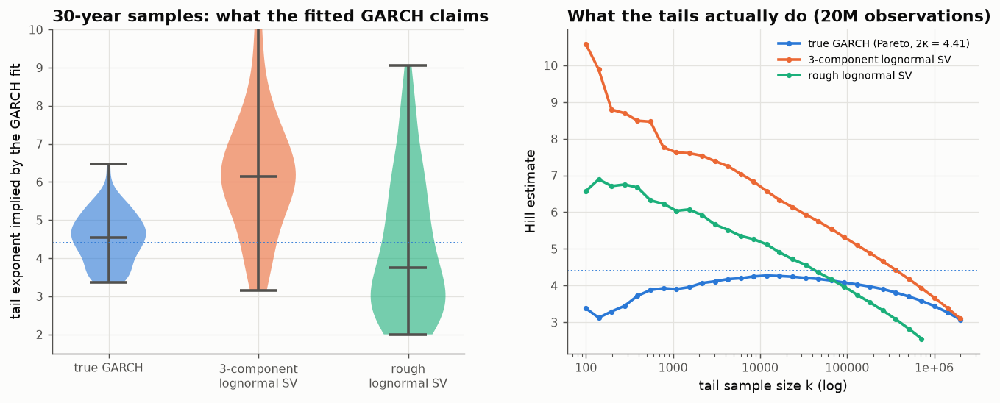

# 15 · A misspecified GARCH invents power-law tails

*Code: [`code/15_garch_invents_tails.py`](../code/15_garch_invents_tails.py) · output: [`figures/15_output.txt`](../figures/15_output.txt)*

Note 14 ended with a conjecture. Real volatility has long memory. A
short-memory GARCH(1,1) fitted to it will push persistence toward 1 to mimic
the slow decay, and since the implied tail exponent is
$\zeta\approx2+2(1-p)/\alpha^2$, that will manufacture fat power-law tails the
data may not have. This note tests it.

## Setup

For each of three data-generating processes I simulate 60 independent samples
of 30 years of daily returns (7,560 days), fit GARCH(1,1) by Gaussian maximum
likelihood, and compute the Kesten tail exponent each fit implies:

1. **True GARCH(1,1)** with α = 0.09, β = 0.90. The implied tail should be
   right: 2κ = 4.41.
2. **Three-component lognormal SV.** Log-volatility is a sum of AR(1)s with
   persistences 0.5, 0.97 and 0.998: a cascade of time scales that looks like
   long memory. Returns are Gaussian given volatility. This process **has no
   power-law tail**: all moments are finite.
3. **Rough lognormal SV.** Log-volatility is driven by fractional noise with
   $H = 0.1$ (the empirical roughness of note 08), with slow mean reversion.
   It also has no power-law tail.

## Results

| data-generating process | fitted α (median) | fitted persistence (median, 10–90%) | implied tail exponent 2κ (median, 10–90%) | true tail |
|---|---|---|---|---|
| true GARCH(1,1) | 0.092 | 0.9890 [0.9856, 0.9930] | 4.55 [3.59, 5.35] | Pareto, 4.41 |
| 3-component lognormal SV | 0.071 | 0.9882 [0.9783, 0.9951] | 6.14 [4.08, 8.17] | none (lognormal) |
| rough lognormal SV | 0.061 | **0.9970** [0.9894, 0.9993] | **3.74** [2.41, 6.72] | none (lognormal) |

**The conjecture holds for rough volatility.** Fitting GARCH to rough,
lognormal volatility gives persistence of 0.997 (the fits sit close to
IGARCH) and a median implied tail exponent of **3.7**, right in the "cubic
law" range, for a process whose true tail is not a power law. A tenth of the
fits imply $2\kappa < 2.4$, i.e. infinite variance. The three-component model
is less extreme (its clustering is less persistent), and its fits imply
exponents around 6.

Even for data that really are GARCH, 30 years pins the tail exponent down only
to about ±1 (3.6 to 5.4).

## What the tails actually look like

The right panel shows Hill estimates on 5–20 million observations. For true
GARCH there is a plateau near 4.2–4.4. For both lognormal models the Hill
estimate keeps rising as you go further into the tail (no plateau, so no power
law), which is the signature of a lognormal mixture. But look at the
conventional tail fractions an empirical study uses:

| Hill estimate at | top 1% | top 2% | top 5% |
|---|---|---|---|
| true GARCH (Pareto 4.41) | 3.97 | 3.81 | 3.44 |
| 3-component lognormal SV | 4.89 | 4.42 | 3.66 |
| rough lognormal SV | 4.36 | 3.97 | 3.32 |

**At the quantiles that 30 years of data can reach, the three processes are
indistinguishable.** All give a "tail exponent" of 3.3–4.9. The lognormal
processes only reveal themselves in the extreme tail (top 0.001%), which no
realistic sample contains.

## What I take from this

- "Returns have power-law tails with exponent ≈ 3" can't be distinguished,
  with realistic samples, from "returns are conditionally Gaussian with rough
  lognormal volatility". The data are consistent with both, and the two
  disagree hugely about the *very* far tail (10- and 20-sigma events).
- A GARCH(1,1) fitted to long-memory volatility reports near-unit persistence
  and fat implied tails. Some of the heavy-tail evidence built on GARCH fits
  may be a projection of long memory onto a model that can express it only as
  persistence.
- In practical terms: risk models that extrapolate a fitted power law to
  extreme quantiles (99.99% VaR, stress scenarios) are extrapolating a
  modelling choice, not a measurement.

This complements note 14. There, the implied tail was badly identified even
under the correct model. Here, under a plausible *wrong* model, it comes out
looking right for the wrong reason.

## Loose ends

- A HAR-type or FIGARCH fit to the same rough data should give much thinner
  implied tails, if the story is right. That's a direct test.
- The discriminating statistic between "Pareto" and "lognormal mixture" is the
  *curvature* of the Hill plot. How many years of data would it take to tell
  them apart at 95% confidence? My guess is centuries.
