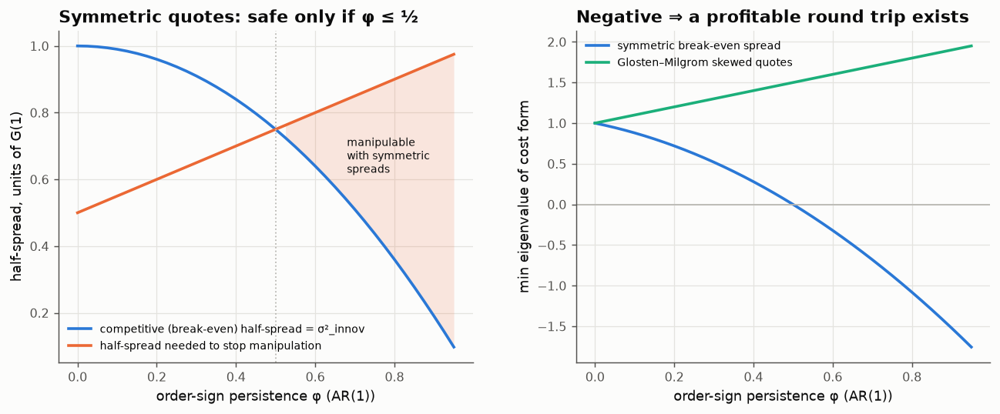

# 16 · Skewed quotes, not wide spreads, stop manipulation

*Code: [`code/16_quote_skew.py`](../code/16_quote_skew.py) · output: [`figures/16_output.txt`](../figures/16_output.txt)*

Note 11 showed that an efficient propagator price (the cumulative surprise in
order flow) can be manipulated by alternating buys and sells unless trades pay
enough immediate cost. That left two questions:

1. Would a *competitive* market maker, who sets spreads to break even against
   adverse selection, charge enough?
2. Is the spread even the right defence?

The answers: (1) only if order flow isn't too persistent, with a clean
threshold; and (2) no. What protects the market is **skewing quotes toward
the expected direction of order flow**, and with skewed quotes the market is
manipulation-proof for *any* persistent flow.

## Setting up the execution convention properly

Note 11 used a continuous-time convention in which each trade pays half its
own impact. Here I use the discrete one. Order signs $\varepsilon_t = \pm1$,
predictor $\hat\varepsilon_t = \sum_j a_j\varepsilon_{t-j}$, efficient mid
$p_t = G(1)\sum_{s<t}(\varepsilon_s - \hat\varepsilon_s)$. A trade at $t$
executes at a quote set *before* the trade.

**Regime A: symmetric fixed spread.** A buy pays $p_t + h$, a sell receives
$p_t - h$. For a strategic trader using unit trades
$v_t\in\{-1,0,1\}$, the expected cost is the quadratic form
$\tfrac12 v^\top M v$ with $M(0) = 2h$ and $M(k) = G(k)$. With the Dirichlet
identity from note 11, it is positive semi-definite iff

$$h \;\ge\; h_{\rm manip} = G(1)\,\frac{1 + (a_1 - a_2 + a_3 - \cdots)}{2}.$$

The competitive (Glosten–Milgrom-style average break-even) half-spread
equals the expected price move caused by a trade:
$h_{\rm BE} = G(1)\,\mathbb E[\varepsilon_t(\varepsilon_t - \hat\varepsilon_t)] = G(1)\,\sigma^2_{\rm innov}$.

**For AR(1) order signs** with persistence $\varphi$: $\sigma^2_{\rm innov} = 1-\varphi^2$
and $a_1 - a_2 + \cdots = \varphi$. The break-even spread is manipulation-proof
iff

$$1 - \varphi^2 \;\ge\; \frac{1+\varphi}{2}\iff (2\varphi-1)(\varphi+1)\le 0 \iff \boxed{\varphi \le \tfrac12}.$$

The two effects work against each other. More persistence makes order flow
*more predictable*, so each trade carries less surprise and competitive
spreads get *narrower* ($1-\varphi^2$). But it also makes reversals *more
surprising*, so the manipulation profit grows ($\varphi$). They cross at
exactly one half.

**Regime B: skewed quotes (Glosten–Milgrom).** A market maker who prices each
side at the expected post-trade value sets

$$\text{ask}_t = p_t + G(1)(1 - \hat\varepsilon_t),\qquad \text{bid}_t = p_t - G(1)(1+\hat\varepsilon_t).$$

The total spread is constant, $2G(1)$, but the quotes **shift toward the
expected flow**. When buys are expected, the ask tightens and the bid widens.
The average cost paid is still $G(1)\sigma^2_{\rm innov}$ per trade, the same
as regime A. But now each trade executes at the post-trade mid $p_{t+1}$, and
the expected cost of a strategy is $\tfrac12 v^\top Q v$ with $Q(0) = 2G(1)$,
$Q(k) = G(k+1)$. The same Fourier calculation as in note 11 gives the symbol

$$\frac{\hat Q(\omega)}{G(1)} = 1 + \sum_{j\ge1} a_j\,D_{j-1}(\omega).$$

Summing by parts, $\sum_j a_j D_{j-1} = \sum_j (a_j - a_{j+1})\,j\,F_{j-1}(\omega)$,
where $F$ is the **Fejér kernel**, which is non-negative. So if the predictor
coefficients are **positive and decreasing** (persistent order flow),

$$\hat Q(\omega) \;\ge\; G(1) > 0 \quad\text{for all }\omega:$$

**no round trip is profitable, however persistent the flow.** The smallest
eigenvalue is $G(1)(1 + a_1 - a_2 + \cdots)$, and persistence makes it *more*
positive.

## Numbers

| order-sign process | σ²_innov | $a_1 - a_2 + \cdots$ | break-even h | needed h | min eig, symmetric | min eig, skewed |
|---|---|---|---|---|---|---|
| fGn signs, H = 0.60 | 0.987 | 0.069 | 0.987 | 0.534 | +0.91 | +1.07 |
| fGn signs, H = 0.75 | 0.896 | 0.172 | 0.896 | 0.586 | +0.62 | +1.17 |
| fGn signs, H = 0.90 | 0.637 | 0.267 | 0.637 | 0.633 | **+0.007** | +1.27 |
| metaorder mixture | 0.522 | 0.455 | 0.522 | 0.727 | **−0.41** | +1.45 |
| AR(1), φ = 0.5 | 0.750 | 0.500 | 0.750 | 0.750 | 0.000 | +1.50 |
| AR(1), φ = 0.7 | 0.510 | 0.700 | 0.510 | 0.850 | **−0.68** | +1.70 |

(Units of $G(1)$.) For the metaorder mixture (a sum of AR(1) components, from
fast to very persistent) a symmetric break-even market loses about 41 units of
$G(1)$ per 200-trade alternating round trip to the manipulator. With skewed
quotes the same strategy costs the manipulator 146 units.

## Why skew works

Alternating manipulation exploits one specific thing: a market that expects
persistence treats a reversal as a large surprise. With a symmetric spread,
the reversing trade pays only $h$ but moves the price by
$G(1)(1+\hat\varepsilon)$, which is more than $h$ when persistence is high.
The next trade (reversing again) then benefits from that overshoot. Skewed
quotes charge each trade *its own expected impact*: a surprising trade pays
for being surprising. What's left over is only the diagonal $G(1)$ and the
Fejér-positive part.

In practice market makers do skew. The "microprice" and quote-imbalance
adjustments used in high-frequency market making move quotes toward the
predicted direction of flow. This calculation suggests that skewing is not
just a way to earn more. It is **structurally necessary** once order flow is
persistent enough ($\varphi > \tfrac12$ in the AR(1) case), because a
competitive market without it can be exploited.

## Summary

- Symmetric break-even spreads stop alternating manipulation iff
  $\sigma^2_{\rm innov} \ge \tfrac12(1 + a_1 - a_2 + \cdots)$. For AR(1) flow
  that is $\varphi\le\tfrac12$.
- Glosten–Milgrom skewed quotes make the cost form's symbol at least $G(1)$
  (Fejér kernel positivity), so no manipulation for any positive, decreasing
  predictor.
- The defence is the *position* of the quotes relative to the forecast, not
  the width of the spread.

(And a correction to note 11: its "s = 0" case corresponds to trades paying
half their own impact, i.e. a half-spread of $G(1)/2$ in the discrete
convention. "No spread" there should be read as "no spread beyond half the
own impact". The qualitative conclusion stands, and the threshold here is the
exact discrete version.)
