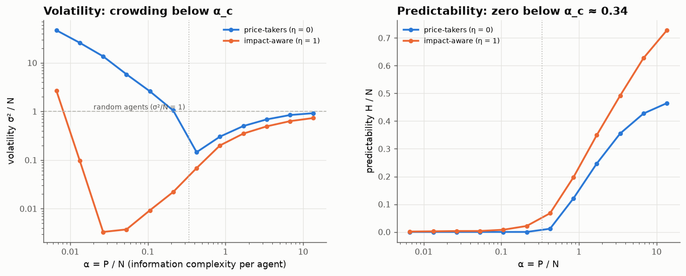

# 17 · The minority game: efficient markets are crowded markets

*Code: [`code/17_minority_game.py`](../code/17_minority_game.py) · output: [`figures/17_output.txt`](../figures/17_output.txt)*

The notes so far have mostly studied prices as given processes. This one asks
where the statistics come from when prices are produced by agents who learn.
The minority game (Challet & Zhang, 1997; Challet, Marsili & Zecchina, 2000) is
the simplest such model with real structure. I'm using it to look at one
question: **what does it cost a market to be efficient?**

## The model

- $N$ agents. Each round a piece of public information $\mu\in\{1,\dots,P\}$
  arrives (think "the state of the market").
- Each agent owns two fixed random strategies, lookup tables from $\mu$ to an
  action $a=\pm1$ (buy/sell). They play whichever currently has the higher
  score.
- Excess demand is $A = \sum_i a_i$. **The minority wins.** If most agents buy,
  sellers profit, as in a market where buying into excess demand means paying
  up.
- After each round every strategy's score is updated by what it *would* have
  earned. Price-takers use $-a_s^\mu A$. Impact-aware agents also account for
  the fact that switching strategy would have changed $A$ itself:
  $-a^\mu_s\big(A - \eta(a_i - a^\mu_s)\big)$ with $\eta = 1$.

The single control parameter is $\alpha = P/N$: how much distinct information
there is per agent. Two outputs:

- **volatility** $\sigma^2/N = \langle A^2\rangle/N$. For comparison, agents
  flipping coins give exactly 1;
- **predictability** $H/N = \frac1{PN}\sum_\mu\langle A\mid\mu\rangle^2$: how
  well the information predicts the excess demand. $H = 0$ means an
  *informationally efficient* market, where nothing in $\mu$ predicts $A$.

## Results (N = 301, four seeds per point)

| α | σ²/N, price-takers | H/N, price-takers | σ²/N, impact-aware | H/N, impact-aware |
|---|---|---|---|---|
| 0.027 | 13.6 | 0.000 | 0.003 | 0.003 |
| 0.106 | 2.60 | 0.000 | 0.009 | 0.008 |
| 0.213 | 1.04 | 0.000 | 0.022 | 0.022 |
| 0.425 | **0.145** | 0.012 | 0.068 | 0.067 |
| 1.70 | 0.50 | 0.25 | 0.35 | 0.35 |
| 13.6 | 0.92 | 0.46 | 0.73 | 0.73 |

**Price-takers** show the classic phase transition at $\alpha_c\approx0.34$:

- **Below $\alpha_c$ the market is perfectly efficient** ($H = 0$). There is
  so much strategic capacity relative to information that every predictable
  pattern is arbitraged away.
- **It is also wildly volatile.** At $\alpha = 0.027$ volatility is 14 times
  what random coin-flipping agents would produce. The agents collectively
  exploit every pattern, but they all do it at once, overshoot, and generate
  crowding cycles.
- **Above $\alpha_c$** the market becomes predictable ($H>0$) but calm. At the
  transition, volatility is at its minimum (0.145), about 7 times below
  random.

So among price-takers, efficiency and excess volatility are **the same
phenomenon**: the market becomes efficient by overcrowding.

**Impact-aware agents** remove the transition. When each agent accounts for
the fact that its own switch changes $A$, the learning dynamics become
gradient descent on a potential (Challet–Marsili–Zecchina), and they settle
into a Nash equilibrium:

- **Volatility collapses**, by a factor of up to 4,000 at small α (0.003
  against 13.6). There is no crowding, because each agent knows that piling
  into the popular side worsens its own payoff.
- **But the market is no longer efficient.** Some predictability always
  remains ($H>0$ at every α), and at large α it is *higher* than with
  price-takers (0.73 against 0.46). In the Nash state almost all remaining
  fluctuation is predictable ($\sigma^2\approx H$). The patterns are visible
  but nobody exploits them, because exploiting them would move the price
  against the exploiter by more than the pattern is worth.

(Two small-$P$ exceptions: at $m = 1, 2$, i.e. $P = 2, 4$, the impact-aware
game settles at higher volatility, and running ten times longer doesn't
change it. With so few information states, the strategy space is too coarse
to reach the low-volatility equilibrium. I haven't pinned down exactly why.)

## Why this matters

This is a toy, but its lesson carries over:

1. **Perfect informational efficiency is a symptom of agents ignoring their
   own price impact.** Remove that naivety and the market stops arbitraging
   away the last bit of predictability. That's a mechanical version of the
   Grossman–Stiglitz paradox, where market impact plays the role of the cost
   of information, and it's the "limits to arbitrage" idea emerging from
   learning rather than being assumed.
2. **Excess volatility and efficiency trade off.** A market can be
   perfectly efficient and violently noisy (crowded price-takers), or calm and
   slightly predictable (impact-aware players), but not calm and perfectly
   efficient.
3. It connects to the microstructure notes. In notes 10, 11 and 16, correct
   accounting of one's own impact decided whether manipulation was possible.
   Here it decides the whole macroscopic regime. In both, **how agents model
   their own footprint is a first-order determinant of market statistics.**

## Loose ends

- The *grand-canonical* minority game (agents may abstain when no strategy
  looks profitable) is known to show fat tails and volatility clustering near
  its critical point, which would link to note 08's "criticality produces
  stylised facts". A good next experiment would be to measure the kurtosis of
  $A$ against distance from criticality.
- The price-taker market self-organises to its volatility minimum only at
  $\alpha_c$. Is there a mechanism (entry/exit of agents, say) that drives the
  real market *to* $\alpha_c$? Self-organised criticality would say yes, and
  that would be another route to the near-critical order flow of note 08.
