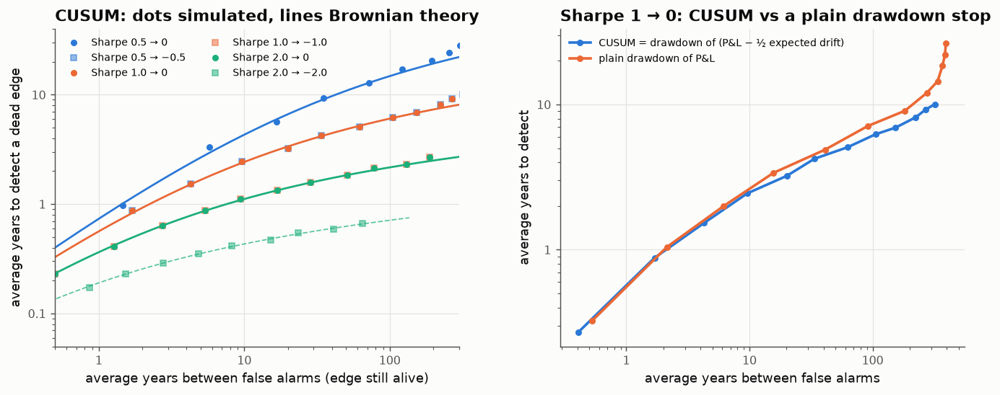

# 18 · When did my edge die? Quickest detection for strategies

*Code: [`code/18_dead_edge.py`](../code/18_dead_edge.py) · output: [`figures/18_output.txt`](../figures/18_output.txt)*

Note 07 asked how long it takes to *prove* skill. This note asks the reverse,
which comes up more often in practice: a strategy has been working, and at
some unknown moment it stops (crowding, a regime change, publication). How long
until you notice? And what should the stopping rule be?

## The optimal rule is a drawdown rule, on the right quantity

Model daily returns, in units of their volatility, as $\mathcal N(d,1)$ while
the edge is alive ($d = \mathrm{SR}/\sqrt{252}$) and $\mathcal N(d',1)$ after
it dies. The optimal procedure for detecting an unknown change point, in the
sense of minimising worst-case delay for a given false-alarm rate
(Lorden 1971; Moustakides 1986), is Page's **CUSUM**:

$$W_t = \max\big(0,\; W_{t-1} + \ell_t\big),\qquad \ell_t = \log\frac{\varphi(x_t - d')}{\varphi(x_t - d)},\qquad \text{stop when } W_t\ge h .$$

For the case "edge goes to zero" ($d'=0$), $\ell_t = -d\,(x_t - d/2)$, so

$$W_t = d \times \text{drawdown of }\sum_{s\le t}\big(x_s - \tfrac d2\big).$$

**The optimal stop rule is a drawdown rule**, but on the cumulative P&L *minus
half its expected drift*, not on raw P&L. Intuitively, the expected drift
while alive is $d$ and after death is $0$, and the halfway point $d/2$ is the
decision boundary. A plain drawdown rule implicitly uses a boundary of $0$
and so reacts too slowly.

## How long it takes

For small per-day drifts the CUSUM statistic is a reflected Brownian motion,
and there are exact formulas. Let $\tau = 1/\mathrm{KL} = 2/\Delta\mathrm{SR}^2$
years, where $\Delta\mathrm{SR}$ is the *drop* in annualised Sharpe. Then

$$\text{mean time between false alarms} = \tau\,(e^h - h - 1),\qquad \text{mean detection delay} = \tau\,(h - 1 + e^{-h}).$$

Only $\Delta\mathrm{SR}$ matters. A strategy that goes from Sharpe 1 to 0 is as
hard to monitor as one going from 0.5 to −0.5.

Simulated delays match the Brownian theory:

| Sharpe while alive | edge dies to | τ = 2/ΔSR² | delay at 1 false alarm per 5y | per 20y |
|---|---|---|---|---|
| 0.5 | 0 | 8 y | 2.9 y | **6.4 y** |
| 0.5 | −0.5 | 2 y | 1.7 y | 3.2 y |
| 1.0 | 0 | 2 y | 1.7 y | **3.2 y** |
| 1.0 | −1.0 | 0.5 y | 0.8 y | 1.4 y |
| 2.0 | 0 | 0.5 y | 0.8 y | **1.4 y** |

A Sharpe-1 strategy that quietly stops working will, on average, run for
**three more years** before an optimal monitor calls it, if you accept one false
alarm (killing a live strategy) every 20 years. For a Sharpe-0.5 strategy,
typical of a good factor or a long-only manager, it's six and a half years.
Allowing more false alarms helps only logarithmically.

A correction to my own first attempt: I first applied Lorden's asymptotic
delay ≈ log(ARL)/KL and got "17 years for Sharpe 1". That asymptotic assumes
each observation carries O(1) information. Daily returns carry very little,
and the right unit of time is $\tau$ itself. The simulation disagreed with me,
which is how I found the mistake.

## Plain drawdown stops

Many funds use a rule like "cut the strategy after a drawdown of X". At
matched false-alarm rates, for Sharpe 1 → 0:

| false alarm every | CUSUM delay | plain drawdown delay | plain drawdown trigger |
|---|---|---|---|
| 5 y | 1.7 y | 1.8 y | 1.24 × annual vol |
| 20 y | 3.2 y | 3.7 y | 1.84 × annual vol |
| 50 y | 4.8 y | 5.4 y | 2.25 × annual vol |

The plain drawdown is 5–15% slower. That's a modest loss, since the drawdown
rule is only mildly misspecified. The table also gives a rule of thumb: for a
Sharpe-1 strategy, a stop at a drawdown of **about 1.8 times annual
volatility** corresponds to one false kill per 20 years.

## What I take from this

- The time to notice a dead edge scales as $2/\Delta\mathrm{SR}^2$ years.
  Sharpe 1 → 0 takes about 3 years and Sharpe 0.5 → 0 about 6.5 years at
  reasonable false-alarm rates. Detection is at least as slow as proving skill
  in the first place (note 07), and for the same reason: information
  accumulates at rate $\mathrm{SR}^2/2$.
- Strategies that "die into negative" (crowded trades that reverse) are
  detected about twice as fast. Quiet deaths to zero are the expensive ones.
- The optimal stop is a drawdown of the *drift-adjusted* P&L. Subtracting half
  the expected return makes the rule optimal and costs nothing to implement.
- Combined with the evidence that published anomalies decay after publication
  (McLean & Pontiff, 2016), this suggests allocators spend years holding
  strategies whose edge has already gone, and that this is statistically
  unavoidable rather than a failure of discipline.

## Loose ends

- A Bayesian version (Shiryaev) with a prior hazard of death, say 10% a year
  for a published anomaly, gives a posterior probability that the edge is
  alive, which could feed straight into the Kelly shrinkage of note 05. Bet
  size would then decay smoothly as the evidence of death accumulates, rather
  than stopping abruptly.
- Edges more often *decay* gradually than die suddenly. Detecting a slow
  drift in the Sharpe ratio is a different problem (a trend in a mean), and
  its information rate is even lower.
