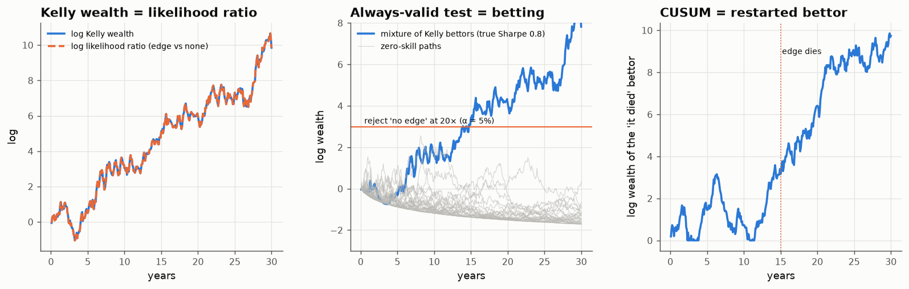

# 19 · The Kelly bettor is a statistician

*Code: [`code/19_testing_by_betting.py`](../code/19_testing_by_betting.py) · output: [`figures/19_output.txt`](../figures/19_output.txt)*

Three earlier notes answered what looked like different questions:

- note 05: how much should you bet on an edge? (Kelly, growth rate $\tfrac12\mathrm{SR}^2$)
- note 07: when can you conclude a manager has skill? (an always-valid
  boundary from a mixture martingale)
- note 18: when should you conclude an edge has died? (CUSUM, delay governed
  by $2/\Delta\mathrm{SR}^2$)

The quantity $\mathrm{SR}^2/2$ appeared in all three. It turns out they are all
**one object**: the wealth of a Kelly bettor. This is the idea behind "testing
by betting" (Shafer & Vovk; Shafer 2021; Grünwald's "safe testing" and
e-values). Working it out on my own examples made several earlier results
clearer.

## Kelly wealth is a likelihood ratio

Let excess returns be $dX = \mu\,dt + \sigma\,dB$. By Girsanov, the likelihood
ratio of "the edge is $\mu$" against "there is no edge" on an observed path is

$$\frac{dP_\mu}{dP_0} = \exp\!\Big(\frac{\mu}{\sigma^2}X_T - \frac{\mu^2}{2\sigma^2}T\Big).$$

A bettor who holds the Kelly leverage $f = \mu/\sigma^2$ has wealth

$$W_T = \exp\!\Big(f X_T - \tfrac12 f^2\sigma^2 T\Big),$$

**which is the same expression.** Path by path, a Kelly bettor's wealth *is*
the likelihood ratio in favour of their model (checked to $10^{-14}$ over 360
simulated months). Three things follow:

1. **Kelly's growth rate is the KL divergence.** $\mathbb E_\mu[\log W_T]/T = \mu^2/(2\sigma^2) = \mathrm{KL}(P_\mu\|P_0)$ per unit time.
   The rate at which a Kelly bettor gets rich *is* the rate at which evidence
   accumulates. That's why $\tfrac12\mathrm{SR}^2$ is the clock in notes 05, 07
   and 18.
2. **Under the null, Kelly wealth is a fair game.** If there is no edge, $W_t$ is
   a non-negative martingale with $W_0 = 1$, so by Ville's inequality
   $\Pr(\sup_t W_t \ge 1/\alpha) \le \alpha$. A test that rejects "no edge" when
   your Kelly bet has multiplied your money $1/\alpha$ times is valid **however
   often you look and whenever you stop**.
3. **Betting the wrong size is testing the wrong hypothesis.** Over- or
   under-betting relative to the true edge means your wealth grows slower than
   the KL rate. Note 05's shrinkage question is the same as asking which
   alternative hypothesis to test.

## Note 07's boundary is a mixture of bettors

You don't know $\mu$, so you can't bet the right Kelly fraction. Spread your
capital across bettors with different leverages $\lambda$, weighted by a prior
$\lambda\sim\mathcal N(0, 1/\rho)$. The combined wealth is

$$\int e^{\lambda S_t - \lambda^2 t/2}\,\varphi_\rho(\lambda)\,d\lambda = \sqrt{\frac{\rho}{t+\rho}}\exp\!\Big(\frac{S_t^2}{2(t+\rho)}\Big),$$

which is Robbins' normal-mixture martingale from note 07 exactly (numerical
integral against closed form: $10^{-15}$). So **the always-valid t ≈ 3
boundary is the rule "reject when a Bayesian mixture of Kelly bettors has made
20× its money"**. The mixture over leverages is Cover's universal portfolio in
continuous time. Over 30 years of monthly checks, 2.7% of zero-skill paths
reach 20×, within the 5% guarantee.

## Note 18's CUSUM is a bettor who keeps restarting

For detecting that an edge has died, take the likelihood ratio of "dead"
against "alive". As a bet, that is holding $-\mu$ units of the strategy's
*excess over its alive expectation*, $x_t - \mu$, which is a fair game while
the edge is alive. CUSUM is this bettor's log-wealth **with a floor at 1**:
every time the bet loses money, the bettor starts again from scratch. (It
matches the CUSUM statistic to $10^{-14}$.) Page's CUSUM is a gambler who
refuses to stay in debt, and the optimality results of Lorden and Moustakides
are statements about how fast such a gambler gets rich once the regime has
changed.

## Why I find this useful, not just neat

- **It unifies sizing and evidence.** How much to bet and how sure to be are
  the same computation. A strategy that "has a t-stat of 3" is one whose
  mixture-Kelly bettor has made about 20×, and that tells you both how
  confident to be and roughly how much edge the market has been paying.
- **It makes evidence composable.** Wealth from independent bets multiplies,
  and so do e-values. A research programme that keeps betting and reinvests
  winnings has a correct combined evidence measure (the total wealth) no
  matter how adaptively it chose what to test next. That is the
  selection-bias fix of note 05 from a different angle: if every idea is
  funded from the same betting account, failures are accounted for
  automatically.
- **It's robust to peeking.** Optional stopping, the problem behind note 07's
  35% false-positive rate, can't break Ville's inequality.

## A synthesis of notes 05, 07, 18

| question | object | rate |
|---|---|---|
| how much to bet? | Kelly fraction | growth $\tfrac12\mathrm{SR}^2$ |
| is there skill? | mixture-Kelly wealth ≥ 1/α | evidence $\tfrac12\mathrm{SR}^2$ per year |
| has the edge died? | restarted "it died" bettor ≥ $e^h$ | evidence $\tfrac12\Delta\mathrm{SR}^2$ per year |

One number, the squared Sharpe ratio over two, sets how fast you can get rich,
how fast you can learn you're right, and how fast you can learn you've become
wrong.
