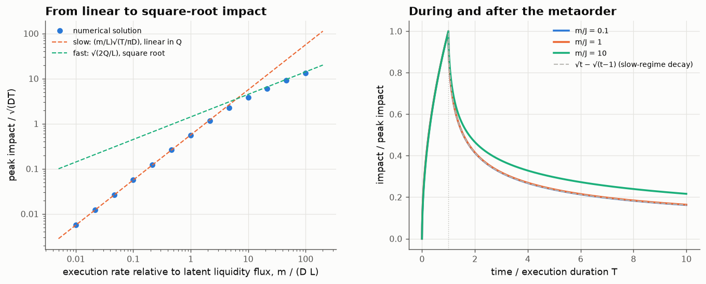

# 20 · The square-root law from a diffusing order book

*Code: [`code/20_latent_book_sqrt.py`](../code/20_latent_book_sqrt.py) · output: [`figures/20_output.txt`](../figures/20_output.txt)*

The most robust empirical law in market microstructure is the **square-root
law**: a metaorder of total size $Q$ moves the price by about
$Y\sigma\sqrt{Q/V}$ (with $V$ the daily volume and $Y$ of order one), across
markets, decades and execution styles. It is concave, so doubling an order does
not double its cost. Notes 10, 11 and 16 used *linear* propagators. This note
asks where the square root comes from, using the "latent liquidity" model of
Tóth et al. (2011) and Donier, Bonart, Mastromatteo & Bouchaud (2015), solved
numerically in a way I found clean.

## The model, and a trick that makes it linear

The visible order book is a small tip of the **latent** book: the buy and sell
intentions of everyone who *would* trade at a given price. Model latent buyers
(A) and sellers (B) as densities in price space that diffuse (people revise
their reservation prices) with coefficient $D$ and annihilate on contact
(A + B → trade).

The key observation is that the net density $\varphi = \rho_B - \rho_A$ obeys
the **plain heat equation**: annihilation removes equal amounts of both
species, so it drops out of the difference. The price is the zero of
$\varphi$. In the stationary state $\varphi(x) = L\,x$, a linear profile: very
little latent liquidity right at the price, growing linearly away from it.

A metaorder buying at rate $m$ for a time $T$ removes sell-side liquidity at
the current price, which is a moving point sink. Using the heat kernel, the
price path satisfies a nonlinear **Volterra integral equation**:

$$L\,p_t = m\int_0^{\min(t,T)} \frac{\exp\!\big(-(p_t - p_s)^2/4D(t-s)\big)}{\sqrt{4\pi D(t-s)}}\,ds .$$

I solve it step by step. On each time interval the integral is done *exactly*
in the time variable, using
$\int u^{-1/2}e^{-b/u}\,du = 2\sqrt u\,e^{-b/u} - 2\sqrt{\pi b}\,\mathrm{erfc}\sqrt{b/u}$,
with the price frozen at the interval midpoint. That handles the $u^{-1/2}$
singularity without ad hoc corrections. Each step is then a monotone 1-D root
find.

## Two regimes, one crossover

The natural flux of the latent book is $J = DL$ (how fast diffusion brings
liquidity to the price). The only dimensionless parameter is the execution rate
$r = m/J$. Two limits can be done by hand:

- **Slow** ($r\ll1$): the price barely moves compared with the diffusion
  length, so the kernel is just $1/\sqrt{4\pi D(t-s)}$ and
  $$I = \frac{m}{L}\sqrt{\frac{T}{\pi D}} .$$
- **Fast** ($r\gg1$): diffusion can't refill, so the metaorder simply eats
  the linear profile. Removing $Q$ from a density $Lx$ moves the price to
  $\int_0^{I}Lx\,dx = Q$:
  $$I = \sqrt{2Q/L}.$$

The numerical solution follows $r/\sqrt\pi$ to three digits for $r\le0.5$ and
approaches $\sqrt{2r}$ from below for large $r$ (93.5% of it at $r = 100$). The
crossover is around $r\approx5$.

**The two square roots are different.** In the slow regime, at a *fixed
participation rate* $m$, impact is $\propto\sqrt T\propto\sqrt Q$. This square
root comes from diffusion: the heat kernel makes the refilled liquidity grow
like $\sqrt t$. In the fast regime impact is $\sqrt{2Q/L}$ whatever the rate.
This square root comes from geometry: the book is linear, so the volume
removed grows like the price move squared. The empirical law, $\sqrt Q$ with
weak dependence on execution speed, matches the **fast** regime. Real
metaorders are "fast" relative to how quickly latent liquidity revises itself.

## What happens after the metaorder

In the slow regime, impact after completion relaxes exactly as
$I(t)/I(T) = \sqrt{t} - \sqrt{t-T}$ (the numerical solution: 0.414 at $2T$ and
0.162 at $10T$, against the formula's 0.414 and 0.162). In the fast regime it
relaxes more slowly (0.47 at $2T$, 0.22 at $10T$), because the depleted region
is wide and diffusion takes longer to refill it. Either way the impact is
**fully transient** in this model: with no permanent information content,
prices return to where they started. Empirical studies of metaorders often
find that a sizeable fraction of peak impact persists (figures around
two-thirds are commonly quoted). That persistent part reflects information,
which this model doesn't contain.

## Connecting to note 10

In the slow regime, the response to a small trade is the heat kernel, so the
linear propagator of this model decays as $G(t)\propto t^{-1/2}$: $\beta = \tfrac12$.
Note 10 showed that with long-memory order flow ($\gamma\approx0.5$), prices
are diffusive only if $\beta = (1-\gamma)/2\approx0.25$. With $\beta=\tfrac12$
they would **mean-revert**. So the simplest latent book is *too* forgetful
to be consistent with efficiency.

The fix in the literature (Benzaquen & Bouchaud, 2018) is a latent book with a
*broad spectrum of renewal times*: some intentions are revised in seconds,
others persist for weeks. Averaging heat kernels over that spectrum slows the
decay to $t^{-\beta}$ with $\beta<\tfrac12$, and the right spectrum gives the
efficient exponent. So the heterogeneity of investor horizons isn't a detail.
**It is what makes a square-root, diffusion-driven book compatible with an
efficient price.**

## Summary

- The net latent density obeys the heat equation exactly. A metaorder is a
  moving sink, and the price solves a Volterra equation that is easy to solve
  with exact product integration.
- Slow execution: $I = (m/L)\sqrt{T/\pi D}$ (a diffusion square root). Fast
  execution: $I = \sqrt{2Q/L}$ (a geometric square root). The empirical law
  is the fast one.
- Pure diffusion gives a $t^{-1/2}$ propagator, which is too fast-decaying
  for efficiency under long-memory order flow. Heterogeneous revision times
  fix that.
