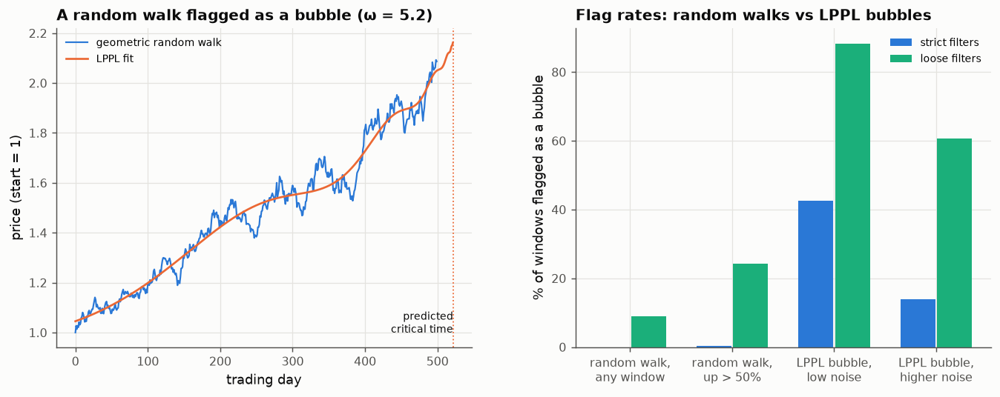

# 21 · How often does a random walk look like a bubble?

*Code: [`code/21_lppl_false_positives.py`](../code/21_lppl_false_positives.py) (simulation), [`code/21b_lppl_real.py`](../code/21b_lppl_real.py) (real data) · output: [`figures/21_output.txt`](../figures/21_output.txt), [`figures/21_lppl_real_output.txt`](../figures/21_lppl_real_output.txt)*

(Written after the real-data notes began, although numbered 21.)

The **log-periodic power law** (LPPL; Johansen, Ledoit & Sornette) is the
best-known mathematical model of bubbles. Before a crash, it says, the log
price accelerates super-exponentially toward a critical time $t_c$, decorated
by oscillations that speed up as $t_c$ approaches:

$$\log p(t) = A + B(t_c - t)^m + C(t_c-t)^m\cos\big(\omega\ln(t_c - t) - \phi\big).$$

It is fitted to rallies to "diagnose" bubbles and estimate crash dates. Seven
parameters and a flexible oscillating term raise an obvious question: **how
often does it find a bubble in a plain random walk?**

## Method

- **Fitting.** The Filimonov–Sornette reformulation makes $A$, $B$ and the two
  oscillation amplitudes linear given $(t_c, m, \omega)$. So I grid-search those
  three (7,150 combinations, compiled with numba), solve the linear part by
  least squares, then polish with Nelder–Mead.
- **Qualification filters**, in the style of Sornette's group.
  *Strict*: $0.1\le m\le0.9$, $6\le\omega\le13$, $B<0$, $t_c$ within 10% of
  the window after its end, damping $m|B|/(\omega|C|)\ge0.8$, and at least 2.5
  oscillations. *Loose*: $0.01\le m\le0.99$, $2\le\omega\le15$, $B<0$,
  $t_c$ within 20%, damping ≥ 0.5.
- **Samples.** 500-day windows of geometric Brownian motion (8% drift, 20%
  vol); the same conditioned on having risen more than 50% (the windows
  people actually test); and **genuine LPPL bubbles** plus autocorrelated
  noise as a positive control, with oscillation amplitude small enough to
  pass the damping filter.

## Results (300 windows each)

| sample | strict filters | loose filters | median R² of fit |
|---|---|---|---|
| random walk, any window | 0.0 % | 9.0 % | 0.86 |
| random walk, **up > 50 %** | 0.3 % | **24.3 %** | 0.95 |
| true LPPL bubble, low noise | 42.7 % | 88.3 % | 0.99 |
| true LPPL bubble, realistic noise | **14.0 %** | 60.7 % | 0.97 |

The trade-off is bad either way:

- **Loose filters** catch 61–88% of genuine bubbles but also flag **a quarter
  of random walks that simply rose 50%**. With any plausible base rate of true
  bubbles among strong rallies (say 5%), a loose flag means a bubble only
  about 12% of the time.
- **Strict filters** almost never flag random walks (0.3%), but catch only 14%
  of genuine LPPL bubbles at realistic noise. The damping filter itself forces
  the oscillations to be small relative to the trend, and small oscillations
  are hard to see in noise.
- Random walks flagged by the loose filters get **predicted crash dates
  about 22 trading days after the window ends** (IQR 2–53). The fit puts
  $t_c$ right after the data, because the super-exponential term is fitting
  the most recent rally, whatever caused it.
- A median R² of 0.95 on *random walks* shows why goodness of fit says
  nothing here.

## Real data: rolling LPPL on the S&P 500 and NASDAQ, 2001–2018

Rolling 500-day windows, advanced 10 days at a time, with the next 120 trading
days recorded after each window. (The daily data start in 1999, so the
dot-com peak can't be tested.)

| index | filter | windows flagged | next-120d return (flagged / not) | next-120d max drawdown (flagged / not) |
|---|---|---|---|---|
| S&P 500 | strict | 5 of 442 (1.1 %) | +3.9 % / +2.1 % | −6.4 % / −11.7 % |
| S&P 500 | loose | 55 (12.4 %) | +1.4 % / +2.2 % | −9.4 % / −11.9 % |
| NASDAQ | strict | 0 of 442 | | |
| NASDAQ | loose | 44 (10.0 %) | +1.3 % / +3.5 % | −11.5 % / −14.9 % |

Flagged windows were followed by slightly *lower* returns but *smaller*
drawdowns than unflagged ones, which is the opposite of a crash warning. The
loose flags cluster in 2005, 2007, 2011, 2014–15 and 2017–18. The 2007 flags
came before the 2008 crash, but 2014–15 and 2017 flags were followed by modest
corrections at most. The flag rate on real data (10–12%) sits between the
random-walk rates (9% for any window, 24% for strong rallies), about what
you'd expect if the detector were reacting to rallies rather than bubbles.

## Summary

- With realistic noise, LPPL bubble detection is either **sensitive and
  unspecific** (loose filters: flags a quarter of ordinary strong rallies) or
  **specific and insensitive** (strict filters: misses most genuine LPPL
  bubbles).
- Fitted critical times on random walks land just after the end of the
  window, so a "predicted crash date" is mostly a restatement of "prices have
  been rising".
- On 2001–2018 S&P and NASDAQ data, flags didn't precede larger drawdowns.

That doesn't prove bubbles lack log-periodic structure. It shows that with
realistic noise and window lengths, the LPPL fit can't separate that
structure from a rally. The honest null has to be a random walk *conditioned
on having risen*, because that is the situation in which anyone asks whether
something is a bubble.
