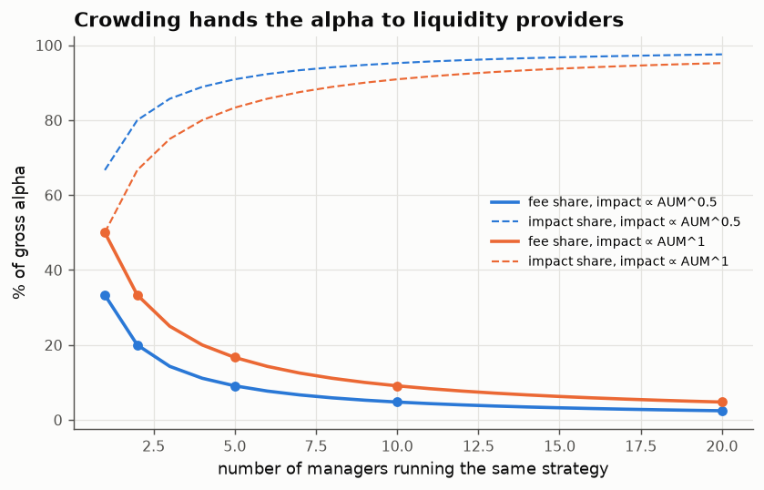

# 22 · Who gets the alpha? Thirds, crowding and the square-root law

*Code: [`code/22_who_gets_alpha.py`](../code/22_who_gets_alpha.py) · output: [`figures/22_output.txt`](../figures/22_output.txt)*

Suppose a strategy has genuine gross alpha $a$ per dollar per year. Three
parties can end up with it: the **manager** (through fees), the **investors**
(net returns), and **liquidity providers** (through the market impact the
strategy pays when it trades). How it splits turns out to depend on one
exponent and one integer, and the answer is simple enough to remember.

## Setup

- Impact cost per dollar of assets under management grows with AUM $S$ as
  $kS^\delta$. With the square-root law (note 20), impact per dollar traded is
  $\propto\sqrt{\text{trade size}}\propto\sqrt S$, so $\delta = \tfrac12$.
  Linear impact would give $\delta = 1$.
- Investors are competitive, as in Berk & Green (2004): money flows in until
  investors' net alpha is zero, $a - f - kS^\delta = 0$, where $f$ is the fee.

## One manager: the rule of thirds

A monopolist manager picks the fee $f$ to maximise revenue $f\cdot S(f)$, where
$S(f) = ((a-f)/k)^{1/\delta}$. Differentiating,

$$f^* = \frac{\delta}{1+\delta}\,a,\qquad \text{impact cost} = \frac{1}{1+\delta}\,a,\qquad \text{investors} = 0 .$$

With the square-root law ($\delta=\tfrac12$): **the manager keeps one third of
the gross alpha, market impact eats two thirds, and investors get nothing
beyond fair compensation for risk.** (With linear impact the split is half and
half.)

## N managers running the same strategy

Now let $N$ managers trade the same signal, so they share one impact function
$kS^\delta$ with $S = \sum_i A_i$. Each chooses its capacity $A_i$, and
competitive investors hold each fund's net alpha at zero, so fund $i$'s
revenue is $A_i\,(a - kS^\delta)$. This is a Cournot game. The symmetric
equilibrium has

$$\text{fee share} = \frac{\delta}{N+\delta},\qquad \text{impact share} = \frac{N}{N+\delta}.$$

Best-response iteration reproduces the formula to four decimal places:

| managers N | fee share (δ = ½) | impact share (δ = ½) | fee share (δ = 1) |
|---|---|---|---|
| 1 | 33.3% | 66.7% | 50.0% |
| 2 | 20.0% | 80.0% | 33.3% |
| 5 | 9.1% | 90.9% | 16.7% |
| 10 | **4.8%** | **95.2%** | 9.1% |
| 20 | 2.4% | 97.6% | 4.8% |

**Crowding transfers alpha to whoever provides liquidity.** With ten managers
on the same signal, 95% of the gross alpha is paid out as market impact: to
market makers, and to the other side of the crowded trade.

## Things this clarifies

1. **Why a "good" strategy's live returns look so poor.** A strategy's
   *paper* alpha is gross of impact. Even a monopolist should run it at a
   scale where two thirds of that alpha is lost to impact. So a paper
   Sharpe of 1.5 turning into a live Sharpe of 0.5 is what optimal sizing
   *implies*, not evidence of a mistake.
2. **Why published anomalies decay.** Publication raises $N$. If the gross
   mispricing is fixed, paper returns stay the same but achievable returns
   collapse toward zero as $N$ grows. If arbitrage capital actually moves
   prices (the mispricing shrinks as capital arrives), the paper returns
   decay too. McLean & Pontiff's large post-publication declines are
   consistent with this, though with realistic, finite capital $N$ is
   probably not large.
3. **Who benefits from crowded trades.** Liquidity providers, not investors
   and not managers. That fits with the rise of market makers as some of the
   most consistently profitable firms in finance.
4. **The exponent matters.** Concave (square-root) impact gives the manager
   a *smaller* share than linear impact would ($\tfrac13$ vs $\tfrac12$).
   Concavity means the marginal dollar is cheaper to deploy, so capacity is
   larger, fees are lower, and more alpha is burned.

## Caveats

This is a static model with a fixed gross alpha and no risk aversion, no
information heterogeneity, and no decay of the signal itself. Berk–Green's
zero-net-alpha condition is an equilibrium assumption, and empirically net
alpha to investors is somewhere around zero, which is consistent with it. A
dynamic version, where managers enter until fee revenue covers a fixed cost
of research, would make $N$ endogenous. Setting
$\text{fee revenue} = aS\,\delta/(N+\delta)$ equal to that cost gives the
equilibrium number of competitors, and so a prediction for how crowded a
strategy of a given gross alpha becomes.
