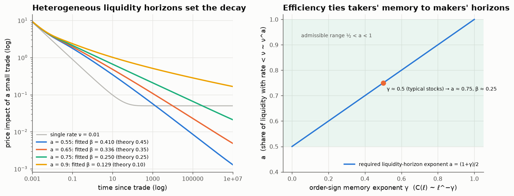

# 23 · Liquidity providers' horizons set how impact decays

*Code: [`code/23_multiscale_book.py`](../code/23_multiscale_book.py) · output: [`figures/23_output.txt`](../figures/23_output.txt)*

Note 10 showed that when order flow has long memory (sign autocorrelation
$\sim\ell^{-\gamma}$), prices are diffusive only if the impact of a trade
decays as $t^{-\beta}$ with $\beta = (1-\gamma)/2$. Note 20 showed that a
latent order book in which liquidity simply diffuses gives $\beta=\tfrac12$,
which is too fast, and pointed to heterogeneous liquidity horizons as the
fix. This note derives that fix and gets an explicit exponent.

## A latent book with many horizons

Split latent liquidity into populations indexed by a renewal rate $\nu$: how
often those participants cancel and re-post their interest *around the current
price*. A market maker has $\nu$ of seconds; a pension fund's standing
interest has $\nu$ of months. Population $\nu$ holds a share $\rho(\nu)$ of the
liquidity near the price. Its net density $\varphi_\nu$ diffuses, decays at rate
$\nu$, and is re-deposited around the current price $p_t$:

$$\partial_t\varphi_\nu = D\,\partial_x^2\varphi_\nu - \nu\varphi_\nu + \nu L\rho(\nu)\,(x - p_t).$$

A small trade $\delta q$ at time 0 removes liquidity at the price. Linearising
around the stationary profile, the price response $u(t) = \delta p(t)$ solves

$$L\,u(t) = \delta q\sum_\nu \rho_\nu\frac{e^{-\nu t}}{\sqrt{4\pi D t}} \;+\; L\sum_\nu\nu\rho_\nu\int_0^t u(s)\,e^{-\nu(t-s)}\,ds,$$

and in Laplace space it has the closed form

$$\hat u(z) = \frac{\delta q}{2L\sqrt D}\;\frac{\sum_\nu\rho_\nu\,(z+\nu)^{-1/2}}{\sum_\nu\rho_\nu\,z/(z+\nu)} .$$

**One population.** Inverting gives
$u(t) = \frac{\delta q}{2L\sqrt D}\big[e^{-\nu t}/\sqrt{\pi t} + \sqrt\nu\,\mathrm{erf}\sqrt{\nu t}\big]$:
heat-kernel decay $t^{-1/2}$ at short times, then a **permanent** impact
$\propto\sqrt\nu$. Liquidity that renews "forgets" where the price used to be
and re-centres on where it is, so it stops pushing the price back.

**A power-law spread of horizons.** Suppose the share of liquidity with renewal
rate below $\nu$ scales like $\nu^a$, i.e. $\rho(\nu)\,d\nu\propto\nu^{a-1}d\nu$
for small $\nu$, with $0<a<1$. For small $z$ the denominator is
$z\int\rho/(z+\nu)\sim z^{a}$. If $a>\tfrac12$ the numerator stays finite, so
$\hat u\sim z^{-a}$ and by a Tauberian argument

$$\boxed{\;G(t)\sim t^{-(1-a)},\qquad \beta = 1 - a\quad(\tfrac12<a<1)\;}$$

If $a<\tfrac12$ the numerator diverges too, and the heat kernel wins:
$\beta = \tfrac12$.

## Numerical check

I computed $u(t)$ by a fixed-Talbot numerical inverse Laplace transform (all
singularities lie on the negative real axis, which is the case Talbot's
contour is designed for), with 400 populations spanning rates $10^{-9}$ to
$10^{2}$:

| spectrum exponent a | fitted decay exponent β (t from 10² to 10⁶) | theory 1 − a |
|---|---|---|
| single rate ν = 0.01 | permanent level 0.0500 | √ν/2 = 0.0500 |
| 0.30 | 0.487 | ½ (heat kernel) |
| 0.55 | 0.410 | 0.45 |
| 0.65 | 0.336 | 0.35 |
| **0.75** | **0.250** | **0.25** |
| 0.90 | 0.129 | 0.10 |

Talbot inversion matches the single-population closed form to $2\times10^{-4}$.
The power-law cases converge to $1-a$ with the slow, logarithmic approach you'd
expect near the ends of the range ($a\to\tfrac12$ and $a\to1$).

## Efficiency ties both sides of the market together

Combine this with note 10's efficiency condition:

$$1 - a = \frac{1-\gamma}{2}\qquad\Longleftrightarrow\qquad a = \frac{1+\gamma}{2}.$$

The left side of the market (liquidity *takers*) has order-flow memory set by
how metaorders are split, with exponent $\gamma$. The right side (liquidity
*providers*) has a spread of revision horizons with exponent $a$. **The price
is a martingale only if the two match.** For typical stocks, $\gamma\approx0.5$
requires $a\approx0.75$: the share of latent liquidity revised more slowly than
rate $\nu$ should scale like $\nu^{3/4}$.

Some thoughts on this:

- It turns "the market is efficient" into a statement about **populations**:
  the horizons of patient liquidity providers must be spread in a particular
  way relative to the persistence of impatient liquidity takers. Nothing forces
  this *a priori*. It would have to be an equilibrium outcome, since
  providers whose horizons don't match earn predictable profits or losses, and
  the population adjusts.
- It gives a testable relation between two things that are normally measured
  separately: sign autocorrelation in the trade tape (γ), and the
  distribution of order lifetimes and revision times in the book (a).
- Notes 06, 08, 10 and 20 each found an exponent fixed by efficiency. This
  one fixes a **distribution**: the market's ecology of horizons.

(Benzaquen & Bouchaud (2018) developed a fractional reaction–diffusion version
of this multi-timescale latent book. The Laplace-domain derivation and the
$a = (1+\gamma)/2$ matching condition are my own working, and they may well
coincide with results there.)
