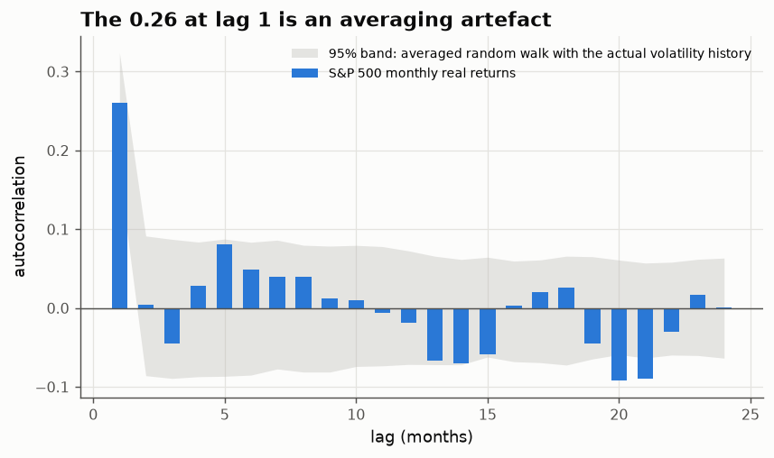
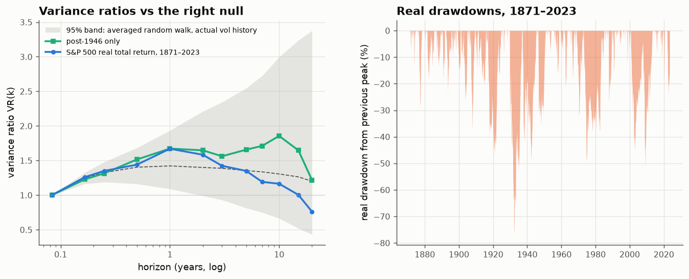

# 24 · 150 years of the S&P 500: which trends survive an honest null?

*Code: [`code/24_long_run_sp500.py`](../code/24_long_run_sp500.py) · output: [`figures/24_output.txt`](../figures/24_output.txt) · data: Shiller's monthly S&P composite via [`code/data.py`](../code/data.py)*

This is the first note on **real data**. Shiller's monthly series gives the
S&P composite price back to 1871, with dividends and CPI to mid-2023, so I can
compute real total returns over 152 years. The question: are there
*trends* in the index, meaning momentum or mean reversion that make future
returns predictable from past ones, or is it a random walk with drift?

## The trap in this dataset

Shiller's monthly prices are **averages of daily closes over the month**, not
month-end prices. Holbrook Working pointed out in 1960 that averaging a random
walk creates artificial structure: monthly changes get a lag-1
autocorrelation of about +0.25, and their variance shrinks to 2/3 of the true
value. Run the textbook autocorrelation test on this series and you "discover"
strong one-month momentum. It isn't there.

So every null hypothesis below is **simulated with the same averaging**: a
daily random walk averaged into months exactly as Shiller's prices are. The
stronger version also gives the random walk the S&P's actual volatility
history (a 13-month rolling estimate), so the 1930s are as turbulent in the
null as in the data.

## 1. Growth rates, and a check on note 01

| real total return, 1871–2023 | value |
|---|---|
| arithmetic mean | 7.69 %/yr |
| geometric mean | 6.90 %/yr |
| difference (volatility drag) | **1.01 %/yr** |
| σ²/2 from the monthly vol | **1.00 %/yr** |
| calendar years with negative real return | 31 % |

The gap between arithmetic and geometric means is σ²/2 to within a
hundredth of a percent, which is the μ−σ²/2 of note 01 on real data.

By era (real geometric return; volatility corrected for averaging):

| era | real growth | volatility |
|---|---|---|
| 1871–1913 | 7.1 % | 13.8 % |
| 1914–1945 | 6.4 % | **24.6 %** |
| 1946–1981 | 5.3 % | 14.9 % |
| 1982–2000 | **13.1 %** | 14.2 % |
| 2001–2023 | 4.8 % | 16.6 % |

Two things stand out. Volatility is remarkably stable at about 14–17% except
in 1914–1945. And the famous late-20th-century boom (13% real for 19 years)
is the outlier, not the norm.

## 2. Autocorrelation: the averaging artefact, and what's left

- The lag-1 autocorrelation is **0.260**. The averaged-random-walk null puts it
  at about 0.25 (95% band 0.21–0.30). **All of the apparent one-month momentum
  is averaging.**
- Against a constant-volatility null, a portmanteau test on lags 2–24 rejects
  strongly (p < 0.001). There is positive autocorrelation around 5–6 months and
  negative around 13–15 and 20–21 months.
- Against the null **with the actual volatility history**, that rejection
  disappears (p = 0.11). Only lags 20–21 fall outside the band, about what
  chance gives with 24 lags. The "structure" comes from the 1930s: huge
  volatility makes a few autocorrelations look large. Pre-1946
  autocorrelations at those lags are −0.09 to −0.10. Post-1946 they are
  mostly within ±0.04.

## 3. Variance ratios: mean reversion is a pre-war phenomenon

If prices mean-revert over long horizons, multi-year changes should vary less
than a random walk would allow: variance ratio below the null.

| horizon | full sample VR | post-1946 VR | 95% null band (actual vol history) |
|---|---|---|---|
| 1 y | 1.67 | 1.67 | 1.09 – 1.94 |
| 5 y | 1.35 | 1.66 | 0.81 – 2.55 |
| 10 y | 1.16 | 1.86 | 0.66 – 3.00 |
| 20 y | **0.76** | 1.22 | 0.43 – 3.38 |

(The null median is about 1.4 rather than 1, because of the averaging.)

The full sample shows the classic pattern that Poterba & Summers and Fama &
French made famous in the late 1980s: variance ratios falling below the
random-walk level at long horizons, i.e. mean reversion. But:

1. **It isn't significant.** With only about seven independent 20-year
   windows in 152 years, the null band is enormous (0.43–3.38).
2. **It's a pre-war pattern.** From 1946 on, the variance ratios go the other
   way (1.66 at 5 years, 1.86 at 10 years), which, if anything, suggests mild
   trending. Kim, Nelson & Startz reached the same conclusion in 1991, and 30
   more years of data haven't changed it.

So on the question of whether the market mean-reverts in the long run, the
data can't decide, and the evidence that appears to favour it comes from
1929–1945.

## 4. Tails and drawdowns

- Monthly real returns have kurtosis **14** and a Hill tail exponent of about
  **2.8–3.2**. That is a cubic law even at the monthly horizon, driven by
  1929–1932 (four of the five worst months: −26%, −23%, −18%, plus 2008-10
  and 2020-03 at −19%). Note 15's warning applies: with this sample size,
  "exponent ≈ 3" and "lognormal mixture with a rough-vol regime in the 1930s"
  can't be told apart.
- The maximum **real** drawdown was −77% (June 1932). The longest time spent
  below a previous real peak was **12.7 years (Sept 2000 – May 2013)**,
  closely followed by 1973–1985 (11.9 years).

## What's real, and what isn't

| claim | verdict |
|---|---|
| Stocks grow about 6.9% real a year with about 1% volatility drag | robust (note 01's formula holds exactly) |
| Monthly momentum (lag-1 autocorrelation 0.26) | **artefact** of monthly averaging |
| Autocorrelation at 5–21 months | not significant once volatility clustering is respected |
| Long-horizon mean reversion | pre-war only and not significant; post-war data point the other way |
| Fat tails, exponent about 3 | present, but dominated by one episode (1929–32) |
| Decade-scale real drawdowns happen | yes: 12.7 years underwater from 2000 |

The broad lesson matches the theory notes. At the index level, **the honest
null is very hard to beat**, and most apparent trends come from the
measurement (averaging), the model of the null (ignoring volatility
clustering), or a single historical episode. The next notes look where
structure is more likely to be real: daily data, volatility itself, and the
cross-section.
