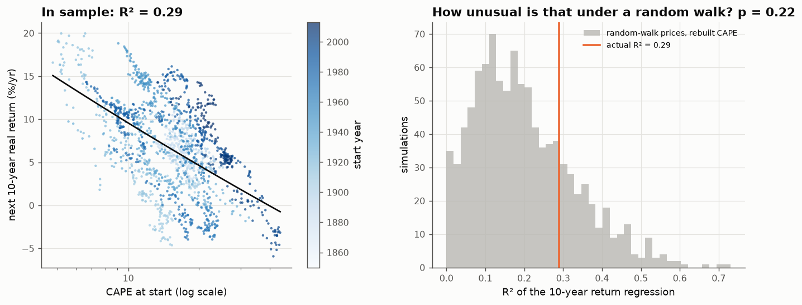
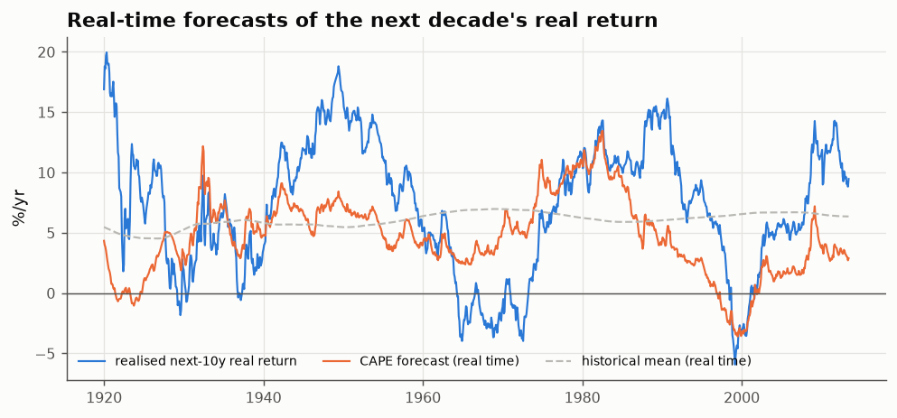

# 25 · Does valuation predict the next decade? CAPE against a fair null

*Code: [`code/25_cape_predictability.py`](../code/25_cape_predictability.py) · output: [`figures/25_output.txt`](../figures/25_output.txt) · data: Shiller monthly, 1881–2023*

The most widely cited "long-term trend" in equity markets is that **high
valuations predict low subsequent returns**. Shiller's cyclically adjusted P/E
(CAPE: price over ten-year average real earnings) is the standard measure, and
the chart of CAPE against the next decade's return is famous. Note 24 found no
robust trend in past returns themselves. Valuation is a different kind of
predictor, so this note tests it.

## In sample

Regressing the next 10-year annualised real total return on $\log(\mathrm{CAPE})$,
using start dates from 1881 to 2013:

$$\text{next 10y real return} = 0.244 - 0.066\,\log(\mathrm{CAPE}),\qquad R^2 = 0.29 .$$

The slope says a doubling of CAPE comes with 4.6 percentage points a year
lower returns over the following decade. Non-overlapping decades (14 points)
give the same slope and R² = 0.27.

## The fair null: random-walk prices, CAPE rebuilt

Two well-known problems make a 29% R² hard to interpret:

1. **Overlapping outcomes and a persistent predictor.** Monthly start dates
   share nine years and eleven months of their 10-year windows, and CAPE
   barely changes from month to month. There are really only about 13
   independent observations, and two slow-moving series with 13 degrees of
   freedom produce large R² values by chance.
2. **Stambaugh bias.** CAPE has price in the numerator, so its innovations
   are strongly correlated with returns. In small samples this biases the slope
   toward exactly the negative value the theory predicts.

So I built the null that has both features. I generated **random-walk prices**
(12-month block bootstrap of the actual real returns, so volatility and fat
tails are realistic but there is no predictability) and **rebuilt CAPE from the
simulated prices and the actual earnings history**, then ran the same
regression 1,000 times:

| | data | random-walk null: median | 95th percentile | p-value |
|---|---|---|---|---|
| R² | 0.29 | 0.18 | 0.45 | **0.22** |
| slope | −0.066 | −0.034 | −0.076 (5th pct) | 0.09 |

**A 29% R² is unremarkable when prices are a random walk.** The null's
*median* R² is 18%, and its median slope is already negative (Stambaugh bias).
The evidence that CAPE predicts returns is weak: a slope p-value of 0.09 at
best.

## Out of sample

The practical test is whether an investor using CAPE *in real time*, with only
data available at the time, would have beaten a forecast equal to the
historical average return (Goyal & Welch's test):

| forecasts made | out-of-sample R² vs historical mean | average error (actual − forecast) |
|---|---|---|
| 1920–1959 | −0.14 | +3.5 %/yr |
| 1960–1989 | **+0.46** | −1.1 %/yr |
| 1990–2013 | −0.21 | **+4.5 %/yr** |
| all (1920–2013) | +0.08 | |

CAPE forecasting **worked well for one 30-year stretch (1960–1989)**, and was
worse than the naive mean before and since. After 1990 it was systematically
too pessimistic by about 4.5 percentage points a year.

## Why: the level of CAPE drifted

| period | mean CAPE |
|---|---|
| 1881–1919 | 15.6 |
| 1920–1959 | 13.3 |
| 1960–1989 | 15.0 |
| 1990–2023 | **26.5** |

Predicting returns from valuation assumes valuations *revert to a fixed
mean*. For 110 years that mean was about 15. Since 1990 CAPE has averaged 26
and has rarely been below 20. Whatever the reason (lower real rates, higher
profit margins, changes in accounting and payout policy that bias the earnings
denominator, or a lower equity risk premium), a regression fitted on the old
mean keeps predicting a reversion that hasn't happened.

A live example: at the last CAPE in the data (29.9, June 2023) the in-sample
regression predicts **1.9% a year** real return for the next decade. In the
3.2 years since, the S&P 500's *nominal price* has risen **19.9% a year**.
Three years is short and says nothing definitive about ten, but the pattern
of a pessimistic CAPE forecast followed by a strong market is the same one
behind the negative out-of-sample R² since 1990.

## Summary

- The famous CAPE–returns relationship has the right sign and a plausible
  size, but **it isn't statistically distinguishable from what random-walk
  prices produce** once the null includes the persistent-regressor and
  Stambaugh effects.
- Its real-time forecasting record is good only for 1960–1989.
- The underlying problem is non-stationarity: the "normal" level of valuation
  is itself a trend, and long-horizon regressions can't estimate a moving
  mean with 13 independent observations.

This matches the general conclusion from notes 07 and 24: **long-horizon
effects have very few independent observations**, and the honest error bars
are much wider than the scatter plot suggests.
