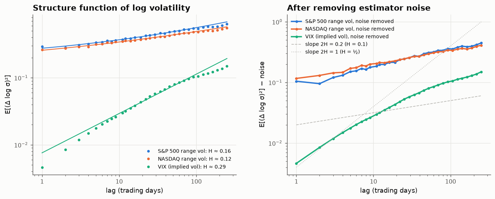

# 26 · Real volatility is rough, and GARCH still gets the tails wrong

*Code: [`code/26_daily_stylised_facts.py`](../code/26_daily_stylised_facts.py) · output: [`figures/26_output.txt`](../figures/26_output.txt) · data: daily S&P 500 and NASDAQ OHLC 1999–2018, VIX 1990–2026*

Several theory notes made claims that daily data can test:

- note 08: volatility is **rough**, with $H\approx0.1$ if order flow is nearly
  critical;
- note 14: a fitted GARCH implies a tail exponent through the Kesten equation;
- note 15: fitting a short-memory GARCH to long-memory volatility pushes
  persistence toward 1 and **invents fat tails**.

## A data-quality trap first

In this dataset (Yahoo-sourced, bundled with the `arch` package), the S&P 500's
"Open" equals the previous close on 96% of days in 1999–2005 and on almost no
days after 2014. It isn't a real opening price for most of the early sample.
So nothing here uses opens. Daily volatility comes from the **Parkinson range
estimator** $(\ln H/L)^2/4\ln 2$, which needs only the high and low.

## 1. Is volatility rough?

Following Gatheral, Jaisson & Rosenbaum, I look at the structure function
$m_2(\Delta) = \mathbb E[(\log\sigma_{t+\Delta}-\log\sigma_t)^2]\propto\Delta^{2H}$.
One day's range is a noisy measure of that day's volatility, and the noise
adds a constant to $m_2$ that flattens the curve and biases $H$ down. So I fit
$m_2(\Delta) = c\,\Delta^{2H} + 2\eta^2$ with an explicit noise term, over lags
of 1–100 days.

| series | noise-corrected H | naive log-log slope ÷ 2 |
|---|---|---|
| S&P 500, 1999–2018 | **0.156 ± 0.017** | 0.079 |
| NASDAQ, 1999–2018 | **0.121 ± 0.013** | 0.071 |
| S&P 500, 1999–2008 / 2009–2018 | 0.189 / 0.136 | |
| NASDAQ, 1999–2008 / 2009–2018 | 0.149 / 0.105 | |
| VIX (implied), 1990–2026 | 0.29 (see below) | 0.34 |

**Realised volatility is rough**: $H$ between 0.10 and 0.19 in every
subsample, far from the $\tfrac12$ of classical stochastic-volatility models
and in line with the 0.1–0.15 that Gatheral et al. found with intraday
data. With the naive fit, measurement noise alone would have given a
spuriously "very rough" 0.07–0.08. Note 08's mechanism (nearly critical Hawkes
order flow with a $t^{-1.6}$ kernel) gives $H\approx0.1$, which is the right
neighbourhood.

The VIX looks different. At lags up to about 20 days its structure function
has slope close to 1 ($H\approx\tfrac12$), and it flattens beyond that. That's
what you'd expect: the VIX is the market's forecast of *average* variance over
the next 30 days, and averaging a rough process over a window makes it smooth
on scales shorter than the window. The single fitted $H = 0.29$ is a
compromise between two regimes, not a real exponent.

## 2. The other stylised facts, measured

| fact | S&P 500, 1999–2018 |
|---|---|
| kurtosis of daily returns | 11.2 (NASDAQ 8.4) |
| Hill tail exponent, top 1% / 2% / 5% | 3.77 / 3.38 / 2.94 |
| autocorrelation of abs(r) at lags 1 / 20 / 250 days | 0.24 / 0.24 / 0.05 |
| decay of abs(r) autocorrelation, lags 5–250 | power law, exponent 0.41 (long memory) |
| leverage: corr(r_t, abs(r_t+k)), k = 1…5 | −0.13, −0.11, −0.08, −0.10, −0.08 |
| reverse: corr(abs(r_t), r_t+k) | about 0 (+0.04 … −0.02) |

Volatility clustering at a 20-day lag is as strong as at 1 day, which is long
memory. The leverage effect is one-directional: falls predict higher
volatility, but volatility doesn't predict returns. So the process isn't
time-reversible.

## 3. GARCH tails on real data: note 15 happens

| model (S&P 500) | persistence α+β | implied tail exponent | data (Hill, top 2%) |
|---|---|---|---|
| GARCH(1,1), Gaussian innovations | 0.987 | 2κ = **4.40** | 3.38 |
| GARCH(1,1), Student-t (ν = 6.5) | **0.9996** | min(2κ, ν) = **2.04** | 3.38 |
| FIGARCH (long memory), Gaussian | d = 0.54 | | |

(NASDAQ: 0.991 → 4.42; t-GARCH 0.9985 → 2.29; FIGARCH d = 0.51.)

The Gaussian GARCH's implied tail (4.4) is somewhat thinner than the data
(Hill 3.4 at the top 2%). The **Student-t GARCH is the telling case**. Given
fat-tailed innovations it becomes even more persistent: 0.9996 is
indistinguishable from IGARCH. Its Kesten equation then implies a tail
exponent of **2.04**, i.e. infinite variance, far fatter than anything in
the data. That is note 15's mechanism on real data: slow-decaying (long-memory)
volatility clustering gets squeezed into the one persistence parameter
GARCH has, and the implied tail becomes absurd.

The long-memory model fits better. FIGARCH's fractional-integration parameter
is $d\approx0.5$ for both indices, and it improves the log-likelihood by 11–12
points with one extra parameter (a likelihood-ratio statistic of about 22,
overwhelming). The data are telling us that volatility has long memory, and a
short-memory model misreads that as extreme tails.

## Summary

- Realised volatility is **rough**, $H\approx0.12$–$0.16$, but only once
  measurement noise is handled. The naive estimate is biased low by half.
- Implied volatility (VIX) is *not* rough at short lags, because it is a
  30-day average.
- Long memory in volatility is strong (power-law autocorrelation of $|r|$ with
  exponent about 0.4; FIGARCH $d\approx0.5$), and a fat-tailed GARCH fitted
  to it implies an infinite-variance tail the data don't have.
