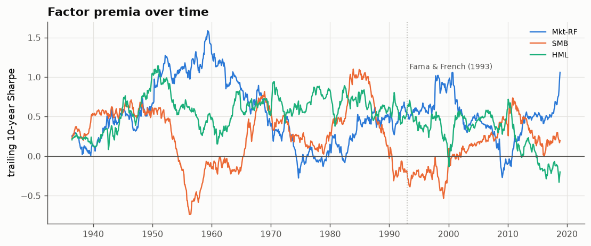
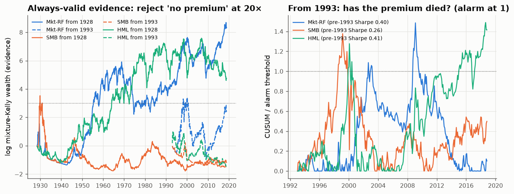

# 27 · Factor premia, 1926–2018: when were they proven, and did they die?

*Code: [`code/27_factor_premia.py`](../code/27_factor_premia.py) · output: [`figures/27_output.txt`](../figures/27_output.txt) · data: Fama–French 3 factors, monthly, 1926-07 to 2018-11*

The three Fama–French factors are the market excess return (Mkt-RF), small
minus big (SMB, the size premium) and high minus low book-to-market (HML, the
value premium). They are the best-documented "long-term trends" in equity
returns. This note runs them through the tools built in notes 05, 07, 18 and
19: shrinkage, always-valid evidence, and quickest detection of death.

## Eras

The Fama–French (1993) paper used data from 1963 to 1992, so 1993–2018 is
genuinely out of sample:

| factor | era | premium %/yr | Sharpe | t-stat | Kelly shrinkage t²/(1+t²) |
|---|---|---|---|---|---|
| Mkt-RF | 1926–62 | 10.2 | 0.45 | 2.7 | 0.88 |
| | 1963–92 | 5.2 | 0.33 | 1.8 | 0.77 |
| | 1993–2018 | 7.9 | 0.54 | 2.8 | 0.88 |
| SMB | 1926–62 | 2.4 | 0.21 | 1.3 | 0.61 |
| | 1963–92 | 3.3 | 0.33 | 1.8 | 0.76 |
| | 1993–2018 | **1.6** | **0.14** | 0.7 | 0.35 |
| HML | 1926–62 | 5.0 | 0.33 | 2.0 | 0.80 |
| | 1963–92 | 5.5 | **0.62** | 3.4 | 0.92 |
| | 1993–2018 | **2.4** | **0.23** | 1.2 | 0.58 |

Two patterns stand out. The value premium had its best Sharpe ratio (0.62)
**exactly in the sample period of the paper that made it famous**, and roughly
a third of that out of sample. Size's premium more than halved after
publication. That's the McLean–Pontiff post-publication decline, and note
05's selection bias, in two numbers. The market premium, by contrast, was
stronger out of sample.

## When was each premium proven? (always-valid evidence)

Note 19 showed that a Bayesian mixture of Kelly bettors (volatility-scaled,
since a real bettor sizes positions by current risk) has wealth equal to an
always-valid likelihood ratio. "Reject 'no premium' when it has made 20×"
controls false positives at 5% however long you watch. Starting the bettor
in 1928 (after a two-year volatility burn-in):

| factor | reaches 20× (monitored from 1928) | final evidence | monitored from 1993 |
|---|---|---|---|
| Mkt-RF | **1955** | ≈ 4,200× | 1998 |
| HML | **1964** | ≈ 120× | never (0.25×) |
| SMB | **never** | 0.31× | never |

- The **equity premium** needed 27 years of continuous monitoring to be proven
  at the 5% always-valid level: the "SR²/2 information clock" of note 19 on
  real data.
- The **value premium** was already established by 1964, before Fama and
  French looked at it. It has not accumulated evidence since 1993.
- The **size premium** has never been convincing, even over 90 years (full-sample
  t = 2.2, below the always-valid threshold of about 3). The size effect has
  long been contested, and its always-valid evidence is where that debate
  should begin.

## Did they die? (quickest detection)

A CUSUM monitor (note 18) is tuned on each factor's 1926–1992 Sharpe and run
from 1993 with one false alarm per 20 years:

| factor | alive Sharpe (1926–92) | alarm | P(alarm by 2018, premium still alive) | Sharpe **after** the alarm |
|---|---|---|---|---|
| Mkt-RF | 0.40 | Sept 2002 | 0.65 | **+0.71** (16 y) |
| SMB | 0.26 | Aug 1998 | 0.67 | +0.30 (20 y) |
| HML | 0.41 | Dec 1999 | 0.63 | +0.30 (19 y) |

All three monitors fired, **and all three alarms were at least partly false**:
each factor earned a positive Sharpe after its alarm. The HML alarm (December
1999) came at the bottom of value's dot-com drawdown, just before value's
strong 2000–2006 run. The market alarm (September 2002) came near the bottom
of the bear market.

This isn't a badly designed monitor. For premia with Sharpe 0.3–0.4, **a
monitor watching for 26 years should fire about two times in three even if
nothing has died**, and after the alarm the premium looks the same as before.
With ΔSR ≈ 0.4, the natural time scale of note 18 is $2/\Delta\mathrm{SR}^2
\approx 12$ years, about half the window. Detecting a real death is slow,
and false alarms are common. The HML CUSUM crossed its threshold again in
2016–2018 (value's 2010s drought). Whether that one is real, 2018 data can't
say.

## Summary

- Post-publication, the value and size premia fell to about a third to a half
  of their in-sample Sharpe ratios. The market premium didn't.
- Always-valid evidence: equity premium proven by 1955, value by 1964, size
  never.
- Death detection is statistically weak at these Sharpe ratios. All three
  factors triggered "death" alarms after 1993 and all three kept earning, so
  even "value is dead" in the late 2010s is not something the data can
  establish quickly.
