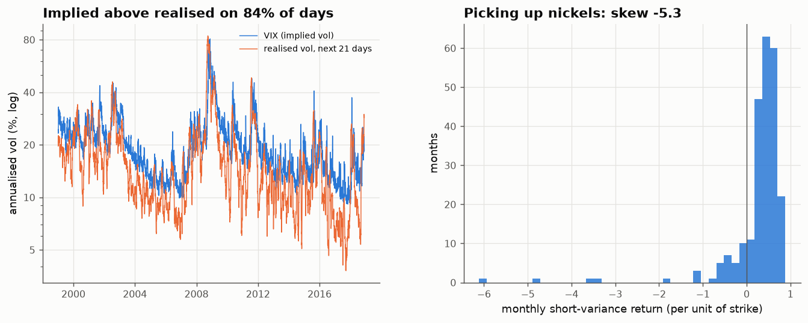

# 28 · The variance risk premium, and volatility targeting, on real data

*Code: [`code/28_vrp_and_vol_targeting.py`](../code/28_vrp_and_vol_targeting.py) · output: [`figures/28_output.txt`](../figures/28_output.txt) · data: daily S&P 500 1999–2018, VIX, Fama–French market 1926–2018*

Two strategies with a claim to being real, persistent "trends": selling
volatility insurance, and scaling exposure down when volatility is high. Both
link directly to theory notes (05 on Kelly sizing, 09 on the 3/2 rule).

## 1. The variance risk premium is real, and a Sharpe ratio misprices it

The VIX squared is the market's price for S&P 500 variance over the next 30
days. I compare it with the variance actually realised over the next 21
trading days, 1999–2018:

| | value |
|---|---|
| mean implied variance (as vol) | 21.7 % |
| mean realised variance (as vol) | 19.1 % |
| days on which implied > realised | **84 %** |

Implied variance is about 29% above realised on average. Buyers of volatility
insurance consistently overpay. As a monthly strategy (short a variance swap,
P&L per unit of strike, 239 non-overlapping months):

| | short variance |
|---|---|
| mean monthly return | +0.27 |
| Sharpe (annualised) | **1.25** |
| skewness | **−5.3** |
| worst month | **−6.1** (Sept 2008) |
| other disasters | Aug 2015 −4.9, Jul 2011 −3.6, Jan 2018 −3.5 |

A Sharpe of 1.25 over 20 years looks like one of the best trends in finance.
But the return distribution is a textbook "picking up nickels in front of a
steamroller": many small gains, and a few losses several times larger than a
year's income.

**Kelly sizing makes the danger concrete.** The mean–variance (Gaussian) Kelly
leverage is $\mu/\sigma^2 = 0.48$. The exact Kelly leverage, maximising
$\mathbb E\log(1+fR)$ over the actual empirical distribution, is **0.14**. The
worst month caps any leverage above $1/6.1 = 0.16$, because beyond that a
repeat of September 2008 wipes you out. **Sizing this strategy by its Sharpe
ratio would have ruined the investor in 2008.** At the exact Kelly fraction
the growth rate is a healthy +33% of strike per year.

This is note 05's point from a different direction. The Sharpe ratio sees
two moments, but the growth-optimal bet depends on the whole distribution,
and for negatively skewed strategies it's set by the **worst loss**, i.e. the
tail. Notes 14–15 showed that tail is exactly the part of the distribution
we measure worst.

## 2. Volatility targeting: the 3/2 rule on real data

Note 09 predicted that scaling exposure by $\sigma^{-m}$ improves the Sharpe
ratio over constant exposure iff expected returns grow more slowly than
$\sigma^{3/2}$. Real data:

**Monthly Fama–French market, 1927–2018** (volatility = trailing 6-month realised, lagged):

| vol quintile (annualised σ) | 0.08 | 0.11 | 0.14 | 0.17 | 0.30 |
|---|---|---|---|---|---|
| mean excess return | 3.0% | 6.5% | 12.4% | 5.6% | 11.9% |

Expected returns rise only weakly with volatility. A log-log fit gives
**p ≈ 0.84**, well below 3/2, so vol targeting should help:

| exposure rule | Sharpe | ratio to constant | lognormal theory (note 09) |
|---|---|---|---|
| constant | 0.426 | 1 | 1 |
| ∝ 1/σ (vol targeting) | **0.461** | **1.08** | 1.16 |
| ∝ 1/σ² (variance targeting) | 0.405 | 0.95 | 1.07 |

Vol targeting helps, by about half what the perfect-forecast formula predicts,
and variance targeting slightly hurts. That is what note 09's forecast-noise
extension predicts: a trailing 6-month volatility estimate is a noisy forecast
of next month's volatility, and noise shrinks the optimal exponent
($m^* = b s^2(2-p)/(b^2s^2+e^2)$) below the perfect-forecast value $2-p$, so
the aggressive $m=2$ rule overreacts.

**Daily S&P 500, 1999–2018:**

| exposure rule | EWMA vol (21-day half-life) | VIX as the vol forecast |
|---|---|---|
| constant | 0.18 | 0.18 |
| ∝ 1/σ | 0.28 | 0.19 |
| ∝ 1/σ² | **0.34** | 0.21 |

At daily frequency, with a responsive vol forecast, the improvement is large:
Sharpe nearly doubles. Scaling by the VIX helps much less, presumably because
the VIX mixes a volatility forecast with the time-varying risk premium measured
in section 1, so it isn't a clean forecast.

## Summary

- The variance risk premium is one of the most consistent quantitative
  patterns in the data (implied > realised 84% of the time, Sharpe 1.25).
  Its skewness (−5.3) makes Sharpe-based sizing catastrophic. The exact Kelly
  leverage is less than a third of the Gaussian one and sits just below the
  ruin bound set by September 2008.
- Expected market returns rise much more slowly with volatility than
  proportionally to variance ($p\approx0.8$). So volatility targeting helps,
  as the 3/2 rule predicts, with the size of the gain limited by how well
  volatility can be forecast.
