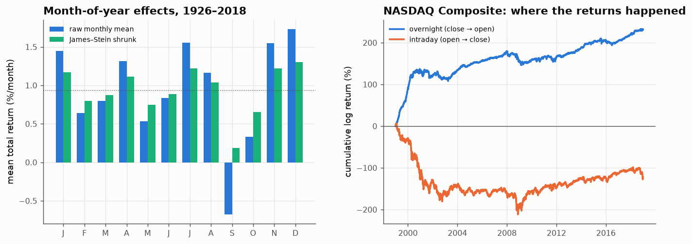

# 29 · Calendar effects, tested honestly

*Code: [`code/29_calendar_effects.py`](../code/29_calendar_effects.py) · output: [`figures/29_output.txt`](../figures/29_output.txt) · data: Fama–French market 1926–2018, Shiller S&P 1871–2026, daily S&P/NASDAQ 1999–2018*

Calendar "trends" (seasonality, turn-of-the-month, day-of-the-week, overnight
drift) are the most folkloric patterns in markets. They are also the easiest
to test badly: there are many calendar slices, so something always looks
significant. Here each one gets a multiple-testing correction where relevant,
empirical-Bayes shrinkage (note 05), and, where the effect was published, a
before/after split.

## Month of the year (Fama–French total market return, 1926–2018)

| month | mean %/month | t vs other months | p | Holm-adjusted p | shrunk mean |
|---|---|---|---|---|---|
| Jan | +1.45 | +1.06 | 0.29 | 1.00 | +1.17 |
| Jul | +1.55 | +1.11 | 0.27 | 1.00 | +1.22 |
| **Sep** | **−0.68** | **−2.81** | **0.006** | 0.072 | +0.19 |
| Nov | +1.55 | +1.22 | 0.23 | 1.00 | +1.22 |
| **Dec** | **+1.73** | +2.12 | 0.036 | 0.40 | +1.30 |
| (others) | 0.3 – 1.3 | within ±1 | | 1.00 | |

- **September** is the only month that stands out. It is the only month with
  a negative average over 92 years (t = −2.8). It **doesn't survive** a Holm
  correction for having tested 12 months (p = 0.07), though it's close.
- James–Stein shrinkage of the 12 monthly means toward the grand mean uses a
  factor of **0.46**. Statistically, a bit more than half of the apparent
  month-to-month variation is noise. After shrinkage, September's expected
  return is +0.19%/month: lower than other months, but not negative.

## "Sell in May and go away"

Bouman & Jacobsen (2002) documented that November–April beats May–October
across many markets. Before and after their paper:

| data | before 2002 | after 2002 |
|---|---|---|
| Fama–French market (month-end) | +3.8 %/yr (t = 1.72, 75 yrs) | +4.1 %/yr (t = 1.40, 17 yrs) |
| Shiller S&P (monthly averages) | +1.6 %/yr (t = 1.13, 130 yrs) | +2.5 %/yr (t = 0.78, 24 yrs) |

The effect **didn't decay after publication**: the same size, about 4% a
year, before and after. But it's never been individually significant at 5% in
US data. (The Shiller series understates it, because monthly averaging
smears returns across the May and November boundaries, the effect found in
note 24.)

## Turn of the month and day of the week (daily S&P, 1999–2018)

- The last trading day plus the first three of each month are **19% of days**
  and produced **68% of the total return**: +5.0 bp/day against +0.6 bp/day
  on other days. But t = 1.05. Daily noise is large enough that even this
  striking share isn't significant in 20 years. The effect was huge in
  1999–2008 (+5.3 vs −2.8 bp/day) and **nearly gone in 2009–2018** (+4.7 vs
  +3.9).
- Day of the week: nothing. All five Holm-adjusted p-values are 1.00.

## Overnight vs intraday

Taken over the full sample, NASDAQ's entire 1999–2018 gain came overnight
(close to next open: +2.32 log points), while intraday (open to close) *lost*
1.22. Overnight t = 4.1. That looks like a strong and famous anomaly (Cliff,
Cooper & Gulen, 2008). Splitting by period changes the picture:

| period | overnight bp/day | intraday bp/day | corr(overnight, intraday) |
|---|---|---|---|
| 1999–2000 | **+26.3** | **−24.0** | +0.01 |
| 2001–2005 | +2.0 | −2.9 | +0.01 |
| 2006–2010 | +0.7 | +0.8 | +0.07 |
| 2011–2018 | +3.3 | +1.3 | −0.02 |

Almost all of it is **the dot-com bubble**. In 1999–2000, NASDAQ gapped up
by 26 bp on an average night and gave it back during the day. Since 2006
overnight and intraday returns have been about equal. So have S&P 500
returns on days with a genuine opening price in 2008–2018 (0.17 against
0.15). The near-zero correlation argues against a simple noisy-open artefact,
but index opening values are constructed from stale first trades and remain
a concern. What survives: **retail-driven bubble markets can show enormous
overnight/intraday asymmetry, and the asymmetry disappears in normal markets.**

## Summary

| effect | verdict |
|---|---|
| September weakness | the strongest seasonal (t = −2.8) but fails a 12-month multiple-testing correction; shrink it by half |
| Sell in May | about +4%/yr, stable across publication, never individually significant |
| Turn of the month | dramatic concentration of returns in 1999–2008, faded since |
| Day of week | nothing |
| Overnight drift | real and huge in 1999–2000 NASDAQ, largely absent since 2006 |

The same lesson as notes 24–27: the effects that look most convincing on a
chart usually come from one era, and the honest shrinkage factor is about
one half.
