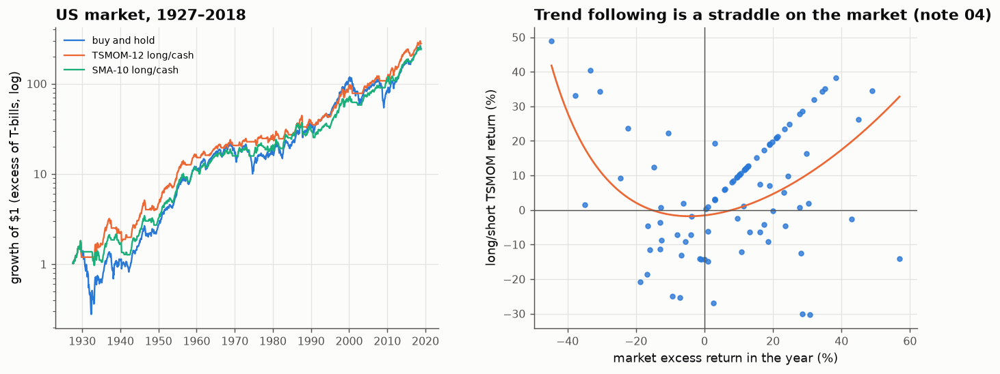

# 30 · Does trend following work on the US stock market? (1927–2018)

*Code: [`code/30_trend_following_index.py`](../code/30_trend_following_index.py) · output: [`figures/30_output.txt`](../figures/30_output.txt) · data: Fama–French market and T-bill returns, month-end, 1926–2018*

The most literal version of "a trend in the stock market" is time-series
momentum: be in the market when it has been rising and out when it has been
falling. Note 04 derived what such a rule is mathematically (a bet that
long-horizon variance exceeds short-horizon variance, and a long straddle).
Note 24 found no significant autocorrelation in 150 years of monthly returns.
So what happens when you actually run the rules?

## The rules

Signals use only information available at the end of month $t$ and are applied
to month $t+1$. Excess returns are over T-bills (month-end data, so there is
no averaging artefact):

- **TSMOM-12**: long if the trailing 12-month excess return is positive, else cash.
- **SMA-10**: long if the total-return index is above its 10-month moving
  average, else cash (Faber's rule).

| strategy | Sharpe | mean %/yr | vol %/yr | max drawdown | skew | months long |
|---|---|---|---|---|---|---|
| buy and hold | 0.42 | 7.8 | 18.5 | **−85 %** | +0.19 | 100 % |
| TSMOM-12 long/cash | **0.56** | 7.0 | 12.5 | **−44 %** | −0.61 | 70 % |
| SMA-10 long/cash | 0.54 | 6.8 | 12.5 | −46 % | −0.73 | 73 % |
| TSMOM-12 long/short | 0.33 | 6.2 | 18.6 | −68 % | −0.92 | |

The trend rules give up about 0.8% a year of return, take a third less risk,
and **halve the worst drawdown**. By era, the Sharpe improvement is there in
1927–62 (0.44 → 0.64) and 1993–2018 (0.54 → 0.71), but not in 1963–92
(0.33 → 0.34).

## Is it timing, or just being out of the market some of the time?

Two nulls:

1. **Same exposure, random timing.** Take the actual TSMOM signal, with its
   exact run lengths, and shift it circularly to random dates: median Sharpe
   0.34, 95th percentile 0.45. The real 0.56 beats it with **p = 0.001**
   (SMA-10: p = 0.002).
2. **No autocorrelation at all.** Bootstrap months i.i.d. and rerun the
   rule. The Sharpe *improvement* over buy-and-hold is typically negative
   (median −0.09). The real +0.14 has **p < 0.001**.

The timing matters.

## Return predictability or volatility timing?

Note 28 showed that stepping out of high-volatility periods can raise a
Sharpe ratio with no return predictability at all. Is that all trend following
does here?

| months when TSMOM is… | share | mean excess return | vol | Sharpe | trailing vol |
|---|---|---|---|---|---|
| long | 70 % | **+10.0 %/yr** | 14.8 % | 0.67 | 14.6 % |
| out | 30 % | **+2.7 %/yr** | 25.1 % | 0.11 | 20.3 % |

Both effects are present: the "out" months are more volatile **and** have much
lower average returns. Two checks separate them:

- A pure volatility-timing rule (out when trailing volatility is in its top
  30%) gets a Sharpe of only **0.23**, *worse* than buy-and-hold. It exits
  after volatility spikes, which is when subsequent returns tend to be high
  (the $p>0$ risk–return relation of note 28). The two signals are only weakly
  correlated (0.21).
- Regressing next-month excess returns on the trend signal *and* trailing
  volatility: trend coefficient **+9.6%/yr (t = 2.2)**; volatility
  coefficient positive (t = 1.8).

So the 12-month trend sign carries real information about next month's
return beyond volatility.

**How to square this with note 24's null result?** Note 24 tested
autocorrelations lag by lag, and each one is small (±0.05). A 12-month trend
signal *adds up* twelve lags of weak dependence, and uses the *sign*, which
concentrates the bet where the dependence is (in prolonged bear markets). In
note 04's spectral terms, a trend follower is long low-frequency power, and
individual-lag tests have little power at low frequencies. Weak correlations
spread over many lags can add up to a useful signal.

## The straddle, on real data

Note 04 predicted that a long/short trend follower's P&L is **convex** in the
market's move. Plotting annual long/short TSMOM returns against the market's
return (right panel) gives a clear smile: a quadratic fit has coefficient
+1.23 on the squared market return, and the correlation with the squared move
is 0.41.

| year | market | TSMOM long/short |
|---|---|---|
| 1931 | −45 % | **+49 %** |
| 1974 | −33 % | **+40 %** |
| 2002 | −22 % | +24 % |
| 2008 | −38 % | **+33 %** |
| 1937 | −35 % | +2 % (the crash came too fast for a 12-month signal) |

This is "crisis alpha". The price is paid in choppy markets, which is why the
long/short version has a lower Sharpe (0.33) than long/cash. Being short
the equity premium in the "out" months costs more than the convexity earns.

## Summary

- **12-month trend following is the most robust "trend" found in this
  notebook's real-data section.** It improved the risk-adjusted return of the
  US market over 90 years (Sharpe 0.42 → 0.56, max drawdown −85% → −44%). It
  beats random-timing and no-autocorrelation nulls at p ≤ 0.002, and it
  predicts returns beyond volatility (t = 2.2).
- It didn't work in 1963–1992, and its main value is avoiding a few
  prolonged bear markets. Over a short sample it can look useless.
- Its convex payoff matches the Itô-formula analysis of note 04.
- Caveats: one market, one well-known rule (so little data-mining freedom,
  but also no out-of-sample *rule choice*), and no trading costs. With
  monthly signals and about 70% time in the market, turnover is low (a few
  switches a year), so costs are unlikely to change the conclusion.
