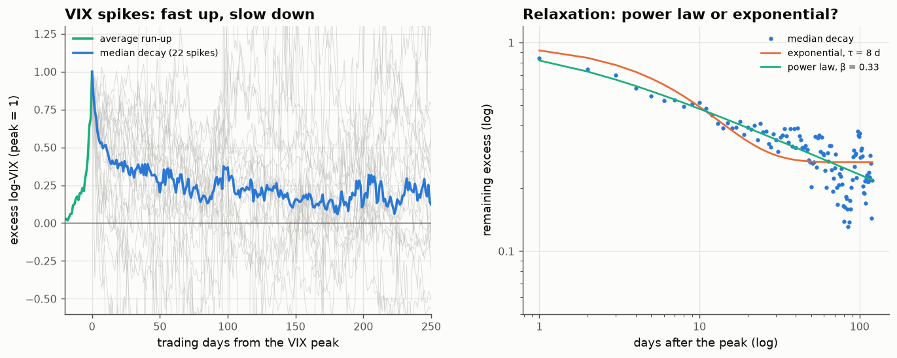

# 31 · How volatility shocks decay: a power law, as rough volatility predicts

*Code: [`code/31_vix_spike_relaxation.py`](../code/31_vix_spike_relaxation.py) · output: [`figures/31_output.txt`](../figures/31_output.txt) · data: daily VIX, 1990 – Sept 2026*

When fear spikes, how fast does it fade? The answer separates two families of
volatility models:

- **Classical** (Heston, GARCH, any Ornstein–Uhlenbeck log-vol): after a shock,
  expected volatility relaxes **exponentially**, with one characteristic time
  scale.
- **Rough/long-memory** (notes 08, 26): the response to a shock is a Volterra
  kernel $K(t)\propto t^{H-1/2}$, so the excess decays as a **power law** with
  exponent $\beta\approx\tfrac12 - H$. With the roughness measured in note 26
  ($H\approx0.12$–$0.16$), that predicts $\beta\approx0.34$–$0.38$.

## Event study

A spike is the VIX rising more than 40% within 10 trading days to above 25,
at least 120 days after the previous spike, aligned at its peak within the
next 30 days. That gives **22 spikes** from 1990 to 2025, including 2008
(peak 80), March 2020 (83), August 2015, February 2018, August 2024 and April
2025 (52). For each, the excess log-VIX over its pre-spike baseline is scaled
to 1 at the peak.

| days after peak | median remaining excess | mean |
|---|---|---|
| 5 | 0.56 | 0.47 |
| 20 | 0.39 | 0.33 |
| 60 | 0.29 | 0.21 |
| 120 | 0.22 | 0.18 |
| 250 | 0.12 | 0.07 |

The shape is typical of a power law. Half the excess is gone in about a week,
but after four months a fifth still remains, and a trace is left after a
year. An exponential can't produce both a fast initial drop and a long tail.

## Fits (median curve, days 1–120)

| model | parameters | squared error |
|---|---|---|
| exponential + constant floor | τ = 8.5 days, floor 0.27 | 0.52 |
| power law $(1+k/k_0)^{-\beta}$ | $k_0$ = 1.2 days, **β = 0.33** | **0.32** |
| power law + floor | β = 0.35, floor 0.02 | 0.31 |

- The power law fits better with fewer effective parameters. Adding a floor
  doesn't help it (the fitted floor is about 0), while the exponential
  *needs* a large floor to imitate a long tail.
- **Leave-one-spike-out:** fitting both forms on 21 spikes and predicting the
  22nd, the power law wins **14 of 22** times.
- The fitted exponent **β = 0.33–0.35 matches the rough-volatility prediction
  $\tfrac12 - H\approx0.34$–$0.38$** from note 26's independently measured
  roughness. Two different statistics (the small-scale structure function of
  realised volatility, and the large-shock relaxation of implied volatility)
  agree on one exponent.

## Time asymmetry

On average a spike climbs from half its size to the peak in **2 days** and
decays back to half in **8 days**. Volatility rises like a jump and relaxes
like a slow diffusion. Note 08's burn-in episode warned against taking
simulated skewness at face value, but here the asymmetry is in real data,
which a time-reversible Gaussian rough-vol model can't reproduce. It is what
you'd expect from the self-exciting (Hawkes) mechanism: a burst of activity
triggers more activity at once, and the memory then decays slowly.

## Summary

- Volatility shocks decay as a power law with exponent ≈ 0.33, not
  exponentially. There is no single time scale for "how long fear lasts".
- The exponent agrees with the roughness measured from realised volatility
  (note 26), which is strong internal consistency for the rough-volatility
  picture.
- Spikes are strongly time-asymmetric: up in about 2 days, down to half in
  about 8.

Practically, VIX mean-reversion trades that assume an exponential half-life
will be surprised by how long the last fifth of a spike lingers.
