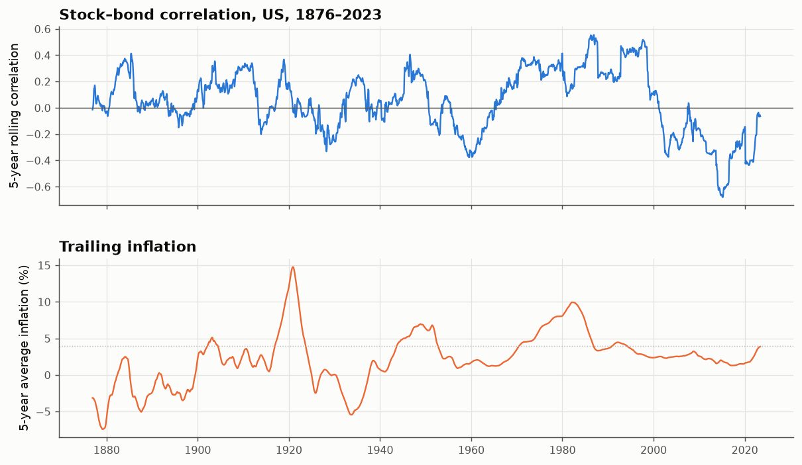

# 32 · The stock–bond correlation: a trend that flips

*Code: [`code/32_stock_bond_correlation.py`](../code/32_stock_bond_correlation.py) · output: [`figures/32_output.txt`](../figures/32_output.txt) · data: Shiller monthly S&P total return, long government yield and CPI, 1871–2023*

For a diversified investor, the most important "trend" in markets may not be
in stocks or bonds but **between** them. The case for a 60/40 portfolio in the
2000s and 2010s rested on bonds rising when stocks fell. That is a negative
correlation, and it isn't a constant of nature.

## Building bond returns

Shiller's series gives the long government yield (the 10-year Treasury from
1953; long government bonds before that). Each month I hold a par bond with
about 10 years to maturity and a coupon equal to last month's yield, and
reprice it at this month's yield (semiannual discounting, dirty price). This
gives 1872–2023 total bond returns of 4.6%/yr. Both the stock and yield series
are monthly averages, so both are smoothed the same way.

## The regimes

| era | stock–bond correlation | mean inflation | inflation sd |
|---|---|---|---|
| 1871–1913 | +0.04 | −0.3 % | 7.0 % |
| 1914–1945 | +0.07 | 2.2 % | 7.5 % |
| 1946–1965 | −0.14 | 2.9 % | 4.2 % |
| 1966–1999 | **+0.28** | 5.1 % | 3.0 % |
| 2000–2021 | **−0.32** | 2.2 % | 1.4 % |
| 2022–mid 2023 | **+0.46** | 7.0 % | 1.8 % |

The rolling 5-year correlation reached **+0.55 in the mid-1980s** and
**−0.65 around 2014**, then turned sharply upward with the 2021–22 inflation
shock.

## What drives it?

The standard story is **inflation**. When inflation is the dominant macro
risk, a surprise hurts both stocks and bonds (rates up, prices down), so they
move together. When growth is the dominant risk and inflation is anchored,
bad news lowers yields while it lowers stocks, and bonds hedge.

The data partly agree:

- Windows with trailing inflation **above 4%** average a correlation of
  **+0.22**. Below 4%, the average is **−0.01**.
- The three modern regimes line up exactly: high inflation 1966–99 gives a
  positive correlation, low and stable inflation 2000–21 gives a negative one,
  and the 2022 inflation shock gives positive again.

But across all 30 non-overlapping 5-year windows since 1872, a regression of
the correlation on inflation's level and volatility gives t-statistics of only
1.3 and 0.9 (R² = 0.12). Before 1946 inflation was *very* volatile (sd 7%,
under the gold standard, with deflations) and the correlation hovered near
zero. **Inflation explains the post-war regimes but not the whole history.**
The monetary regime (gold standard vs fiat with an inflation-targeting
central bank) probably matters as much as the inflation level. Under a
credible inflation target, bad news is growth news, and that's when bonds
hedge.

## Why it matters

For a 60/40 portfolio, the swing from +0.28 to −0.32 is the difference between:

| period | 60/40 volatility | if uncorrelated |
|---|---|---|
| 1966–1999 | 8.6 % | 7.8 % |
| 2000–2021 | 7.4 % | 8.2 % |

That is a modest change in volatility, but a large change in *when*
diversification works. In 2000–2021 bonds rallied in almost every equity
crisis, and in 2022 both fell together. Any risk model estimated on
2000–2021 data would have assigned 2022-style joint losses a very low
probability.

## Summary

- The stock–bond correlation is not a parameter. It is a slow-moving state
  variable that has changed sign at least three times since 1945.
- Its post-war regimes line up with inflation (positive when inflation is
  above about 4%), but the pre-war record shows the link isn't universal.
  The central bank's regime seems to matter too.
- This is the clearest example in this notebook of a "trend" that is real
  and important but **non-stationary**, like the CAPE level in note 25.
  Long-sample averages hide it, and short-sample estimates extrapolate it
  too confidently.
