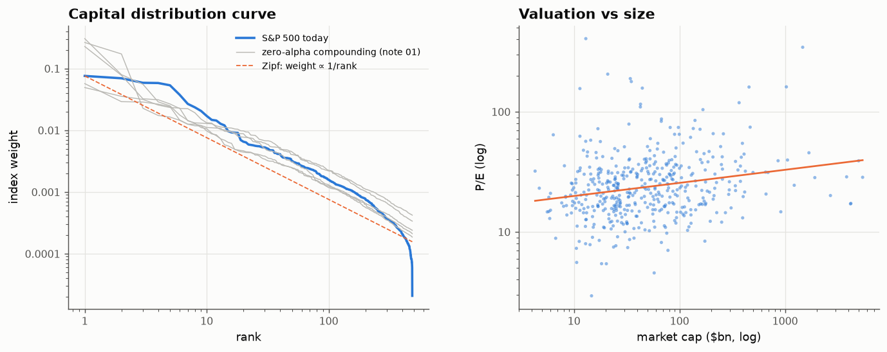

# 34 · Today's market obeys Zipf's law, and compounding explains its concentration

*Code: [`code/34_capital_distribution_today.py`](../code/34_capital_distribution_today.py) · output: [`figures/34_output.txt`](../figures/34_output.txt) · data: S&P 500 constituents snapshot (github.com/datasets/s-and-p-500-companies-financials; prices imply about 2026)*

"The market has never been this concentrated" is one of the most repeated
claims about today's stock market. Notes 01 and 02 said concentration is a
natural consequence of lognormal compounding, and that the *shape* of the
capital distribution matters for rebalancing. A current snapshot of all S&P
500 constituents lets me test both.

## The shape: Zipf's law, almost exactly

Rank the 485 companies with reported market cap (total \$71.5T; largest
\$5.4T; median \$40B) and plot index weight against rank on log–log axes:

| tail used | rank–size regression | Hill estimator |
|---|---|---|
| top 20 | 0.95 | 0.88 |
| top 50 | 0.96 | 1.05 |
| top 100 | 0.99 | 1.00 |
| top 250 | 0.97 | 0.86 |
| top 100, Gabaix–Ibragimov (rank − ½) | **1.05 ± 0.15** | |

The market-cap distribution has a Pareto tail with exponent **≈ 1: Zipf's
law**. A company's weight is roughly proportional to 1/rank. The same law
describes city sizes and firm sizes by employment. Gabaix's explanation is
random proportional growth (Gibrat's law) combined with entry of new small
units, which is exactly the zero-alpha compounding-with-turnover world of
note 01.

The one visible deviation is at the very top. The five largest companies form
a *plateau* (\$3.8–5.4T each, 5–8% weights), flatter than Zipf would give,
before the curve drops toward the 1/rank line. The top of today's market is a
cluster of similar-sized giants rather than a single dominant firm.

## Concentration

| measure | value |
|---|---|
| largest company | 7.6 % of the index |
| top 10 | **44.2 %** |
| top 50 | 68.4 % |
| effective number of stocks, 1/Σw² | **38** |

In risk terms, the S&P 500 behaves like an equally weighted portfolio of
about 38 stocks.

## Is it unusual? Compare the zero-alpha compounding market

Note 01 simulated a market with **no alpha anywhere**: 25,000 listings over
90 years, CAPM expected returns, lognormal idiosyncratic noise, random births
and deaths. Taking the 485 largest firms alive at the end of each of five
simulated histories:

| simulated history | top-10 share | effective N | tail exponent |
|---|---|---|---|
| 1 | 22.8 % | 102 | 1.50 |
| 2 | 55.4 % | 10 | 1.06 |
| 3 | 48.8 % | 16 | 1.00 |
| 4 | 56.2 % | 9 | 1.06 |
| 5 | 24.2 % | 97 | 1.35 |
| **actual S&P 500** | **44.2 %** | **38** | **≈ 1.0** |

Today's concentration **sits in the middle of what pure compounding
produces**, and so does the Zipf exponent. The simulated histories vary a
lot: in some, a handful of lucky firms end up with over half the market. That
is note 01's message again: when idiosyncratic volatility compounds over
decades, extreme concentration is the *typical* outcome, not a sign of
something special. Whether today's leaders deserve their size is a separate
question. Their *number* and *share* need no special explanation.

## Valuation rises with size

P/E ratios increase with market cap (right panel). The elasticity is +0.11,
so a firm 10× larger trades at about **1.29×** the P/E. The ten largest have
a median P/E of 28.4 against 22.5 for the index as a whole. Part of the
concentration is therefore a valuation premium on the largest companies, not
just larger earnings. That links to note 25's observation that the index-level
CAPE has drifted up since 1990: the large-cap premium weighs more as
concentration rises.

## Summary

- Today's S&P 500 has a Zipf capital distribution (exponent ≈ 1.0).
- It is concentrated (top 10 = 44%, effective N = 38), but a zero-alpha
  lognormal market over 90 years produces the same range. Compounding alone
  accounts for it.
- The largest firms carry a valuation premium (+29% P/E per 10× size).
