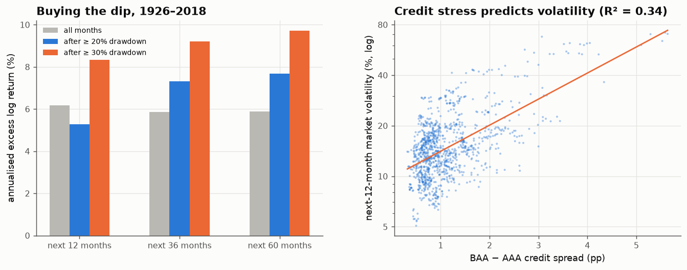

# 35 · After crashes and credit stress: risk is predictable, returns are not

*Code: [`code/35_after_stress.py`](../code/35_after_stress.py) · output: [`figures/35_output.txt`](../figures/35_output.txt) · data: Fama–French market 1926–2018; Moody's AAA and BAA yields 1919–2018 (via `arch`)*

Two popular conditional "trends":

1. **Buy the dip.** After a big fall, stocks are cheap, so future returns are
   higher.
2. **Watch credit.** Widening corporate credit spreads warn of trouble for
   equities.

## Buying the dip (1926–2018)

At every month-end where the market is at least 20% (or 30%) below its
previous peak, I record the subsequent 12-, 36- and 60-month excess returns:

| condition | share of months | next 12m | next 36m | next 60m |
|---|---|---|---|---|
| all months | 100 % | +6.2 %/yr | +5.9 %/yr | +5.9 %/yr |
| drawdown ≥ 20 % | 24 % | +5.3 %/yr | +7.3 %/yr | +7.7 %/yr |
| drawdown ≥ 30 % | 16 % | +8.3 %/yr | +9.2 %/yr | +9.7 %/yr |

The point estimates lean toward buying the dip at 3–5 year horizons: about
+1.5%/yr after a 20% drawdown and +3.5%/yr after a 30% drawdown. They also
show slightly *lower* returns over the next 12 months after a 20% fall, which
fits the time-series momentum of note 30.

But there have been only **20 distinct 20%+ drawdowns since 1926**, and
overlapping windows reuse the same few episodes. A 12-month block bootstrap
(same rule, random-walk returns with realistic volatility) gives:

| horizon | observed difference | 95 % null band | p |
|---|---|---|---|
| 12 m | −0.9 %/yr | [−4.8, +7.4] | 0.70 |
| 36 m | +1.4 %/yr | [−4.2, +5.9] | 0.41 |
| 60 m | +1.8 %/yr | [−3.7, +5.0] | 0.34 |

**Nothing is distinguishable from chance.** The dip-buying premium is
plausible (it would follow from note 24's weak pre-war mean reversion), but
with 20 episodes in a century the data can't establish it.

## Credit spreads (1926–2017)

The BAA−AAA spread averages 1.13 percentage points and is extremely
persistent (monthly AR(1) coefficient 0.975). Persistent predictors create
spurious R² (note 25), so the null uses an independent AR(1) series with the
same persistence.

| target | slope | R² | null median R² | null 95th pct | p |
|---|---|---|---|---|---|
| next-12m excess return | +2.2 %/yr per pp | 0.005 | 0.004 | 0.034 | **0.44** |
| next-12m log volatility | +0.36 per pp | **0.336** | 0.013 | 0.098 | **< 0.001** |

- **Credit spreads don't predict equity returns.** The slope is even
  positive: wider spreads came before slightly *higher* returns, consistent
  with a risk premium but indistinguishable from zero.
- **Credit spreads strongly predict equity volatility.** Each extra
  percentage point of spread goes with about **43% higher market volatility
  over the next year**, and the spread alone explains a third of the
  variation in future volatility. That is ten times the null's typical R².

## The pattern, again

This matches the scorecard (note 33) exactly:

> **Stress variables forecast risk, not reward.**

Drawdowns, credit spreads and (in notes 28 and 31) the VIX all carry strong,
statistically robust information about *how volatile* the next months will
be, and little or no information about *which direction* the market will
move. That is roughly what an efficient market with time-varying risk
predicts. Risk is priced and persistent, so it is forecastable. Returns
above the price of risk are not.

Practically, stress indicators are much more useful for **sizing** positions
(via the volatility-targeting logic of notes 09 and 28) than for timing them.
